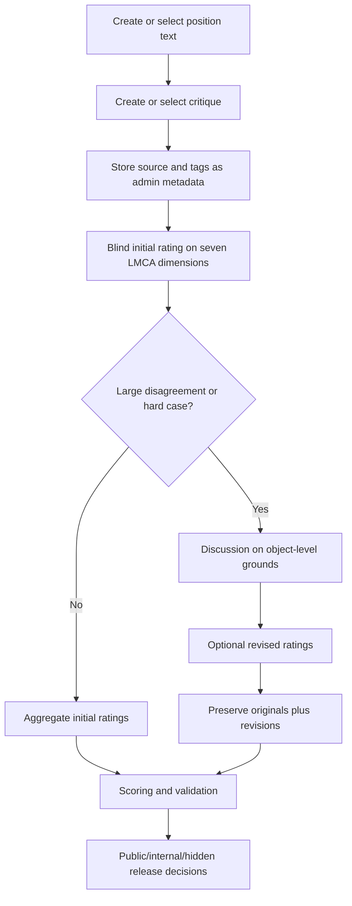
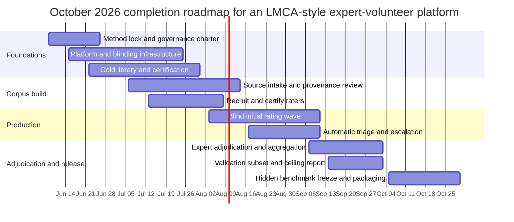

# LMCA Volunteer Annotation Platform Assessment and October Release Specification

## Executive summary

Using **LMCA_dataset.pdf** as the primary source, prioritizing the CMU-hosted PDF at `https://www.andrew.cmu.edu/user/coesterh/LMCA_dataset.pdf`, and treating the uploaded planning documents as secondary design references, the answer is: **yes, the LMCA workflow can be implemented as an expert‑volunteer online annotation project, but only if the platform preserves LMCA’s underlying measurement regime rather than mimicking only its surface workflow.** In practice, that means preserving the contextualized **position → critique → seven-dimensional rating** unit; source/tag blinding during rating; blind initial ratings before discussion; preserved original ratings after revision; disagreement-centered adjudication; the emphasis on **centrality × strength** rather than either score alone; and LMCA’s two scoring families. It also means being explicit that several things the later design memos add—such as gold-item injection, hidden-benchmark governance, exposure logging, and rights workflows—are **project-level safeguards**, not source-stated LMCA requirements.

The two volunteer-design documents, **AI Conceptual1.md** and **Implementing the LMCA Workflow as an Expert-Volunteer Online Project.pdf**, are substantively the same design memo in two formats. They are architecturally strong and much closer to LMCA than naive crowd annotation would be, but they remain incomplete as an operating specification. Their main weakness is not conceptual error; it is **underspecification**: they do not fully freeze Appendix F’s rubric semantics into production rules, define exact escalation triggers, harden a release-cycle validation routine, formalize benchmark-eligibility rules, or close the provenance/rights and leakage-control loops.

A serious first release by **October 31, 2026** is feasible without collapsing into an MVP if the project is run as a **parallelized full-release program**. The best quality-preserving compressed scope supported by the uploaded planning documents is approximately **120 positions**, **3 critiques per position**, **4 blind initial ratings per position-critique rating unit**, a **60-item gold library**, an Appendix-C-scale formal validation subset modeled on LMCA's rating test, a frozen hidden benchmark, and a release report using both LMCA scoring families. The strongest uploaded October plan keeps **four expert adjudicators** and lands around **132–154 person-weeks** with a planning budget envelope of roughly **$0.60M–$1.00M**; where I provide more granular line items below, those are conservative planning assumptions inside that envelope, because the uploaded corpus does not provide market-rate cost data. This October scope should remain explicitly labeled as a compressed first-release target, not as a claim to replicate LMCA's current source scale: LMCA reports **951 rated dialogues/critiques**, **1458 ratings ignoring revisions**, **478 rated model-written critiques**, **442 positions with at least one rated critique**, and **279 positions with at least two rated critiques**. Release reports should also compare against LMCA's exact position-source counts: **27 hand-written**, **168 book-adapted**, **41 coursework-derived**, **108 magazine/blog/forum-derived**, **68 primarily model-written**, and **28 other-dataset-adapted** positions; when other-dataset-adapted comparability is claimed, the report should identify known subsource counts such as **18 DebateBench** and **6 VivesDebate** positions. For adapted-source comparability, release reports should also track source-language and transformation format: DebateBench items are transcribed competitive-debate speeches with judge ratings, VivesDebate items are Catalan debate material machine-translated into English and topically concentrated on gestational-surrogacy legalization, and LMCA notes a few LSAT-derived data points while cautioning that LSAT questions are usually not in suitable domains. The release report should also distinguish corpus scale from LMCA's published model-evaluation denominators: LMCA's weighted-pairwise model ranking is aggregated over **255 positions/arguments and 856 critique pairs**, while its custom-metric model ranking is averaged over **933 dialogues**. For headline model-score comparability, reports should preserve representative LMCA score anchors rather than only the denominators: Table 5's weighted-pairwise anchors include **gpt-5-2025-08-07: 0.080 ± 0.016**, **o3-pro-2025-06-10: 0.083 ± 0.018**, **claude-opus-4-1-20250805: 0.090 ± 0.017**, and **random: 0.173 ± 0.016**, while Table 7's custom-metric anchors include **gpt-5-2025-08-07: 0.211 ± 0.009**, **claude-opus-4-1-20250805: 0.222 ± 0.010**, and **gpt-4.1-nano-2025-04-14: 0.433 ± 0.016**. For reasoning-mode comparability, release reports should also preserve LMCA Table 6 as a paired sensitivity baseline rather than merely recording a reasoning-mode field; examples include Claude Opus 4.1 thinking10k **0.086** versus non-thinking **0.090**, Claude Sonnet 4 thinking10k **0.112** versus non-thinking **0.098**, Gemini 2.5 Flash no-thinking **0.112** versus default **0.118**, and Qwen3-4B Instruct **0.142** versus Thinking **0.149**, illustrating that thinking sometimes helps and sometimes hurts within uncertainty. Because LMCA Appendix A warns that some losses can reward matching the dataset's critique-quality prior rather than conceptual judgment, release reports should also publish human label-score distributions—at minimum overall-score mean, median, spread, and per-dimension histograms by split/source/topic/length where feasible—so prior-only, constant-score, and recalibrated baselines can be interpreted against the target distribution. To separate binary ordering skill from margin-weighted ordering error, pairwise evaluation reports should also include a non-headline unweighted pairwise/Kendall-style diagnostic whenever weighted pairwise results are reported; this diagnostic should use the same pairwise-eligible position set, target label, tie policy, and uncertainty policy, but it should be labeled diagnostic rather than a replacement for LMCA's weighted headline metric. To test whether rankings are sensitive to using LMCA's full rubric rather than only `overall`, the platform should also support a separately versioned **full-rubric derived-utility pairwise diagnostic**; that diagnostic should declare its utility formula and low-clarity policy and should remain a sensitivity analysis rather than a third headline LMCA metric. For model-improvement use, the platform should also separate LMCA evaluation metrics from differentiable training surrogates: exported RLHF/reward-model data may use declared surrogate objectives, but release reports should continue to compute the frozen LMCA scoring functions separately. Prompt comparability should be scoped just as strictly: Appendix G.1 source-states a baseline prompt for eliciting only the `overall` score, so any volunteer full-rubric evaluation prompt should be treated as a versioned project extension unless explicitly reported as a prompt-sensitivity variant. Release reports should also keep the source-comparable simple-baseline prompt track separate from elicitation, few-shot, optimized, or tool-assisted prompt tracks, because the paper treats the simple baseline and few-shot elicitation effects as different experimental conditions. Direct LMCA-replication claims should additionally declare the target label/rater: LMCA's weighted-pairwise Table 5 is scored against **Emery Cooper's ratings**, so a leaderboard scored against multi-rater final averages, adjudicated labels, or benchmark-frozen volunteer labels should be labeled as LMCA-style rather than target-identical to that table. Architecturally, the platform should therefore materialize **paired target-label snapshots** where feasible: one primary-rater-anchored snapshot for LMCA Table-5-style comparability and one adjudicated/final-average or benchmark-frozen consensus snapshot for higher-quality volunteer labels. Where the consensus snapshot uses reliability-weighted aggregation, the reliability-weight model should be frozen before aggregation, versioned, fit only on permitted calibration/validation evidence, and accompanied by unweighted/median sensitivity reports so rater weighting does not become an opaque label-selection mechanism. Model-assisted revisions should also carry evaluator-overlap flags: a model or close model family should not be scored as a clean independent baseline against labels it helped revise unless a human-only or pre-assistance snapshot is also reported. Release artifacts should also be **content-addressed at the item-text, same-position rating-context, and comparison-set level**: each rating, label snapshot, evaluation run, and training export should reference frozen position/critique text versions, frozen same-position context snapshots where the rater or model saw sibling critiques, and frozen pairwise comparison-set snapshots, so text normalization, sibling-context changes, late-added critiques, or sibling-set changes cannot silently alter what was rated, scored, or exported. Release reports should also compare broad topic-family coverage against LMCA's named topic families—**AI safety, decision theory, normative ethics, philosophy of mind, politics, and miscellaneous topics**—so a narrow volunteer release is not mistaken for an LMCA-topic-comparable release. Release reports should also compare rater-contribution structure against LMCA's Table 1 rater distribution—**946** ratings by Emery Cooper, **211** by Caspar Oesterheld, **130** by Alexander Kastner, **103** by Linh Chi Nguyen, **43** by Lukas Gloor, and **25** by Lukas Finnveden, ignoring revisions—so a volunteer release is not treated as rater-composition-comparable merely because total rating counts match. Release validation and human-ceiling reports should also include an LMCA Appendix C numeric-baseline comparison table, including overlapping-rater-vs-primary-rater custom-loss baselines (**0.139 ± 0.016** for Caspar Oesterheld on 209 shared critiques, **0.159 ± 0.023** for Alexander Kastner on 127, and **0.151 ± 0.024** for Chi Nguyen on 103, each against Emery Cooper's first ratings), rating-test final-vs-final-average ranges (**0.044–0.065** on the common-overlap subset and **0.058–0.069** on the whole rating test), initial-vs-final ranges (**0.064–0.149** and **0.081–0.127**), Emery Cooper initial/check deltas (**0.123 ± 0.028** and **0.077 ± 0.014**), and the relevant GPT-5 comparison points (**0.169 ± 0.031** on the whole rating test, **0.153 ± 0.036** on the common-overlap subset, **0.206 ± 0.036** against Emery Cooper's first ratings, and **0.068 ± 0.07** weighted comparison loss on the whole rating test).

I found **three material overstatements** in **LMCA Requirements Audit and Revised October Release Plan.pdf** that should be corrected: it treats **gold items** and **hidden-benchmark governance** too closely as if they were already LMCA core mechanics; it treats **diverse sourcing plus active-learning critique selection** too closely as a benchmark requirement rather than a dataset-construction choice LMCA happened to use; and it summarizes the **custom weighted loss** too loosely for implementation, where exact formulas are required. I did **not** find major numerical misunderstandings of LMCA’s source-stated dataset size, rating workflow, or validation results.

The rest of this report is written as a buildable deliverable for Codex GPT-5.5-xhigh: first the exact LMCA requirements, then the comparison against the two volunteer-project designs, then a compressed October plan, then corrected wording for prior overstatements, then a concrete implementation spec, then the RLHF/model-improvement integration layer, and finally a revision log for this document.

## LMCA requirements extracted from the source paper

LMCA is best read not as “a dataset with some labels,” but as a **measurement regime** for conceptual reasoning. The authoritative paper defines the annotation unit as a **position text**, a **critique** of that position, and human-expert ratings of the critique on **centrality, strength, correctness, clarity, dead weight, single issue, and overall**. It explicitly motivates this design as a workaround for domains where bottom-line truth is inaccessible or too contentious, but where arguments and critiques can still be assessed.

The most important explicit requirements and source-stated constraints are summarized below.

| LMCA requirement or constraint | What the paper says | Status |
|---|---|---|
| Contextualized unit of analysis | The core record is **position + critique + ratings**, not a bottom-line answer key | Explicit |
| Content-addressed item-text versioning and human/model view parity | Because LMCA ratings and model scores are defined over a specific position text and critique, every rating, label snapshot, model evaluation, and export should reference immutable position/critique text versions and canonical text hashes. If the rater-visible text, model-visible text, or normalized/exported text differs materially, the run should be labeled as a text-view sensitivity analysis rather than a clean comparison against the original human labels. | Explicit unit-of-analysis implication; project reproducibility safeguard |
| LMCA source-scale and exact position-source baseline should be distinguished from project release scope | LMCA reports **951 rated dialogues/critiques**, **1458 ratings ignoring revisions**, **478 rated model-written critiques**, **442 positions with at least one rated critique**, and **279 positions with at least two rated critiques**; it also reports exact position-source counts: **27 hand-written**, **168 book-adapted**, **41 coursework-derived**, **108 magazine/blog/forum-derived**, **68 primarily model-written**, and **28 other-dataset-adapted** positions. Related-work/source reporting further states that LMCA includes **18 DebateBench** and **6 VivesDebate** positions. A volunteer release should provide a source-scale/source-composition comparison table while labeling the 120-position October target as a compressed first release rather than an LMCA-scale replication. | Explicit dataset reporting precedent; project comparability safeguard |
| LMCA adapted-source language, translation, and task-format provenance should be tracked | LMCA's adapted DebateBench positions come from transcribed competitive debates with competitive debate judges' ratings; its VivesDebate positions come from debates originally in Catalan that were machine-translated into English and all concern whether gestational surrogacy should be legalized; and the paper notes a few LSAT-derived data points while cautioning that LSAT questions are usually not in suitable domains. A volunteer release should therefore record source language, translation route, task format, source-domain concentration, and source-domain suitability for adapted/external-source items rather than treating all adapted positions as equivalent. | Explicit related-work/source-reporting precedent; project translation/task-format/domain-suitability safeguard |
| LMCA topic-family baseline should be declared | LMCA says the dataset covers a variety of topics, including **AI safety, decision theory, normative ethics, philosophy of mind, politics, and miscellaneous topics**. A volunteer release should therefore publish a topic-family coverage table using these source-named families where possible, plus any project-specific subtopics, and should label releases that cover only one or two topic families as narrower than LMCA's stated topical scope. | Explicit dataset-reporting precedent; project topical-comparability safeguard |
| LMCA rater-contribution baseline should be declared | LMCA reports the number of ratings by each named rater, ignoring revisions: **946** by Emery Cooper, **211** by Caspar Oesterheld, **130** by Alexander Kastner, **103** by Linh Chi Nguyen, **43** by Lukas Gloor, and **25** by Lukas Finnveden, for **1458** total ratings. A volunteer release should therefore publish per-rater contribution distributions and compare its rater concentration to this LMCA baseline rather than treating equal total rating counts as rater-composition-comparable. | Explicit dataset-reporting precedent; project rater-composition comparability safeguard |
| Rater-reliability weighting should be versioned and sensitivity-checked | LMCA reports substantial rater-contribution imbalance and separately analyzes rater-vs-rater and final-average targets rather than treating one mutable weighted average as ground truth. A volunteer platform that uses reliability-weighted aggregation should therefore freeze and version the reliability-weight model, disclose its fit data and per-dimension weights, cap or report effective rater dominance, and publish unweighted/median/final-average sensitivity results for release-critical snapshots. | Project aggregation safeguard motivated by LMCA rater-composition and validation reporting |
| LMCA validation and human-ceiling numeric baselines should be declared | Appendix C reports overlapping-rater baselines against Emery Cooper's first ratings (**0.139 ± 0.016** for Caspar Oesterheld on 209 shared critiques, **0.159 ± 0.023** for Alexander Kastner on 127, and **0.151 ± 0.024** for Chi Nguyen on 103), rating-test final-vs-final-average custom-loss ranges (**0.044–0.065** on the common-overlap subset and **0.058–0.069** on the whole rating test), initial-vs-final ranges (**0.064–0.149** and **0.081–0.127**), Emery Cooper initial and double-checked deltas (**0.123 ± 0.028** and **0.077 ± 0.014**), ceiling estimates against Emery Cooper's initial and checked ratings (**0.126 ± 0.029** and **0.079 ± 0.015**), GPT-5 comparison points (**0.169 ± 0.031** whole rating test, **0.153 ± 0.036** common-overlap, **0.206 ± 0.036** against Emery Cooper's first ratings), and weighted-comparison rating-test figures (**0.007–0.024** for initial ratings versus **0.068 ± 0.07** for GPT-5). A volunteer platform should report the same classes of numbers for its validation and ceiling claims rather than merely saying that validation is Appendix-C-scale. | Explicit validation reporting precedent; project ceiling-comparability safeguard |
| LMCA headline model-evaluation denominators should be distinguished from corpus scale | LMCA's published weighted-pairwise model ranking is not simply over all rated critiques; Table 5 reports loss aggregated across **255 positions/arguments and 856 critique pairs**, while Table 7 reports the custom metric averaged over **933 dialogues**. A volunteer platform should therefore report source corpus size, pairwise-evaluation denominator, and custom-loss denominator separately when comparing itself to LMCA or when reproducing LMCA-style leaderboards. | Explicit model-evaluation reporting precedent; project comparability safeguard |
| LMCA headline model-score baselines should be declared | LMCA reports concrete model-score anchors, not only metric definitions and denominators. For lower-is-better comparisons, Table 5's weighted-pairwise anchors include **gpt-5-2025-08-07: 0.080 ± 0.016**, **o3-pro-2025-06-10: 0.083 ± 0.018**, **claude-opus-4-1-20250805: 0.090 ± 0.017**, and **random: 0.173 ± 0.016**; Table 7's custom-metric anchors include **gpt-5-2025-08-07: 0.211 ± 0.009**, **claude-opus-4-1-20250805: 0.222 ± 0.010**, and **gpt-4.1-nano-2025-04-14: 0.433 ± 0.016**. A volunteer platform should report whether its own model-score ranges are numerically comparable to these LMCA anchors or only methodologically LMCA-style because of different splits, labels, prompts, or release scope. | Explicit model-evaluation reporting precedent; project numeric-baseline comparability safeguard |
| LMCA headline target-label/rater baseline should be declared | LMCA's Table 5 weighted-pairwise ranking is scored against **Emery Cooper's ratings**, while Appendix C separately analyzes initial ratings, checked ratings, final averages, and model-vs-final comparisons. A volunteer platform should therefore declare whether each LMCA-comparison run uses an EC-style primary-rater target, initial mean, checked rating, final-average approximation, adjudicated label, or benchmark-frozen label, and should not describe an adjudicated or multi-rater volunteer target as a target-identical reproduction of LMCA's Table 5. | Explicit model-evaluation/validation reporting precedent; project target-comparability safeguard |
| Paired primary-rater and consensus label snapshots should be first-class release artifacts | LMCA's headline Table 5 uses a primary-rater target, while Appendix C uses final averages as an approximation target and compares initial, checked, final, and model ratings. A volunteer platform should therefore create paired `primary_rater_anchor` and `adjudicated_or_final_average_consensus` label snapshots for release-critical items where feasible, report model scores against both, and treat their difference as target-sensitivity evidence rather than silently choosing one label regime. | Explicit target distinction and validation precedent; project architecture safeguard |
| Primary-rater-anchor selection should be frozen before model evaluation | LMCA's Table 5 has a source-stated primary-rater target: Emery Cooper's ratings. A volunteer platform that creates a primary-rater-anchor snapshot should therefore predeclare the anchor rater or deterministic selection rule before any model outputs, model-score tables, or leaderboard comparisons are inspected. The selection criteria may use coverage, topic competence, continuity, and independence, but not post-hoc agreement with models or desired leaderboard effects. | Explicit target-label precedent; project anti-post-hoc-selection safeguard |
| LMCA comparability-claim tiers should be explicit | LMCA reports distinct evidence about corpus scale, source composition, topic families, rater concentration, validation design, target-label regime, metric denominators, prompt setup, and model-score anchors. A volunteer platform should therefore replace a single vague `LMCA-comparable` label with explicit claim tiers such as `method_preserving`, `corpus_scale_comparable`, `source_topic_rater_comparable`, `metric_denominator_comparable`, `target_label_comparable`, `validation_design_comparable`, `validation_ceiling_comparable`, `model_score_anchor_comparable`, and `replication_like`, each marked `passes`, `partial`, `fails`, or `not_applicable` with evidence. | Explicit reporting pattern across dataset, validation, scoring, and model-evaluation sections; project anti-overclaiming architecture safeguard |
| Release-gate profiles should distinguish source-critical requirements from claim-gated diagnostics | LMCA source-states a measurement regime and reports several diagnostics, limitations, and experimental conditions, but it does not require every project-level diagnostic to be completed for every release. A volunteer platform should therefore define a release-gate profile that separates source-preserving core requirements, benchmark-quality safeguards, and claim-gated diagnostics. Diagnostics such as sycophancy probes, obfuscation stress tests, derived-utility pairwise diagnostics, or exact LMCA numeric-anchor comparisons should be required when they support a corresponding claim, otherwise recorded with a not-run or deferred rationale rather than silently treated as core LMCA mechanics. | Project architecture safeguard motivated by LMCA's distinct method, validation, limitation, and experiment reporting |
| Conceptual-scope and non-conceptual dependency tracking | LMCA defines conceptual questions as cases with no realistically accessible ground truth answer and no widely accepted methodology for resolving the question, where progress can be made by considering and debating arguments; it also distinguishes mathematical/empirical questions as paradigmatically non-conceptual while noting that important areas can mix conceptual and non-conceptual components. A volunteer platform should therefore screen and tag whether a candidate item is primarily conceptual, mixed, or primarily non-conceptual, and should record which parts are verifiable or methodology-governed rather than treating all hard-looking reasoning as LMCA-scope conceptual reasoning. | Explicit scope definition; project intake/release safeguard |
| Argument-quality labels are not persuasion or personal agreement labels | LMCA's approach is to rate contextualized critiques on explicit argumentative dimensions, while related work separately studies persuasiveness, convincingness, factual-question answering, and descriptive agreement; a volunteer platform should not replace LMCA ratings with whether a rater personally agrees, is persuaded, or predicts audience persuasion | Explicit methodological distinction; project label-contamination safeguard |
| Obfuscated-argument handling | LMCA says the obfuscated-arguments problem is at least as relevant in philosophy as elsewhere and that the clarity rating is included partly to address it; a volunteer platform should therefore track fluent or sophisticated-looking critiques that hide ambiguity, invalid inference, or unsupported transitions rather than treating surface readability as sufficient clarity or strength | Explicit related-work motivation; project stress-test/QA safeguard |
| Seven rating dimensions | **centrality, strength, correctness, clarity, dead weight, single issue, overall** | Explicit |
| Rubric semantics matter, not only field names | Appendix F tightly defines anchors, examples, and edge-case rules | Explicit |
| Source-example anchor cases should be preserved as public calibration fixtures | LMCA includes source-stated example data points in Tables 2 and 3, with multi-rater ratings on the seven dimensions, and Table 4 illustrates a large model failure on one of those examples. A volunteer platform should preserve these public examples as versioned, non-protected rubric-anchor and model-failure fixtures for onboarding, QA, and prompt-regression testing rather than relying only on abstract rubric prose. | Explicit example/reporting precedent; project calibration safeguard |
| Source/tag blinding during rating | Source and tags are not shown when rating a critique | Explicit |
| Tag-confounder-risk classification should be preserved | LMCA notes that some early ratings had visible sources/tags; source is an obvious confounder, many topic tags were not confounders, but later tags became rating-confounding and had to be removed from view. A volunteer platform should therefore store admin tags with a confounder-risk classification and visibility policy rather than treating all tags as epistemically identical metadata. | Explicit footnote/workflow detail; project blinding-audit safeguard |
| Same-position grouping with asynchronous additions | Critiques of the same position are shown in sequence by default, but later critiques may be added and rated later | Explicit |
| Same-position rating-context and model-context parity should be declared | LMCA says critiques of the same position are shown in sequence by default, while later critiques may be created or rated later and rating may be interrupted. A volunteer platform should therefore freeze the exact same-position sibling context visible during each rating and model-evaluation prompt, and should distinguish clean single-critique comparisons from context-sensitive comparisons where humans or models saw different sibling critiques. | Explicit workflow implication; project evaluation-comparability safeguard |
| Pairwise comparison-set snapshots should be immutable | Since LMCA pairwise losses compare critiques within the same position and critiques may be added after earlier critiques have already been rated, every pairwise evaluation or pairwise-preference export should freeze the exact critique set and non-tied comparison edges used. Adding a later critique should create a new pairwise comparison snapshot, not mutate earlier denominators or historical leaderboard results. | Explicit workflow/metric implication; project denominator reproducibility safeguard |
| Preserved originals after revision | Revised ratings may be added, but the original rating is always preserved | Explicit |
| Rating-count denominators distinguish initial ratings from revisions and checks | LMCA reports rating counts while ignoring revisions, preserves original ratings after revisions, and distinguishes first, checked, revised, and final-average targets in validation; release reports should therefore not inflate rater coverage by counting revisions/checks as independent blind ratings | Explicit workflow/reporting implication; project denominator safeguard |
| Blind initial ratings before discussion | Validation raters were blind to each other’s ratings during the initial period | Explicit |
| Multi-rater disagreement review | Large disagreements are discussed, and revisions are supposed to be based on object-level considerations | Explicit |
| Appendix-C-scale validation floor | LMCA's rating-test subset consisted of 52 critiques across 19 positions, with four core raters rating all critiques, two additional raters rating partial prefixes, blind initial ratings, roughly 7-8 hours of meeting discussion plus written follow-up, and object-level revision instructions. A volunteer release should either meet or exceed this scale for its protected validation/ceiling report or explicitly label the release validation as thinner than LMCA's Appendix C precedent. | Source-stated validation precedent; project release safeguard |
| Appendix-C validation-design comparability should be declared | Appendix C's validation design is not exhausted by the 52-critique/19-position scale: it also included four full-coverage raters, two partial-rater prefixes, blind initial ratings, a mix of rating-test-membership awareness, roughly synchronized rating, non-random position order, fixed critique order, 7-8 hours of discussion, and written follow-up. Volunteer validation reports should therefore separately declare scale comparability, coverage comparability, blinding/membership-awareness comparability, order-policy comparability, discussion-time comparability, and revision-instruction comparability. | Explicit validation-design precedent; project validation-comparability safeguard |
| Saturation-response corpus refresh should prioritize double-rated, double-checked, and harder items | LMCA says that, because top models are beginning to approach expert performance on the validation evidence, later releases will likely increase the number of double-rated and/or double-checked critiques and add more difficult arguments. A volunteer platform should therefore maintain a post-release refresh queue keyed to human-ceiling/saturation reports rather than treating hidden-benchmark freeze as a one-time endpoint. | Explicit validation conclusion; project benchmark-renewal safeguard |
| Model-assisted check staging and incremental-value logging | LMCA reports that double-checking with best-LLM-judge access seemed subjectively to add little beyond double-checking alone; a volunteer platform should therefore, where feasible, lock a human-only self-check before exposing model-judge suggestions, and should record the pre-model versus post-model delta separately so model assistance is evaluated as an intervention rather than silently merged into human checking. | Source-stated validation detail; project model-assistance-bias safeguard |
| Model-assisted label contamination should be separated from clean model evaluation | Because LMCA used LLM assistance only as a checking aid and preserves first/checked/final target distinctions, a volunteer platform should record which model or model family influenced any checked/revised label and should flag evaluations where the evaluated model, a close variant, or a shared judge family helped produce the target snapshot. Clean leaderboard claims should use human-only/pre-assistance or overlap-free snapshots, or else report the run as model-assisted-label-overlap-sensitive. | Project evaluation-contamination safeguard motivated by LMCA model-assisted checking and target-label distinctions |
| Short-item rating time | Short position/critique pairs take about **5–15 minutes** to rate | Explicit |
| Length-normalized effort expectations | LMCA says rating time varies with the length of the position and critique, with short pairs taking about 5–15 minutes; volunteer QA should therefore use length- and task-adjusted effort expectations rather than absolute speed cutoffs | Explicit workflow fact; project QA safeguard |
| Strength and centrality are mainly meaningful via their product | LMCA retains separate rubric fields, but warns that allocation between them is often ambiguous and scores models using the **product** | Explicit |
| Fractional score-scale semantics for centrality and strength | Appendix F treats centrality and strength scores as approximate fractional weakening/refutation magnitudes, not merely ordinal labels; rater training should preserve the intended meaning of 0, 0.5, and 1 and the intended product semantics | Explicit rubric semantics; project calibration safeguard |
| Multi-target strength/product invariance | Appendix F says that when a critique attacks multiple parts and refutes one while failing on another, strength should be reduced in proportion to the extra centrality denominator so that `centrality * strength` still tracks the critique's total weakening of the position; failed added attacks should not by themselves lower the overall weakening product, though they may affect correctness, single issue, or dead weight | Explicit rubric semantics; project calibration safeguard |
| Ambiguous-position interpretation weighting | Appendix F says that when a position remains ambiguous under somewhat literal readings, raters should primarily consider the plausible interpretation under which the critique fares worst; if equally plausible interpretations split, the critique should receive a very low score unless it covers both, while more critique-favorable but non-exclusive cases should receive in-between scores with extra weight on the adversarial interpretation | Explicit rubric semantics; project calibration safeguard |
| Low-clarity branch in custom loss | If human clarity is below **0.5**, the custom loss uses only **overall** and **clarity** | Explicit |
| Custom weighted loss is directional | LMCA notes that its custom loss is not fully symmetric because the human/target clarity score determines the low-clarity branch; human-human and model-human comparisons must therefore declare which label is the target and which output is the prediction | Explicit validation/evaluation warning; project reporting safeguard |
| Pairwise ranking within positions | One scoring family compares critiques only **within the same position** | Explicit |
| Unweighted pairwise/Kendall-style diagnostic should be separated from weighted pairwise headline results | Appendix B.1 first defines the simple pairwise ranking error rate: correct model ordering has loss 0, reversed ordering has loss 1, model indifference has loss 1/2, and results are averaged over same-position critique pairs and then across positions; it also notes the connection to Kendall-style rank correlation before introducing the human-margin-weighted refinement. A volunteer platform should therefore be able to report this unweighted diagnostic alongside the weighted pairwise metric, while labeling the weighted metric as the LMCA headline comparison and the unweighted result as a diagnostic of binary order accuracy. | Explicit scoring discussion; project diagnostic safeguard |
| Full-rubric derived-utility pairwise diagnostics should be explicitly versioned | Appendix B.2 says one could also compute a comparison-based metric by assigning critiques a `utility` from a weighted average of different subscores, addressing the limitation that the ordinary pairwise metric uses only `overall`. A volunteer platform should therefore support a versioned full-rubric derived-utility pairwise diagnostic, with declared utility formula, badness-field normalization such as `1 - dead_weight`, low-clarity handling, target label snapshot, required model-output mode, and tie policy, while labeling it as a sensitivity analysis rather than a replacement for LMCA's weighted-pairwise headline metric or custom weighted loss. | Explicit scoring discussion; project metric-architecture safeguard |
| Evaluation metrics and model-training surrogates should be separated | Appendix B.1 notes that rank-based losses are non-differentiable at model indifference and that the paper ignores that issue because it is primarily concerned with scoring; Appendix B.2 separately motivates absolute-score/custom-loss evaluation. A volunteer platform that exports RLHF, reward-model, or fine-tuning data should therefore record the training surrogate objective separately from LMCA evaluation metrics, including tie/indifference treatment, margin weighting, calibration target, and protected-split policy. | Explicit scoring discussion; project model-improvement safeguard |
| Pairwise-margin distribution and low-margin sensitivity | LMCA weights pairwise errors by the human overall-score difference because narrow human preferences are less important and lower-confidence; a volunteer platform should therefore report human/adjudicated overall-gap distributions, low-margin-pair shares, and whether headline pairwise results are dominated by tiny or noisy human differences | Explicit metric rationale; project pairwise-diagnostic safeguard |
| Metric-family-specific eligibility and denominators | LMCA uses different eligible units for its two scoring families: the weighted pairwise ranking metric is reported over same-position critique pairs, while the custom weighted loss is pointwise over rated dialogues and can use single-critique positions. A volunteer platform should therefore materialize and report pairwise-eligible positions/pairs, custom-loss-eligible items, pointwise-only items, and exclusions separately instead of treating one split membership label as sufficient for all metrics. | Explicit metric-design implication; project denominator safeguard |
| Metric choice requires caution | LMCA says the wrong metric could render the dataset much less useful, that it is not yet clear which metric is best, and that calibration and within-position spread affect interpretability | Explicit warning; project reporting safeguard |
| Human label-score distributions and prior-calibration baselines should be declared | LMCA Appendix A warns that MSE and absolute-error style losses can be highly sensitive to calibration, rating extremity, and a model's prior expectation of critique quality; it notes that few frontier models beat a constant predictor using the dataset's average overall score, a bit over 0.3, and that matching the average critique-quality prior is not itself the conceptual skill of interest. A volunteer platform should therefore publish per-split human score distributions, constant-score/prior-only baselines, and any recalibration target distributions instead of reporting losses without the label-prior context that makes them interpretable. | Explicit scoring-limitation discussion; project calibration/prior-baseline safeguard |
| Uncertainty interval provenance | LMCA reports model-ranking tables with 95% confidence intervals and validation/human-ceiling comparisons with ± intervals; a volunteer platform should therefore record the interval type, nominal level, construction method, resampling unit, number of resamples where applicable, random seed or reproducibility artifact, and whether intervals are per-model, paired-difference, or split-level | Source-stated reporting practice; project reproducibility safeguard |
| Uncertainty-aware rank interpretation | LMCA's thinking/no-thinking comparison says differences are generally small relative to 95% confidence intervals, and Appendix C warns that confidence intervals on a small rating-test subset require caution. A volunteer platform should therefore distinguish point-estimate ordering from uncertainty-supported ordering and should not treat small leaderboard differences as meaningful unless a paired common-set interval or predeclared practical-difference threshold supports the comparison. | Source-stated reporting/interpretation practice; project leaderboard safeguard |
| Largest-error and qualitative model-failure audits | LMCA presents one of Opus 4's largest mistakes as a typical model failure, where the model reaches the wrong conclusion without sufficiently thinking, and notes that few-shot prompting can avoid some but not all such failures; a volunteer platform should therefore preserve largest-error audits that connect aggregate scores to representative per-item failure modes and prompt/elicitation sensitivity | Source-stated model-failure example; project diagnostic safeguard |
| Model-output parsing must be auditable | LMCA elicits model ratings with a specified prompt and JSON output format, and its metrics compare model ratings to human ratings; a volunteer platform should therefore report parse failures, invalid scores, and retry/repair policy rather than silently dropping them | Source-stated evaluation format; project reporting safeguard |
| Resolved model-snapshot provenance | LMCA reports model results with concrete model identifiers, including dated/suffixed model names and thinking/no-thinking variants; evaluation, model-judge, and critique-generation reports should therefore preserve the requested alias and the resolved model snapshot/version/checkpoint used for each run rather than relying on mutable provider aliases | Source-stated model-reporting pattern; project reproducibility safeguard |
| Prompt item-role terminology provenance | LMCA's baseline overall-rating prompt calls position texts `arguments`, explicitly notes that this terminology is outdated, asks the model to think step by step, and requests a JSON `overall` output; model-evaluation and leaderboard reports should therefore preserve item-role terminology and output-format policy rather than treating `argument`/`position` prompt variants as automatically comparable | Source-stated experimental detail; project reproducibility safeguard |
| Appendix-G prompt-scope provenance should be declared | Appendix G.1 source-states a baseline prompt for eliciting an `overall` rating only, not a full seven-dimensional rubric vector. A volunteer platform may use full-rubric prompts for custom-loss model evaluation, but such prompts should be versioned and reported as project prompt extensions or prompt-sensitivity variants rather than as Appendix-G-exact replications. | Source-stated prompt-scope detail; project prompt-comparability safeguard |
| Simple-baseline and elicitation/few-shot prompt tracks should be separated | LMCA reports Table 5 using a simple baseline prompt and separately notes that few-shot prompting can make models reason more thoroughly and avoid some failures. A volunteer platform should therefore maintain an LMCA-style simple-baseline track for source-comparable model rankings and a separate elicitation/few-shot/optimized-prompt track for prompt-sensitivity and upper-bound diagnostics. | Explicit experimental-detail precedent; project prompt-track comparability safeguard |
| Reasoning-mode and budget comparability | LMCA separately compares models with and without “thinking”/reasoning and finds that it does not reliably improve performance; evaluation and leaderboard reports should therefore record reasoning mode, reasoning budget, chain-of-thought/answer-only policy, and whether comparisons mix those settings | Source-stated model-evaluation finding; project comparability safeguard |
| LMCA paired reasoning-mode sensitivity baseline should be declared | LMCA Table 6 reports paired with-versus-without-thinking weighted-pairwise results, including cases where thinking appears slightly better, unchanged, or worse relative to the non-thinking/default variant. A volunteer platform should therefore report paired reasoning-mode deltas and Table-6-style comparability status when it claims that reasoning-mode settings help, hurt, or do not matter, rather than relying only on per-run reasoning-mode metadata. | Explicit model-evaluation reporting precedent; project reasoning-mode sensitivity safeguard |
| Sycophancy and orthodoxy-sensitivity diagnostics | LMCA notes that stronger models could still have worse conceptual judgment if trained to appease users, and that safety training could make models worse at questioning widely accepted ideas; evaluation reports should therefore include or explicitly defer paired diagnostics for user-agreement, authority, consensus, and safety/orthodoxy cue sensitivity | Source-stated model-evaluation concern; project diagnostic safeguard |
| Critique-generation evaluation should be separated from critique-rating evaluation | LMCA includes model-written critiques and explicitly notes that absolute score calibration matters if one wants to know whether a model can generate a very strong critique; generated-critique evaluations should therefore submit model-generated critiques for the same blind human rating workflow rather than using model self-ratings or judge scores as final labels | Source-stated dataset/use case; project evaluation safeguard |
| Active-learning candidate-pool denominators and selection reasons should be auditable | LMCA generated many LLM critiques, had strong LLM judges rate them, selected disagreement and high-rated cases, and then hand-selected critiques for diversity, suitability, and interestingness. A volunteer platform should preserve candidate-pool counts and reason-code counts—generated, judged, disagreement-selected, high-rated, suspected judge-false-positive, hand-selected, rejected, and promoted—so active-learning construction is reproducible and not mistaken for an unbiased sample. | Explicit dataset-construction method; project selection-bias/reproducibility safeguard |
| Distributional artifacts are a real threat | LMCA warns that model-written critiques are disproportionately weak and long in-house critiques disproportionately strong | Explicit |
| Weak within-position quality spread is a problem | LMCA says many positions have only one critique or only weak critiques, which weakens ranking metrics | Explicit |
| Redundant easy critiques can reduce informativeness | LMCA warns that adding many easy weak critiques can make losses less informative, so benchmark construction should track marginal diagnostic value rather than only item count | Explicit warning; project benchmark safeguard |
| Clearly unsatisfactory imprecise critiques should be flagged | Appendix D notes that for many imprecise critiques it is clear they are bad, but the current rating system does not reliably capture the assessment that they are clearly not satisfactory; a volunteer platform should preserve such flags as routing/reporting metadata rather than silently forcing false precision in strength adjudication | Explicit limitation; project routing/reporting safeguard |
| Content-free pseudo-substantive dead weight should be flagged | Appendix F says content can look like it says something while conveying no substantive information and should count as dead weight unless it is paired with a specific explanation of what complexity, flaw, or consideration matters. A volunteer platform should therefore train raters to distinguish empty pseudo-substance from low-strength attempted argument and from unclear-but-substantive argument. | Explicit rubric semantics; project dead-weight calibration safeguard |
| Source and topic composition should be reported | LMCA reports source categories and broad topic areas for the dataset; a volunteer release should therefore publish source/topic and critique-count composition tables rather than relying only on total item counts | Explicit dataset-reporting precedent; project release safeguard |
| Position-source, adaptation, subsource, and LLM-assistance provenance should be explicit | LMCA reports that position texts came from hand-written sources, books, volunteers' philosophy coursework, magazines/blogs/forums, primarily model-written sources, and other datasets, with some positions using LLM assistance; its exact source-count baseline is **27 / 168 / 41 / 108 / 68 / 28** in those categories, and it explicitly names **18 DebateBench** and **6 VivesDebate** adapted positions. A volunteer platform should therefore separately track position authorship/source category, adaptation route, source-dataset/subsource identifier, and LLM-assistance status rather than collapsing all position provenance into a generic source field. | Explicit dataset-construction/reporting detail; project artifact/rights safeguard |
| Position-context sufficiency and assumed-background boundaries should be tracked | LMCA Appendix D says many rating issues stem from positions and critiques being insufficiently contextualized; when the position contains enough background information, it is clearer what knowledge may be assumed and what objections are already priced in. A volunteer platform should therefore track whether the rater-visible position gives enough context to assess background assumptions and priced-in objections, and route context-insufficient candidates away from hidden-benchmark use or into expert normalization/adjudication. | Explicit limitation/design implication; project context-sufficiency safeguard |
| Subjectivity is reduced, not eliminated | Appendix C–D show improved agreement after discussion, but not perfect convergence | Explicit |
| Label uncertainty should propagate into model-improvement exports | LMCA validation shows improved but imperfect human agreement, and Appendix D identifies persistent subjective disagreement classes. Training and RLHF exports should therefore include rater-count, spread, uncertainty, disagreement-taxonomy, and label-status metadata, and should allow downstream training jobs to exclude or downweight unresolved/high-uncertainty examples instead of treating every label as equally clean supervision. | Explicit validation/limitation implication; project model-improvement safeguard |
| Contentious bottom-line dependence should be surfaced | Appendix D notes that some position–critique pairs force raters to adjudicate contentious bottom-line views such as theism or Newcomb-style decision-theory commitments, partially reintroducing the very subjectivity LMCA tries to reduce | Explicit limitation; project routing/reporting safeguard |

These requirements come from LMCA’s dataset description, workflow discussion, scoring section, validation appendix, common-rating-issues appendix, and full rubric appendix, especially **pp. 2–7, 18–20, 21–23, and 24–33** of **LMCA_dataset.pdf**.

The workflow implied by the paper can be visualized as follows.



That flowchart is directly grounded in LMCA’s rating workflow and validation logic, with the final release decision layer added as a platform-level extension rather than a source-stated LMCA mechanic.

The paper’s exact scoring rules are especially important because later documents sometimes paraphrase them too loosely. The **custom weighted loss** is:

\[
0.5 \cdot |overall\ diff| + 0.5 \cdot |clarity\ diff|
\]

when human clarity is below **0.5**, and otherwise:

\[
0.5 \cdot |overall\ diff|
+ 0.2 \cdot |cent \times str\ diff|
+ 0.1 \cdot |clarity\ diff|
+ 0.1 \cdot |correctness\ diff|
+ 0.05 \cdot |dead\ weight\ diff|
+ 0.05 \cdot |single\ issue\ diff|
\]

LMCA’s prose explanation of the **weighted pairwise ranking error rate** also makes clear that if the human overall scores are, for example, **0.45** and **0.43**, then model reversal costs **0.02**, model indifference costs **0.01**, and correct ordering costs **0**; so the operative tie penalty is **half the human score difference**, not a model-dependent quantity.

Appendix F is binding for implementation. Its most consequential rules are: read the position and critique **somewhat literally**; when a position remains ambiguous, primarily evaluate the critique under the **plausible interpretation under which the critique fares worst**; treat generic or already‑obvious “priced in” objections cautiously; count **only object‑level arguments** toward strength; do not treat bad arguments as “dead weight” merely because they are bad; and use the **centrality × strength** product as the stable quantity when separate allocation is ambiguous. Appendix F also treats correctness as a genuine truth-assessment dimension: logical claims should be verified to the extent practical, and empirical claims should be checked where doing so is easy. If the entire critique is too unclear to assign a correctness credence, Appendix F says correctness should be **0.5**, not silently omitted. The platform should therefore give raters and adjudicators a `needs_verification` flag, a short verification-note field, and a `correctness_not_assessable_due_to_clarity` option that records the Appendix F default while still allowing the custom-loss engine to ignore correctness when human clarity is below 0.5. Finally, the UI and export schema must preserve the direction of the nonstandard fields: `dead_weight` is a **badness** measure where 0 is best and 1 is worst, while `single_issue` is a focus/cleanliness measure rather than a direct quality score.

Just as important is what LMCA does **not** specify. The paper does **not** define a volunteer tier system, gold-item injection, public-vs-hidden split governance, certification thresholds, exposure logging, rights clearance, incentive structures, or reviewer diversity/COI policies. Those are later project design extensions. They may be good and often necessary, but they are **not** exact requirements extracted from **LMCA_dataset.pdf** itself.

## Comparison of the two volunteer-design documents against LMCA

The uploaded comparison and compliance memos are right that **AI Conceptual1.md** and **Implementing the LMCA Workflow as an Expert-Volunteer Online Project.pdf** are substantively the same design memo in two formats. They share the same section structure, the same volunteer-tier logic, the same hidden-benchmark idea, the same calibration logic, and the same overall conclusion that LMCA can be converted into an expert-volunteer project if expert adjudication remains central.

The strict LMCA compliance picture is below.

| Requirement | AI Conceptual1.md | Implementing PDF | Exact mismatch, omission, or risky deviation | Risk if unresolved |
|---|---|---|---|---|
| Contextualized position–critique unit | Yes | Yes | None | Low |
| Seven LMCA scoring dimensions retained | Yes | Yes | None | Low |
| Source/tag blinding during rating | Yes | Yes | Intent is present, but neither design closes the access-control and audit-log requirements needed to prove blind rating in production | Medium |
| Peer-blind initial ratings before discussion | Yes | Yes | Needs a backend-enforced lock before first submission | Medium |
| Preserved original ratings after revision | Yes | Yes | Needs immutable revision records and reason codes | Medium |
| Same-position grouping with asynchronous later critiques | Yes | Yes | Present conceptually, but not specified tightly enough as queue logic | Medium |
| Centrality × strength product-centered scoring | Yes | Yes | Good conceptually, but production dashboards and consistency checks are not fully specified | Medium |
| Low-clarity branch from LMCA | Yes | Yes | Must be backend scoring logic, not only UI guidance | Medium |
| Appendix F semantics frozen as operational rules | Partial | Partial | Missing a frozen rubric pack with examples, counterexamples, adversarial-interpretation guidance, and “priced in” exemplars | High |
| Numeric escalation triggers | Partial | Partial | Missing exact thresholds or service levels for auto-escalation | High |
| Multi-critique benchmark with real quality spread | Partial | Partial | Three critiques per position are proposed, but no hard **benchmark-eligibility spread threshold** is fixed | High |
| Source/style artifact defense | Partial | Partial | Hidden benchmark is proposed, but no quantitative source × length × quality balancing matrix is frozen | High |
| Training for interpretation / vague critiques / “priced in” cases | Partial | Partial | Good ideas, but not frozen into certification and recertification curriculum | High |
| Gold-item cadence and recertification | Partial | Partial | Gold items are proposed, but exact injection schedule and threshold logic remain memo-level | High |
| Recurrent validation and ceiling tracking | Partial | Partial | No formal release-cycle validation requirement modeled explicitly on LMCA Appendix C | High |
| Provenance / rights / consent workflow | Partial | Partial | Rights-awareness is present, but the intake-to-release workflow is not closed | High |
| Hidden benchmark governance and leakage control | Partial | Partial | Freeze rules, role-based access, exposure logging, and refresh cadence are not fully specified | High |
| Reviewer diversity, topic expertise, and conflict management | No | No | No explicit diversity targets, conflict disclosures, or assignment constraints | High |
| Concrete October 2026 operating plan | Partial | Partial | Original plans remain closer to research memos than complete Operating Standards | Medium |

This table tracks the later compliance memo closely, but I have reframed each gap in LMCA-specific terms so that the mismatch is measured against the source paper rather than a generic platform wish list.

The important analytical point is that I do **not** find meaningful contradiction between the two volunteer design memos and LMCA. The problem is not “they tell you to do the wrong thing.” The problem is “they stop too early.” They have the right shape, but not a sufficiently closed operating standard for release-quality execution.

## Accelerated design and October release plan

The uploaded planning sequence is clear. **Rigorous Comparison of LMCA Requirements Against the Two Volunteer-Project Designs.pdf** still extends the build into **2027** and is roughly a **year-long staged program**. **LMCA Requirements Audit and Revised October Release Plan.pdf** compresses that into an October 2026 completion target at roughly **125–150 person-weeks**, but does so partly by thinning adjudication. **LMCA Compliance Assessment and October 2026 Release Plan.md** then improves that compression by restoring **four adjudicators** and recommending a **132–154 person-week** compressed-quality release. That last version is the best of the uploaded options, because it shortens the timeline without stripping out the parts LMCA itself makes non-negotiable: adjudication, preserved originals, validation, and artifact defense.

### Replacement text for the section named Improved design to meet or exceed LMCA standards

The following is the replacement section I would use in **Rigorous Comparison of LMCA Requirements Against the Two Volunteer-Project Designs.pdf**.

> **Improved design to meet or exceed LMCA standards**  
> To **meet** LMCA, the volunteer project must preserve LMCA’s measurement regime rather than only its visible workflow. To **exceed** LMCA, it should add governance and calibration safeguards that LMCA itself does not specify but that LMCA’s own limitations make necessary, without altering the underlying epistemic logic. The result should therefore be a **tiered, adjudicated measurement program**, not a broad undifferentiated annotation pool. The smallest design I would consider plausibly strong enough to meet or exceed LMCA by October 2026 is one in which every item remains a contextualized **position–critique pair** scored on the full seven-part LMCA rubric; Appendix F is frozen into a written operational rubric pack; all raters pass a certification pack of **20 gold items, 5 duplicates, and 5 hard-ambiguity items**; source and tags remain hidden during rating; peer scores remain hidden until the initial submission is locked; items auto-escalate on low clarity, large disagreement, materially different interpretations, or benchmark-candidate status; originals are preserved after revision; benchmark eligibility is **metric-family-specific**: weighted pairwise-ranking headline subsets require at least **3 critiques per position**, at least **4 blind initial ratings per critique**, at least **2 expert-level ratings in the final set**, rights cleared, and meaningful adjudicated spread, while custom-weighted-loss pointwise items may include single-critique or no-non-tied-pair positions if they are explicitly marked pointwise-only, release-cleared, and excluded from pairwise-ranking claims; and the hidden benchmark is balanced across **source type × authorship type × length band × adjudicated quality band**. Gold-item injection, hidden-benchmark governance, and rights tracking should be described explicitly as **project-level safeguards added beyond LMCA**, not as source-stated LMCA mechanics.

That replacement keeps the design ambitious, preserves LMCA’s epistemic bottlenecks, and makes the missing operating rules explicit.

### Replacement text for the section named Implementation roadmap, staffing, effort, and budget

The following is the replacement section I would use in **Rigorous Comparison of LMCA Requirements Against the Two Volunteer-Project Designs.pdf**.

> **Implementation roadmap, staffing, effort, and budget**  
> The right path is not a one-shot MVP and not a slow serial 2026–2027 sequence. It is a **parallelized full-release program** finishing by **October 31, 2026**. Completion by that date should mean that all of the following are done, not merely started: a frozen rubric pack; a working blind-rating platform with immutable revisions and access auditing; certified rater tiers; completed provenance/rights records for every releasable item; a **60-item gold library**; a functioning adjudication workflow with memo templates; an adjudicated corpus of roughly **120 positions / 360 critiques / 1440 blind initial ratings**; an Appendix-C-scale formal validation subset of at least **52 critiques across about 19 positions**, with four core expert/adjudicator-level raters where feasible, modeled on LMCA Appendix C; a frozen hidden benchmark subset; a public/internal split; and a baseline evaluation report using both LMCA scoring families.  
>  
> The milestone sequence should be: **method lock and governance charter** from 2026-06-08 to 2026-06-26; **platform and blinding infrastructure** from 2026-06-15 to 2026-07-24; **gold library and certification curriculum** from 2026-06-22 to 2026-07-31; **source intake, normalization, and provenance review** from 2026-07-06 to 2026-08-14; **production rating and queue triage** from 2026-08-03 to 2026-09-11; **adjudication, aggregation, and validation** from 2026-09-07 to 2026-10-02; and **hidden benchmark freeze and release packaging** from 2026-10-05 to 2026-10-30.  
>  
> Recommended staffing for this compressed-quality release is: **1 research lead, 1 annotation lead, 4 expert adjudicators, 1 full-stack engineer, 1 data/evaluation engineer, 1 operations/governance lead, 4 graduate fellows, and 12–16 undergraduate raters**, totaling roughly **132–154 person-weeks**. This is more compressed than the original longer roadmap, but safer than the audit memo’s thinner October plan because it preserves adjudication and formal validation. Budget should be presented as a planning envelope rather than a source-stated fact; the best uploaded estimate is roughly **$0.60M–$1.00M** for the recommended compressed-quality release.

### Concrete accelerated timeline

The timeline below is the compact operating schedule I recommend.



This Gantt schedule is derived from the October-release planning docs, with the four-adjudicator and formal validation safeguards retained because LMCA’s own validation evidence says that adjudication quality, not raw throughput, is the hard part to compress.

### Minimum viable staffing roles for a full October release

This is **not** an MVP staff. It is the minimum staff I think can still deliver a full October 2026 release while preserving LMCA-quality adjudication. The FTE figures below are planning inferences calculated over roughly **21 project weeks** from early June through October 31.

| Role | Headcount | Person-weeks | Approx. average FTE across the project | Why indispensable |
|---|---:|---:|---:|---|
| Research lead | 1 | 14–16 | 0.67–0.76 | Owns rubric fidelity, release criteria, scientific validity |
| Annotation lead | 1 | 16–18 | 0.76–0.86 | Owns certification, queue policy, gold items, adjudication ops |
| Expert adjudicators | 4 | 28–32 total | 0.33–0.38 each on average | Resolve hard interpretive disputes and finalize benchmark labels |
| Full-stack engineer | 1 | 18–20 | 0.86–0.95 | Blind queue, immutable revisions, role-based access, audit logs |
| Data / evaluation engineer | 1 | 16–18 | 0.76–0.86 | Aggregation, reliability scoring, split management, baseline eval |
| Operations / governance lead | 1 | 12–14 | 0.57–0.67 | Contributor logistics, provenance/rights flow, release packaging |
| Graduate fellows | 4 | 12–16 total | 0.14–0.19 each on average | Medium/hard full-rubric work and dispute triage |
| Undergraduate raters | 12–16 | 16–20 total | roughly 0.05–0.08 each on average | Pairwise work, easier rubric items, clarity/dead-weight support |

These FTEs are my project-planning calculations from the person-week totals in the uploaded plans; they are not source-stated labor commitments. The headcount and effort envelope itself is grounded in the October compliance plan.

### Prioritized task order

| Priority tier | Tasks | Why first |
|---|---|---|
| Must finish first | Freeze operational rubric pack; finalize provenance/rights schema; finalize adjudication memo template; lock scoring formulas | Without these, later ratings are not reproducible or release-safe |
| Must overlap early | Build blind queue and immutable revision chain; build certification system; recruit adjudicators and graduate fellows | These are on the critical path for August production |
| Main production work | Run certification; populate gold library; intake/normalize positions and critiques; launch blind ratings | These create the corpus and the reliability signals |
| Late but non-optional | Formal validation subset; ceiling report; benchmark freeze; public/internal split; baseline eval report | These make the release benchmark-grade rather than merely operational |

That prioritization is the compression strategy: remove the long tail of scale-up work, not the epistemically load-bearing work.

### Compressed budget with line items and contingencies

The uploaded corpus provides only **budget envelopes**, not line-item market-price data. The table below is therefore a **conservative planning assumption** built to sit inside the compliance memo’s recommended **$0.60M–$1.00M** range. I use a midpoint planning budget of **$0.84M**.

| Line item | Planning amount | Assumption basis |
|---|---:|---|
| Core paid staff and adjudicators | $560,000 | Main cost block; covers research/annotation leads, engineers, ops lead, and expert adjudication time |
| Graduate fellow stipends / RA support | $70,000 | Supports medium/hard rating workload without assuming fully salaried appointments |
| Undergraduate support / recruitment / training overhead | $35,000 | Volunteer-heavy program with modest schedule protection |
| Cloud, hosting, storage, monitoring, access logging | $30,000 | Conservative four-month technical operating budget |
| Rights / provenance / release administration | $35,000 | Clearance tracking, admin review, release packaging |
| QA / security / testing / hardening | $25,000 | Focused release QA rather than a large security program |
| Contingency reserve | $85,000 | ~10% reserve for adjudication spikes, engineering bugs, or release slippage |
| **Total planning budget** | **$840,000** | Midpoint inside the uploaded recommended envelope |

These line items are not sourced salary facts. They are conservative defaults chosen to remain consistent with the uploaded budget envelope while making the release operationally specific.

### Original versus revised comparisons

| Dimension | Original Rigorous Comparison roadmap | October audit memo | Recommended final plan |
|---|---|---|---|
| Finish date | Extends into **April 2027** | Ends in **October 2026** | Ends **October 31, 2026** |
| Delivery model | Longer staged build | Compressed release | Compressed release with restored adjudication/validation margin |
| Total effort | About **186 person-weeks** | About **125–150 person-weeks** | About **132–154 person-weeks** |
| Expert adjudicators | 4 | 3 | **4** |
| Validation layer | Implied / later-stage | Mentioned | **Explicit release gate** |
| Budget shape | Roughly **$0.7M–$1.4M** medium scenario in later comparison docs | Roughly **$0.5M–$0.9M** | Roughly **$0.60M–$1.00M** envelope; $0.84M planning midpoint |

This comparison is synthesized across the uploaded planning documents rather than taken from a single table, because the upload set contains the progression from the longer roadmap to the compressed October versions.

## False claims in the October audit memo

I did **not** find broad factual unreliability in **LMCA Requirements Audit and Revised October Release Plan.pdf**. The main problems are **category errors and overstatements**, not wholesale misunderstanding. The precise corrections are below.

| Claim in LMCA Requirements Audit and Revised October Release Plan.pdf | Why it is false or overstated under LMCA | Corrected wording |
|---|---|---|
| The two volunteer designs preserve “most of LMCA’s core mechanics,” and the nearby discussion groups **gold items** and **a hidden benchmark** too closely with that core | LMCA explicitly specifies the rubric, source/tag blinding, preserved originals, blind initial ratings, and the two scoring families; it does **not** specify gold-item injection or hidden-benchmark governance in Sections 2–4 or Appendices B–F | “The designs preserve most of LMCA’s core mechanics and add further safeguards—such as gold items and hidden-benchmark governance—that go beyond LMCA’s source-stated specification.” |
| Diverse provenance plus active-learning critique selection is treated too closely as if it were a benchmark requirement | LMCA reports mixed-source positions and an active-learning-like critique-generation method as **how this dataset was built**, not as a normative requirement with quotas or thresholds | “LMCA uses diverse sourcing and active-learning-like critique selection; a faithful volunteer project should preserve comparable source diversity and challenge level, but this is a source-derived design choice rather than an explicit benchmark requirement.” |
| The custom-loss summary is phrased too loosely for implementation | LMCA does use an explanatory weighting narrative, but the operative rule is the exact formula: special low-clarity branch, otherwise fixed weights with **overall 0.5**, **cent×str 0.2**, **clarity 0.1**, **correctness 0.1**, **dead weight 0.05**, **single issue 0.05** | “Implement the custom weighted loss exactly as LMCA formulates it, and implement the pairwise tie rule as half the human overall-score difference.” |

These are the only material corrections I would insist on before treating the audit memo as a build input. Everything else is better described as under-specification than contradiction.

## Codex GPT-5.5-xhigh implementation specification

This section is the actionable instruction spec. It preserves LMCA’s exact measurement logic and adds only those platform controls that the uploaded planning docs repeatedly treat as necessary for a volunteer implementation.

### Objective

Build a production-ready LMCA-style volunteer annotation platform that:

1. Stores and serves contextualized `position + critique` items.
2. Collects source-blind, initially peer-blind ratings on the seven LMCA dimensions.
3. Preserves original ratings after revision.
4. Supports gold calibration, duplicates, disagreement escalation, adjudication, and benchmark freezing.
5. Supports export of public, internal, and hidden-benchmark manifests.
6. Can complete a full first release by October 31, 2026.

### Release-critical core and claim-gated diagnostic architecture

The platform should avoid treating every later project safeguard as equally mandatory for every release. Instead, each release should freeze a `ReleaseGateProfile` before corpus freeze and model evaluation. The profile should separate: **source-critical LMCA core** requirements needed for any method-preserving LMCA-style claim; **benchmark-quality safeguards** needed for hidden-benchmark or release-quality claims; and **claim-gated diagnostics** that become mandatory only when a report makes the corresponding robustness, comparability, or model-improvement claim. This does not weaken the LMCA core; it prevents optional diagnostics from becoming untracked scope creep and prevents missing diagnostics from being hidden behind vague release language.

| Tier | Examples | Reporting rule |
|---|---|---|
| Source-critical LMCA core | Position–critique units, seven rubric dimensions, source/tag blinding, blind initial ratings, preserved originals after revision, same-position pairwise scoring, custom weighted loss, Appendix-F rubric semantics, Appendix-C-style validation where validation comparability is claimed | Must be complete for any `method_preserving` or stronger LMCA-style claim |
| Benchmark-quality safeguards | Position-cluster split isolation, metric-family eligibility, rights/provenance clearance, source/style artifact audits, rater-composition reporting, hidden-benchmark exposure logging, benchmark freeze | Must be complete for hidden-benchmark, public-release, or leaderboard claims |
| Claim-gated diagnostics | Sycophancy/orthodoxy probes, obfuscation-stress probes, full-rubric derived-utility pairwise diagnostics, LMCA numeric model-score-anchor comparisons, public source-anchor prompt-regression tests, exact adapted-source task-format comparability | Must be run, or explicitly marked not-run/deferred, whenever the corresponding claim is made; cannot be silently implied |

### Non-negotiable measurement rules

| Rule | Implementation requirement |
|---|---|
| Seven LMCA dimensions | Store exactly: `centrality`, `strength`, `correctness`, `clarity`, `dead_weight`, `single_issue`, `overall`. Ordinary ratings should collect all seven; low-clarity ratings may mark non-clarity subscores as nullable/provisional, but exports and scoring must preserve the seven-field schema. |
| Conceptual-scope and ground-truth availability screen | Candidate positions should be classified as `primarily_conceptual`, `mixed_conceptual_non_conceptual`, `primarily_non_conceptual`, or `scope_unclear`. Record whether the central dispute has realistically accessible ground truth, a widely accepted resolution methodology, or verifiable mathematical/empirical subclaims. Primarily non-conceptual items should be excluded from ordinary LMCA hidden-benchmark/headline conceptual-reasoning claims unless intentionally retained as a declared comparison or stress-test subset. Mixed items may be included only when the conceptual target and the verifiable/non-conceptual dependencies are explicitly separated. |
| Fractional centrality/strength scale semantics | Rater training, gold explanations, adjudication memos, and calibration reports should treat centrality as the approximate fraction by which successful refutation of the attacked claim-set would weaken the position, and strength as the approximate fraction by which the critique refutes the attacked claim-set from which its centrality derives. Do not train raters or models to treat these scores as mere ordinal categories, popularity ratings, or confidence ratings. |
| Multi-target strength/product invariance | When a critique attacks multiple independent claim-sets, aggregation guidance and adjudication memos should preserve the intended invariant that `centrality * strength` measures the critique's overall weakening of the position. If a critique adds failed attacks, the strength score may fall only because the critique's attacked claim-set/centrality denominator expanded; the product should not be reduced merely because the critique also contains failed object-level attacks. Penalize such additions through correctness, single issue, dead weight, or overall adjustment where the rubric warrants it, not by double-penalizing the weakening product. |
| Ambiguous-position interpretation weighting | When a position remains ambiguous after somewhat literal reading, rater training and adjudication must not merely name the worst plausible interpretation. They should record the main plausible interpretations, which ones the critique refutes, and the scoring rule used: equally plausible interpretations where the critique refutes only one should score very low on centrality/strength/overall; if the critique-favorable interpretation is much more plausible but an adversarial interpretation remains plausible, assign an in-between score while giving the adversarial interpretation somewhat more weight than its raw probability. High scores for ambiguous positions usually require the critique to address all materially plausible interpretations. |
| Argument-quality / persuasion separation | Rater training, UI copy, exports, and model-improvement datasets must not treat personal agreement, perceived persuasiveness, audience-persuasion predictions, or preference-for-a-style as substitutes for LMCA's seven argumentative-quality dimensions. Optional persuasion or agreement surveys may be collected only as separately flagged non-LMCA metadata and must be excluded from label snapshots, scoring functions, certification targets, and hidden-benchmark labels unless a report explicitly states that it is running a non-LMCA persuasion analysis. |
| Blind rating | Hide source metadata, tags, benchmark status, peer ratings, model-judge scores, active-learning flags, candidate-selection reasons, and admin-only topic-routing tags before initial submission; topic-fit routing may use tags internally, but the rater UI must not reveal them |
| Item-text version and view parity | Every rating assignment should bind to a frozen `ItemTextVersion` for the position and critique, including canonical text hashes and the rater-visible rendering. Every model-evaluation prompt should record the same text-version ids and rendered item hashes. If a model sees a different excerpt, normalization, translation, or formatting-relevant text version than the human label snapshot used as target, the report must mark the run as text-view-sensitive and should not treat it as a clean LMCA-style comparison. |
| Same-position rating-context parity | Every rating assignment and model-evaluation prompt should bind to a `RatingContextSnapshot` that records whether the worker or model saw only the target critique, prior sibling critiques for the same position, all current sibling critiques, or a counterbalanced sibling order. Clean source-comparable model evaluations should either match the target label snapshot's human same-position context policy or restrict the target to ratings with matching context; otherwise the report must label results as rating-context-sensitive and include a paired context-sensitivity table where feasible. |
| Tag-confounder-risk taxonomy | Store every admin tag with a visibility class such as `safe_topic_routing`, `possible_confounder`, or `known_rating_confounder`, plus the date and reason for any visibility-policy change. Topic routing may use safe tags internally, but no tag should be rater-visible during blind initial rating unless an expert exception records why it is non-confounding and release-irrelevant. |
| Post-lock source/style identifiability audit | Because LMCA notes that procedural source blinding does not always prevent source/style inference, the platform may collect optional source/authorship/style guesses only after the initial rating is locked. These guesses must be stored as audit metadata, never shown before rating, and used only to diagnose residual source/style artifacts or rater overreliance on source cues. |
| Preserved revisions | Revisions append; they never overwrite original ratings |
| Rating-count denominator discipline | Release reports, corpus manifests, validation reports, human-ceiling reports, and label snapshots must separately count blind initial ratings, revised ratings, self-checks, expert checks, model-assisted checks, adjudication-derived labels, and total rating rows. Default corpus-size and throughput claims should use blind initial ratings excluding revisions/checks unless explicitly labeled otherwise. Revisions/checks may improve labels, but they must not be counted as independent blind raters or used to inflate human-human coverage. |
| Pairwise ranking metric | Compute within-position ranking based on the selected human/adjudicated overall-score target; ignore human ties; reversal loss = human difference; model-tie loss = half the human difference; average within positions and then across positions |
| Pairwise comparison-set immutability | Before any weighted pairwise report, unweighted pairwise diagnostic, derived-utility pairwise diagnostic, or pairwise preference export, materialize a `PairwiseComparisonSnapshot` containing the position ids, critique ids, text-version ids, eligible non-tied comparison edges, human target score source, tie policy, and exclusions. Late-added critiques, revised labels, or changed text versions create a new snapshot rather than changing previous pairwise denominators. |
| Unweighted pairwise/Kendall-style diagnostic | Implement the unweighted companion diagnostic over the same declared pairwise-eligible position/pair set: human-tied pairs are excluded, correct model order has loss 0, reversed model order has loss 1, model tie has loss 0.5, and averaging occurs within positions and then across positions. Reports must label this as a diagnostic of ordinal order accuracy, not as a replacement for the weighted pairwise headline metric. |
| Full-rubric derived-utility pairwise diagnostic | The metric engine may compute comparison-based diagnostics where each critique's pairwise utility is a versioned function of the full seven-dimensional label, such as a declared combination of `overall`, `centrality * strength`, `clarity`, `correctness`, `1 - dead_weight`, and `single_issue`. The diagnostic must declare its utility formula, badness-field normalization, low-clarity policy, target label snapshot, metric-family eligibility, full-rubric output requirement, and whether ties are based on derived utility or raw overall. It is a non-headline sensitivity analysis, not a substitute for LMCA's weighted pairwise metric or custom weighted loss. |
| Evaluation-vs-training objective separation | Treat LMCA's weighted pairwise ranking error rate, unweighted pairwise diagnostic, full-rubric derived-utility diagnostic, and custom weighted loss as evaluation metrics, not automatically as training losses. Any RLHF, reward-model, fine-tuning, or calibration run must declare its differentiable or otherwise optimized surrogate objective, target fields, margin weighting, tie/indifference policy, calibration target distribution, fit split, and protected-split exclusion policy. The resulting model must then be evaluated separately with the frozen LMCA metric configurations. |
| Training-export uncertainty propagation | Model-improvement exports should carry label-status and uncertainty metadata from the source `LabelSnapshot`: rater count, expert count, pre/post-discussion spread, unresolved-disagreement class, low-clarity/provisional-field policy, pairwise margin bin, and whether the label is primary-rater-anchored, final-average, adjudicated, or benchmark-frozen. Training jobs may predeclare downweighting or exclusion rules for high-uncertainty items, but should preserve the original labels and uncertainty fields in the export manifest. |
| Pairwise tie and score-rounding policy | Predeclare the score precision, rounding/quantization policy, and human/model tie tolerance used for pairwise comparisons. Default to exact comparison of stored scores unless a metric configuration explicitly sets a tolerance. Apply the same tie/rounding policy across all models in a leaderboard and report it with coverage counts. |
| Pairwise-margin distribution reporting | For any weighted pairwise ranking report or pairwise-preference export, compute and report the distribution of absolute human/adjudicated overall-score differences among scored non-tied pairs, including min/median/mean/max, binned counts, configured low-margin thresholds, and the share of total pairwise weight contributed by low-, medium-, and high-margin pairs. Treat low-margin pairs as downweighted signal, not as high-confidence preference labels; if headline results are driven mainly by very small human-score gaps, disclose the result as low-margin-sensitive. |
| Custom weighted loss | Implement LMCA’s formal low-clarity branch and exact post-threshold weights |
| Custom-loss directionality | Treat custom weighted loss as directional: the first/target label controls the low-clarity branch and the target-vs-prediction role must be declared. Model-vs-human evaluations should use the frozen human `LabelSnapshot` as target. Human-ceiling, self-check, and expert-check reports should state whether they use final-average-as-target, initial-as-target, reverse direction, or a symmetric sensitivity analysis. |
| Metric pluralism / no unqualified leaderboard | Report the weighted pairwise ranking error rate and custom weighted loss as distinct LMCA metric families, with coverage, calibration, and human-ceiling context. The simple unweighted pairwise ranking error and any full-rubric derived-utility pairwise score may be reported as separate Appendix-B-style diagnostics. Do not collapse any of these into one unqualified headline score or leaderboard unless the composite is explicitly labeled as a project-level diagnostic rather than an LMCA source-stated metric. |
| LMCA comparability-claim taxonomy | Every release, benchmark, validation report, and leaderboard that uses `LMCA-comparable`, `LMCA-style`, `LMCA-replication`, or similar wording must attach a tiered comparability claim. The claim should independently rate method preservation, corpus scale, source/topic/rater composition, metric denominator, target-label regime, validation design, validation numeric ceiling, prompt/model-score anchor, and protected-split status as `passes`, `partial`, `fails`, or `not_applicable`, with linked evidence from manifests, label snapshots, validation reports, and evaluation runs. |
| Release-gate profile / claim-gated diagnostics | Every release should declare a `ReleaseGateProfile` before freeze. The profile should identify which requirements are source-critical for a method-preserving LMCA-style release, which are benchmark-quality gates for hidden-benchmark claims, and which are diagnostics required only when a report makes the corresponding claim. A not-run rationale is acceptable for claim-gated diagnostics only when the release does not use the missing diagnostic to support a stronger comparability, robustness, or model-improvement claim. |
| Metric-family-specific eligibility | Store and report metric eligibility separately for each split and label snapshot. Pairwise reports require within-position non-tied critique pairs and should declare `pairwise_eligible_position_count`, `pairwise_eligible_pair_count`, and excluded/no-pair counts. Custom-weighted-loss reports are item-level and may include `custom_loss_eligible_item_count`, including pointwise-only items from positions with one rated critique, unless a release deliberately restricts custom loss to the pairwise-eligible subset for comparability. Do not silently apply pairwise spread gates to pointwise-only custom-loss claims, and do not include pointwise-only items in pairwise-ranking claims. |
| Leaderboard common-subset comparability | Any cross-model leaderboard must declare whether it is scored on a common item/pair/position set or on per-model available coverage. Default for headline model comparisons is common-set scoring within each metric family; if models are evaluated on different item coverage, report the results as coverage-sensitive diagnostics rather than as a clean ordinal ranking. |
| Model-output parsing, retry, and invalid-score policy | Every model-evaluation and model-judge run must declare its parser version, accepted output schema, invalid-score handling, retry/repair policy, and whether unparseable outputs are counted as missing coverage, failed evaluations, or repaired outputs. Parse failures, repair attempts, invalid/out-of-range scores, and dropped outputs must be included in coverage/exclusion counts and never silently removed from headline reports. |
| Largest-error and qualitative model-failure audit | Every release evaluation should identify the highest-loss items and largest model-human disagreements under each reported metric family, preserve the raw model output and parsed predictions for those items, and classify the apparent failure mode using a fixed taxonomy. These audits are diagnostics for understanding model behavior and prompt/elicitation sensitivity; they must not replace headline LMCA metrics or be used as training data from protected splits unless the affected position clusters are explicitly deprotected. |
| Resolved model-snapshot and checkpoint provenance | Every critique-rating evaluation, model-judge screening run, and critique-generation run must store the requested model alias/name, provider or hosting route, resolved model snapshot/version/checkpoint, inference date, and relevant deployment or endpoint identifier where available. If only a mutable alias is available, the report must label the run as alias-unstable and avoid treating it as a clean historical baseline unless the model is re-run or the provider supplies a resolved version. For local/open-weight models, store the checkpoint name, quantization/build, commit or artifact hash where available. |
| Critique-generation evaluation provenance | If the platform evaluates a model as a critique generator, create a separate generation-evaluation run that records the generator model, prompt, sampling/reasoning settings, source position split, number of generated critiques, selection/filtering policy, and whether outputs were rated blind before any model-judge screening. Generated-critique performance must be reported separately from critique-rating/judge performance. |
| Critique-generation evaluation denominators and best-of-N reporting | Generator evaluations must predeclare the generation budget per position, number of sampled outputs, filtering policy, and whether the headline metric is uncurated-random, all-generated, best-of-N, top-k, threshold pass-rate, or curated. Reports should include generated, empty/refusal, duplicate, filtered, promoted, rated, and adjudicated counts, and should not compare generators with different generation budgets as clean capability rankings without a budget-normalized sensitivity table. |
| Active-learning candidate-pool denominator audit | For every active-learning or model-judge-assisted intake batch, freeze a selection audit containing the number of generated or ingested candidates, number judged, judge-score/disagreement thresholds or ranking rules, high-rated and disagreement-selected counts, human hand-selection reason counts, rejection reasons, and promoted-to-rating counts. These fields are admin-only before rating but must appear in internal release audits and in any claim about active-learning-like construction. |
| Trivial and prior-only baseline reporting | Every release evaluation should include sanity baselines appropriate to each metric family, such as random pairwise ordering, constant mean/median score predictors, and prior-only predictors fit only on non-protected train/dev data. These baselines must be reported separately from conceptual-reasoning models so apparent progress is not just calibration, prior-quality, or format compliance. |
| Evaluation target provenance | Every model-evaluation run must declare its human target label version, such as `initial_mean`, `first_rater`, `post_discussion_mean`, `adjudicated`, or `benchmark_frozen`; do not silently mix initial, revised, adjudicated, and final-average labels in one reported score |
| Primary-rater and consensus label-snapshot separation | For release-critical and LMCA-comparison splits, create paired label snapshots where feasible: a predeclared `primary_rater_anchor` snapshot that mirrors LMCA Table-5-style primary-rater scoring, and an `adjudicated_consensus`, `final_average`, or `benchmark_frozen_consensus` snapshot that represents the platform's higher-quality multi-rater target. Reports should score models against both when coverage permits and should label primary-vs-consensus differences as target-sensitivity rather than model progress. |
| Primary-rater anchor selection policy | Any `primary_rater_anchor` snapshot must point to a frozen `PrimaryRaterAnchorPolicy` that was approved before model evaluation, leaderboard inspection, or hidden-benchmark scoring on that split. The policy should state whether the anchor is one named rater, a deterministic coverage-and-expertise rule, or a declared EC-style replication surrogate. If the primary anchor is changed after model outputs are inspected, the new snapshot must be labeled post-hoc and cannot support target-identical LMCA Table-5-style claims. |
| Prompt-example and evaluation-context isolation | Evaluation prompts, few-shot examples, worked examples, and calibration examples must record item IDs, position-cluster IDs, split membership, and rubric version. No hidden-benchmark or protected-validation item, nor any same-position sibling of an evaluated protected item, may be used as an in-context example for a model evaluated on that split unless a documented expert exception deprotects the position cluster. |
| Prompt-template reproducibility and prompt-family comparability | Store the full versioned prompt body or immutable prompt artifact, not only a hash. Every evaluation, calibration, model-judge, and few-shot prompt should declare its prompt family, rubric version, example policy, and rendered-prompt checksum. Cross-model leaderboards should use the same prompt family and prompt policy by default; mixed-prompt reports must be labeled as prompt-sensitivity or elicitation analyses rather than clean model-rank comparisons. |
| Prompt item-role terminology comparability | Prompt templates and leaderboard reports must declare whether the prompt labels the position text as a `position`, `argument`, `claim`, `passage`, or some other role, and whether it labels the critique as `critique`, `response`, or another term. Because LMCA's own baseline prompt used the older `argument` terminology, historical-baseline comparisons should preserve that wording or explicitly label terminology changes as prompt-sensitivity analyses. |
| Appendix-G prompt-scope comparability | Prompt templates must declare whether they are `appendix_g_overall_only_exact`, `appendix_g_overall_only_modified`, `project_full_rubric`, or another source-scope class. Full-rubric model-evaluation prompts may be necessary for custom-loss evaluation, but they should never be described as Appendix-G-exact unless they elicit only the source-stated JSON `overall` output. |
| Prompt-track separation | Every evaluation prompt must declare a prompt track such as `lmca_simple_baseline`, `elicitation_few_shot`, `optimized_prompt`, or `diagnostic_ablation`. Source-comparable model rankings should default to the LMCA simple-baseline track; elicitation, few-shot, optimized, or tool-assisted prompt tracks should be reported as prompt-sensitivity or upper-bound diagnostics unless a report explicitly declares a new project-level benchmark protocol. |
| Reasoning-mode and answer-policy comparability | Evaluation runs and leaderboard reports must record whether the model was run with thinking/reasoning enabled, the reasoning budget or token cap where available, whether reasoning was hidden or exposed, and whether the reported score is answer-only, reasoning-assisted, or mixed. Cross-model leaderboards should use a common reasoning-mode/answer-policy where feasible; mixed-reasoning reports must be labeled as reasoning-mode sensitivity analyses rather than clean model-capability rankings. |
| Sycophancy / orthodoxy sensitivity probes | Where feasible, model-evaluation suites should include paired prompt or context probes that keep the position and critique fixed while varying user-agreement cues, majority/authority cues, institutional or safety framing, and no-cue controls. These probes are diagnostic, not LMCA label targets: they should be reported separately from headline LMCA metric-family scores, should not be fit on hidden/protected splits, and should not be used to rank models as better merely because they agree with a user, majority, expert authority, or safety-framed stance. |
| Human-ceiling and saturation tracking | Every release should compute human-human agreement / ceiling baselines on a protected validation subset and report model performance relative to those baselines. If frontier model performance approaches or falls within the human-ceiling band on a metric, mark the benchmark or split as saturation-risk and prioritize more difficult, double-rated, double-checked, and adjudicated position clusters before using it for headline progress claims. |
| Appendix-C-scale validation floor | For an October release that claims LMCA-comparable validation, default to a protected validation subset at least as large as LMCA's rating-test precedent: roughly 52 critiques across roughly 19 positions, all rated by four core expert/adjudicator-level raters where feasible, with any supplemental partial-rater coverage logged separately. If the release uses a smaller or thinner validation design, the report must label it as thinner than Appendix C and avoid human-ceiling or saturation claims that imply LMCA-comparable validation power. |
| Human-ceiling rater-overlap provenance | Human-ceiling reports must record the rater × item coverage matrix, the common-overlap subset used for direct rater comparisons, and the policy by which final-average labels are treated as an approximation target rather than literal ground truth. Comparisons over the full validation set and over the everyone-rated/common-overlap subset should be separated when coverage differs materially. |
| Uncertainty interval and confidence-level provenance | Model-evaluation, human-ceiling, validation, and leaderboard reports must declare the uncertainty interval type and nominal level, such as 95% confidence interval; interval-construction method, such as bootstrap, analytic approximation, or paired-difference interval; resampling unit; number of resamples or analytic degrees of freedom where applicable; random seed or reproducibility artifact; and whether intervals are per-model, paired-difference, or split-level. Do not publish a value as merely `± x` without this provenance. |
| Uncertainty-aware leaderboard interpretation | Cross-model leaderboard reports must separate point-estimate ranks from uncertainty-supported rank claims. For any claimed model-superiority statement, default to a paired-difference interval on the common eligible item/position set, or else a predeclared practical-difference threshold. If the paired interval includes no clear direction or the practical threshold is not met, group the models into an unresolved/tied rank tier and label any ordering as point-estimate-only. Do not present small differences relative to uncertainty intervals as substantive progress. |
| Calibration provenance | Any recalibrated model score must be linked to a calibration artifact that records the fit split, target label snapshot, transformation family, fitted parameters, and whether calibration was fitted on public/internal-dev data only. Hidden-benchmark and protected validation data must never be used to fit calibration parameters. |
| Calibration scope and per-dimension model calibration | Recalibration must declare whether it applies to overall-only scores, the full seven-dimensional score vector, `centrality * strength`, or a specific dimension. For full-rubric custom-loss evaluation, do not apply one scalar calibration to all dimensions unless the report explicitly labels it as a coarse diagnostic; store per-dimension or vector-calibration parameters when they are used, and keep raw predictions available. |
| Correctness verification provenance | When correctness verification is required or performed, store the verification materials, verification method, verifier role, and exposure/blinding status separately from the rating itself. Verification materials may be shown during expert checks or adjudication, but their use must be logged so later audits can tell whether a rating was blind, checked, or source-assisted. |
| Label snapshot immutability | Before model evaluation, training export, public release, or hidden-benchmark freeze, materialize the selected human labels into a versioned `LabelSnapshot`; later rating revisions must create a new snapshot rather than mutating prior evaluation targets. |
| Position-cluster split isolation | Assign train/dev/validation/hidden splits at the position-cluster level by default: all critiques, ratings, discussions, label snapshots, and later-added critiques for a given position should remain in the same split unless an explicit expert exception is recorded. This prevents models from training on a position and later being evaluated on a held-out critique of the same position, which would weaken LMCA’s within-position comparison logic. |
| Gold/certification split isolation | Gold items, duplicate-check items, certification examples, and hard-ambiguity training examples are training exposure, because they may reveal adjudicated labels and rationales. They must come from training-approved calibration splits by default and must not share a position cluster with hidden-benchmark or protected-validation items unless an expert explicitly deprotects the cluster and logs the exception. |
| Marginal-informativeness control for critique sets | Candidate and benchmark construction should avoid inflating critique counts with near-duplicate or trivially weak critiques. For each position cluster, track whether each added critique contributes new diagnostic information, new quality spread, or a deliberately retained hard negative; otherwise cap or downrank redundant easy critiques in benchmark-candidate sets. |
| Self-check and model-assisted double-check separation | A rater or expert may double-check a prior rating before or after seeing permitted auxiliary information, but the checked/revised rating must be stored separately from the original blind initial rating, with any model-output exposure recorded. |
| Model-assisted checks are not independent human labels | Model-assisted rating checks can improve quality, but they should be reported as assisted revisions/checks rather than as independent human agreement evidence. Human-ceiling and validation reports should distinguish self-check-only, expert-check, and model-assisted-check comparisons where feasible. |
| Model-assisted check staging | Before a rater or expert sees model-judge outputs for a check, require the original blind initial rating to be locked and, for release-critical items where feasible, require a human-only self-check to be locked first. Store model-assisted suggestions as post-self-check exposure and record whether they changed scores, rationales, verification notes, or escalation decisions. Reports should show the incremental model-assistance delta separately from the human-only double-checking effect. |
| Model-assisted label / evaluation-overlap guard | Store the assisting model alias, resolved snapshot, provider/family, prompt, and exposure timing for any model-assisted check. If a label snapshot includes model-assisted revisions, model-evaluation reports must declare whether the evaluated model or a close model family influenced the target labels; clean leaderboard claims should either use a human-only/pre-assistance paired snapshot or label the comparison as model-assisted-label-overlap-sensitive. |
| Contentious bottom-line dependence | If a critique's strength or correctness depends mainly on a disputed bottom-line view rather than on a local object-level argument, mark the item as bottom-line-dependent. Such items can be retained, but release-critical snapshots should route them to expert/diverse review, preserve minority rationales, and report the dependence instead of presenting the resulting labels as ordinary low-subjectivity critique ratings. |
| Clearly unsatisfactory imprecise critiques | If a critique is clearly not satisfactory because it is too vague, handwavy, underspecified, or merely gestures toward a possible objection without providing enough object-level argument, store a separate `clearly_unsatisfactory_due_to_imprecision` flag and short reason. Raters should still score the LMCA dimensions as well as they can, but release-critical adjudication should not pretend that a precise mid-range strength score is more meaningful than the underlying low-quality diagnosis. |
| Content-free pseudo-substantive dead weight | If a critique contains phrases that appear substantive but do not meaningfully convey information, specify a flaw, clarify the critique, or provide relevant evidence, store a `content_free_dead_weight_flag` and note. Such material should usually increase `dead_weight`, not be credited as strength merely because it sounds sophisticated; if the same sentence is connected to a specific substantive flaw, treat it as ordinary attempted argument instead. |
| Obfuscated-argument stress handling | If a critique is superficially fluent or technically impressive but its inferential path cannot be pinned down, appears to hide an unsupported transition, or buries a flaw under complexity, store an `obfuscated_argument_flag` and `obfuscation_note`. These fields supplement, not replace, the seven LMCA scores: clarity, strength, correctness, and overall should still be scored under the ordinary rubric, and release/model-evaluation reports should summarize obfuscation flags separately from headline LMCA metrics. |
| Strength-centrality handling | For evaluation and aggregation views, always expose `cent_x_str` as a first-class computed field |
| Overall-score anchoring | Rater training and adjudication should teach that `overall` is initially anchored to `centrality * strength`, then adjusted for insight, clarity, correctness, and extraneous material; it is not a simple mean of the other subscores. |
| Rubric versioning | Every rating, adjudication, gold item, label snapshot, certification pack, and evaluation report must record the rubric version used. If a label snapshot combines ratings created under different rubric versions, the snapshot must report this explicitly and require expert review before hidden-benchmark or certification use. Material rubric changes require a new certification/gold-pack version and recertification or grandfathering review for raters whose prior calibration was on an older rubric. |
| Dead-weight direction | Treat `dead_weight` as a badness field: 0 means no dead weight and 1 means the critique is entirely dead weight. Do not accidentally reward high `dead_weight`. |
| Single-issue interpretation | Treat `single_issue` as a focus/cleanliness field, not as a standalone measure of critique quality. A critique can still score high when multiple subclaims must be attacked to refute one issue; in-between scores should be used when an independent side-issue is only briefly mentioned or when it is ambiguous whether multiple points are jointly needed. Do not optimize models for single-issue scores at the expense of strong multi-part critiques unless the training objective explicitly says so. |
| Correctness-strength consistency | If a rating gives `correctness = 0` while `strength > 0`, flag the rating for review rather than silently accepting it, because LMCA says a zero-correctness critique always has zero strength |
| Correctness-verification status | For logical, mathematical, or easy-to-check empirical claims, store a structured verification status such as `not_needed`, `verified`, `not_practicable`, or `unresolved`, plus verification notes. Do not treat a correctness-sensitive benchmark label as final unless the required verification status is resolved or explicitly marked not practicable by an adjudicator. |
| Same-position workflow | Queue same-position critiques in sequence when possible; allow asynchronous addition of later critiques |
| Same-position exposure tracking | Track whether a rater saw sibling critiques for the same position before rating the current critique, including order, session ID, and whether later-added sibling critiques were absent at submission time. This preserves LMCA's same-position context while making anchoring and comparison effects auditable. |
| Same-position order counterbalancing | For validation, benchmark-candidate, and other release-critical assignments, randomize or counterbalance sibling-critique order across raters where feasible. If a fixed order is used, record and disclose it. Label snapshots and validation reports should state the order policy and order distribution so order/anchoring effects are not conflated with critique quality. |
| Rating-effort telemetry | Record start time, submit time, active time, interruption state, major idle gaps, position length band, critique length band, and expected effort band for ratings as QA metadata. Do not use speed as a direct quality label, but route length-adjusted suspiciously rushed full-rubric ratings or repeatedly interrupted assignments to review before using them in certification, validation, or hidden-benchmark snapshots. |
| Rater assignment independence | Assign ratings so that benchmark-candidate and validation items are not dominated by one rater tier, one narrow topic background, or undisclosed conflicts; report rater-tier and topic-expertise composition for release-critical label snapshots. This is a project-level safeguard motivated by LMCA's residual subjectivity and disagreement analysis. |
| Individual-rater dominance reporting | Release-critical label snapshots should report the largest single-rater contribution share and whether any final labels or validation comparisons are effectively anchored to one primary rater. Hidden-benchmark snapshots should require independent expert review when one rater supplies a disproportionate share of included labels or rationales. |
| Dimension-level rater calibration | Certification and drift reports should include per-dimension error/variance profiles, not only aggregate custom-loss or pairwise scores. A rater who is well calibrated overall but repeatedly mis-scores correctness, clarity, dead weight, or single-issue should be routed to targeted retraining or restricted assignment types. |
| Rater-reliability weight provenance | If aggregation uses rater-reliability weights, the weighting model must be frozen before creating a release-critical `LabelSnapshot`, versioned, linked to its fit data, fit only on permitted calibration/gold/validation evidence, and reported with per-dimension weights, effective sample size, maximum single-rater weight share, and unweighted/median sensitivity labels. Do not fit or tune reliability weights on hidden-benchmark model performance or after seeing the model leaderboard whose target labels they affect. |
| Corpus composition reporting | Every release should include a frozen corpus manifest with source-type, topic-cluster, authorship-type, length-band, critique-count-per-position, and split-level composition tables. Totals such as `120 positions / 360 critiques` should not substitute for the within-position critique-count and source/topic distributions that determine whether LMCA-style metrics are interpretable. |
| Position-source and adaptation provenance | Store and report position-side provenance separately from critique-side provenance: source category, authorship type, adaptation route, whether and how LLM assistance was used, whether the position was adapted from another dataset/source, and whether public release uses original, excerpted, normalized, or rewritten text. These fields should remain hidden from initial raters but be available for rights review, artifact audits, corpus manifests, and source-quality counterbalancing. |
| Adapted-source language, translation, and task-format provenance | For external/adapted-source positions, store source language, translation status and method, source task format such as debate transcript, exam question, essay, blog/forum passage, or model-written passage, and source-domain suitability/concentration notes. Machine-translated or single-topic adapted sources should be balanced, disclosed, or carved out when they might create artifacts or overstate LMCA comparability. These fields stay hidden during initial rating but remain available for rights, artifact, and release-comparability audits. |
| Position-context sufficiency and assumed-background boundary | For each candidate position, record whether the rater-visible text contains enough context to determine the intended conclusion, relevant background assumptions, and what objections are plausibly already priced in. If important background is absent, do not silently ask ordinary raters to fill it in from private expertise; either normalize/excerpt more context, route to expert adjudication with an explicit assumed-background policy, or mark the item as context-insufficient and keep it out of hidden-benchmark/headline use unless intentionally retained as a stress case. |

The rows on the contextualized item, seven rubric dimensions, source/tag blinding, preserved revisions, within-position pairwise scoring, custom weighted loss, centrality×strength handling, and same-position workflow are direct LMCA requirements. The evaluation-target-provenance rule is a project-level safeguard motivated by LMCA's preserved-originals and validation design, where different comparisons can use first ratings, checked ratings, final averages, or adjudicated labels. Hiding benchmark status, model-judge scores, active-learning metadata, and adding exposure control are also project-level safeguards needed for a volunteer platform, not source-stated LMCA requirements.

### Rubric fidelity checks for the operational rubric pack

The platform should convert Appendix F's edge-case rules into training examples, reviewer prompts, and QA checks. These rules are not new scoring dimensions; they are implementation safeguards for the existing LMCA rubric.

| Rubric invariant | Platform implication |
|---|---|
| LMCA source-example anchors | The operational rubric pack should include a source-example anchor suite built from LMCA's public examples: the is/ought-gap example where one critique is rated near-zero and another near-perfect, the approval-voting example with mid-range strength/centrality disagreement, and the Table 4 model-failure response that over-credits a weak critique. These examples should be marked as public training/QA exposure, not hidden-benchmark material. |
| Somewhat literal reading of the position | Training examples should teach raters not to import claims, goals, or background views that are typical of people who defend a position unless those claims are actually stated or clearly entailed by the position text. |
| Do not rate persuasion, agreement, or eloquence as LMCA quality | Training examples should explicitly distinguish a critique that is rhetorically persuasive, socially convincing, or congenial to the rater from one that scores well on centrality, strength, correctness, clarity, dead weight, single issue, and overall. Raters should not raise `overall` merely because they personally changed their mind, nor lower it merely because they remain unconvinced despite a locally strong critique. |
| Hedged and categorical attacks have the same centrality target | The rubric pack should teach that `X may not be true`, `X is unsupported`, and `X is false` can all attack the same claim `X` for centrality purposes. Hedging or confidence language may affect correctness and sometimes strength, but it should not make raters treat the critique as attacking a different issue when the target claim is the same. |
| Centrality and strength are fractional weakening concepts, not just labels | Training examples should calibrate raters on the intended scale: centrality asks how much the position would be weakened if the attacked claims were false, while strength asks how much the critique weakens the attacked claims from which its centrality derives. A 0.5 should represent a substantial but partial weakening/refutation in the relevant target, not merely a vague midpoint or a marker of rater uncertainty. |
| Centrality of attacked claims is evaluated in combination | The rubric pack should include cases where attacking either `X` or `Y` alone is not central but attacking both is central because the position relies on `X or Y`; centrality should track how much the attacked set would weaken the position if falsified. |
| Additional non-central attacks do not reduce centrality | The rubric pack should teach raters that extra non-central attacks mainly affect `single_issue`, `dead_weight`, or `correctness`, not the centrality score of the central target. |
| Strength is assessed against the centrality-generating target | If a critique attacks both central and non-central claims but only refutes the non-central claim, the strength score should not be high merely because some attacked claim was refuted; strength must be assessed relative to the claims from which the critique derives its centrality. |
| Failed added attacks should not double-penalize `centrality * strength` | If critique A attacks X and Y, refutes X, and lands no points against Y, while critique B attacks only X and refutes it, the rubric pack should teach the Appendix F denominator rule: `strength(A)` should fall roughly to `centrality(B) / centrality(A)`, preserving the same successful weakening product from X. If centrality is already 1, adding additional failed attacks should not reduce strength, except where the added material changes the meaning of the successful argument. |
| Strength-centrality allocation ambiguity should be recorded, not overfit | When two ratings differ mostly by treating the same objection as high-centrality/low-strength versus low-centrality/high-strength, the platform should preserve the `centrality * strength` product and an allocation-ambiguity note rather than forcing consensus on the individual subscores. Escalation should focus on product disagreement or genuine target disagreement, not harmless allocation differences. |
| Asserted confidence does not determine strength | Training examples should distinguish the force of the object-level argument from whether the critique says `X is false` or `X may be false`; confidence language may affect correctness, but strength depends on the actual arguments supplied. |
| Additional erroneous content usually reduces correctness, not strength | The adjudication workflow should distinguish “the critique contains false extra material” from “the critique fails to weaken the position”; strength changes only when the extra material changes the meaning or target of the critique. |
| Correctness is weighted by significance within the critique | Training should emphasize that wrong claims are weighted by how significant they are to the critique itself, including irrelevant digressions, not by how important they are to the original position. A low-strength or low-centrality critique can still be fully correct, and a perfectly strong critique can still have imperfect correctness if it adds erroneous material. |
| Generic “the position does not justify its claims” objections usually have low strength | Training and gold items should include generic under-specified critiques so raters do not over-credit them unless they identify a specific flaw or an obviously suspect claim. |
| Overall score is an adjusted anchor, not a formula | The operational rubric should teach raters that `centrality * strength` is the starting anchor for `overall`, but that insightfulness, precision, clarity, correctness, and dead weight can raise or lower the final holistic score. A dashboard should never mechanically compute `overall` from the other fields unless it is explicitly labeled as a diagnostic estimate rather than a human rating. |
| Background-knowledge dependence should be surfaced | When a rating depends on background philosophical, empirical, legal, technical, or field-specific knowledge not stated in the position, the rater should note the assumption rather than silently scoring only the prima facie text or only the expert-background view. Adjudication should record whether the background knowledge is reasonably assumed, already priced in, or too specialized for ordinary raters. |
| Mid-range strength ratings preserve uncertainty | Strength scores in the rough 0.2–0.8 range should be treated as higher-uncertainty by default, especially when disagreements are not traceable to a specific interpretive difference. The platform should preserve uncertainty and rationales rather than forcing false precision through averaging alone. |
| Vague gestures toward good objections should not be steelmanned | Raters should score the critique actually written, not the best argument it reminds them of. If a critique makes an initially promising point but later text shows misunderstanding or fails to supply the missing object-level argument, the item should be routed to clarity/strength/correctness review rather than generously completed by the rater. |
| Clearly unsatisfactory imprecise critiques should be flagged separately from ordinary low strength | When a critique is plainly bad because it is vague, handwavy, or information-poor, raters should assign the ordinary rubric scores but also mark it as clearly unsatisfactory due to imprecision. This preserves LMCA's seven-dimensional score while recording that further fine-grained strength adjudication may have low value. |
| Appeals to authority do not count toward strength without object-level argument | The rubric pack should include examples where expert-consensus claims affect neither strength nor centrality unless they are accompanied by object-level reasoning. |
| Failed substantive arguments are not automatically dead weight | `dead_weight` should capture material that does not substantively contribute or attempt to contribute, not merely arguments that are bad or fallacious. |
| Unclear parts of a critique should be handled carefully for correctness | If only part of a critique is too unclear to assign a correctness credence, exclude that unclear part from the correctness calculation where practicable; if the entire critique is too unclear to assign any correctness credence, store `correctness = 0.5` with `correctness_not_assessable_due_to_clarity = true`. |
| Subjective and intuition-pump claims need explicit correctness handling | For claims such as `this implication is intuitive` or `most people would find this case unacceptable`, correctness should be treated as a credence-sensitive judgment using both the rater's own intuition and their best estimate of broader human responses, rather than as a simple factual lookup. |
| Contentious bottom-line premises should be flagged separately | When a position explicitly hinges on a contentious philosophical, theological, political, or decision-theoretic bottom-line view, and the critique merely disputes that view, raters should score the written critique but mark `contentious_bottom_line_dependence`. Adjudication should record whether the rating depends on the raters' substantive views rather than on a relatively local argument-quality judgment. |
| Claimed-but-not-actual targets split centrality from strength | If a critique attacks a stronger or different claim than the position actually makes, centrality should usually be low, while strength may still be assessed relative to the claimed target. |
| Conclusion attacks are not automatically centrality 1 | Training examples should cover critiques that attack only a minor part of a multi-part conclusion or only non-central special cases, where centrality can be below 1 despite targeting the conclusion. |
| Verbosity is not dead weight by default | The rubric pack should distinguish irrelevant or content-free material from extra explanation or elaboration; being longer than necessary should not by itself increase `dead_weight`. |
| Several attacks can still be one issue when jointly needed | The `single_issue` guidance should include cases where attacking multiple claims is required to refute one argument, so the critique can still score 1 on `single_issue`. |
| Patchable loopholes should be handled differently by case type | If a minor obvious modification to a general position avoids a critique, strength should drop somewhat; but if a concrete method or experiment has a patchable loophole, pointing it out can still be strong. |
| Ambiguous positions use adversarial-plausibility-weighted interpretation handling | Training and adjudication prompts should force raters to identify the main somewhat-literal plausible interpretations, mark which interpretations the critique refutes, and then score centrality, strength, and overall using LMCA's asymmetry: if two interpretations are equally plausible and the critique refutes only one, the critique should receive a very low score; if the critique-favorable interpretation is much more plausible but a worse interpretation remains plausible, give an in-between score while overweighting the adversarial interpretation relative to its probability. High-scoring critiques of ambiguous positions usually need to refute multiple materially plausible interpretations. |
| Rater familiarity is not the same as critique strength | A critique should not be penalized merely because the rater already knew the objection or independently thought of it while reading; training should ask raters to assess the update the critique would provide from a position of initial ignorance. |
| Simple disagreement is not a substantive critique | Gold items should include critiques that merely say `this is wrong`, `10% is a lot`, or similar bare disagreement; these should receive low strength unless they give specific information, evidence, or argument that makes the disagreement probative in context. |
| Priced-in objections require clear prior awareness | The rubric pack should teach that an objection is `priced in` only when it is clear that someone who would write the position would already know and accept the consideration; otherwise, raters should not dismiss a critique merely because it is familiar or obvious to them. |
| Clarity is not subject-matter familiarity | Raters should not lower `clarity` merely because they personally lack the background knowledge needed to evaluate the critique; unclear wording and ambiguous meaning affect clarity, while lack of rater expertise should trigger topic-expert review or reassignment. |
| Clarity measures pin-downability after effort, not immediate ease | Dense or technically difficult critiques can still receive high clarity if, after careful reading and appropriate expertise, their intended meaning and implications can be pinned down. Conversely, fluent prose can receive low clarity if it remains vague, ambiguous, or practically underspecified. |
| Surface fluency is not protection against obfuscation | Training examples should include critiques that sound sophisticated but obscure the actual inferential route, equivocate between claims, or bury an unsupported step under jargon. Raters should not reward these as clear or strong merely because they are fluent; they should flag obfuscation when the intended argument cannot be reliably pinned down after effort or when the apparent force disappears once the hidden step is exposed. |
| Dead weight differs from zero-centrality attempted attacks | Training examples should include the dead-weight litmus tests: whether a reasonable person could think the point attacks the position, whether the critique author appears to intend it as relevant, and whether it is the critique's only point. Such failed or zero-centrality attempted attacks should not automatically be marked dead weight. |
| Content-free pseudo-substance is dead weight | Training examples should include language that gestures at `nuanced complexities`, `broader issues`, or similar phrases without explaining which complexities matter or why they attack the position. Such text should normally count as dead weight or clearly unsatisfactory imprecision, rather than as strength, unless the critique supplies the missing specific explanation. |
| Tone-only comments are usually dead weight unless tied to substance | The rubric pack should distinguish purely tonal commentary from claims about lack of argument; `the position uses emotional language` is usually dead weight, but it can contribute when used to support a substantive claim that the position substitutes rhetoric for argument. |

### Scoring engine pseudocode

Implement the scoring engine with explicit tests for the low-clarity branch, nullable/provisional low-clarity fields, centrality×strength product, badness-field normalization for derived utilities, pairwise human-tie exclusion, model-tie penalty, score-map validation, and dataset-level averaging across positions.

```python
import math


def _is_valid_score(value):
    """Return True only for finite, non-boolean numeric scores in [0, 1]."""
    return (
        isinstance(value, (int, float))
        and not isinstance(value, bool)
        and math.isfinite(value)
        and 0 <= value <= 1
    )


def _require_fields(obj, field_names):
    """Raise a clear implementation error if a required score is missing."""
    missing = [name for name in field_names if getattr(obj, name, None) is None]
    if missing:
        raise ValueError(f"Missing required rating fields: {missing}")


def _validate_unit_interval(obj, field_names):
    """Raise a clear implementation error if a score is not a finite value in [0, 1]."""
    invalid = []
    for name in field_names:
        value = getattr(obj, name)
        if not _is_valid_score(value):
            invalid.append((name, value))
    if invalid:
        raise ValueError(f"Rating fields must be finite, non-boolean numeric values in [0, 1]: {invalid}")


def custom_weighted_loss(human, model):
    """Return LMCA custom weighted loss for one position/critique rating.

    This function is directional: `human` is the target/reference label, and
    its clarity score controls the low-clarity branch. For human-human ceiling
    analyses, reports must specify which rating or aggregate is used as target.

    Required for every case: human/model `overall` and `clarity`.
    If human.clarity < 0.5, LMCA ignores all other subscores, so non-clarity
    fields may be None/provisional in the stored rating object.
    If human.clarity >= 0.5, all non-clarity rubric fields must be present as
    floats in [0, 1].
    """
    _require_fields(human, ["overall", "clarity"])
    _require_fields(model, ["overall", "clarity"])
    _validate_unit_interval(human, ["overall", "clarity"])
    _validate_unit_interval(model, ["overall", "clarity"])

    if human.clarity < 0.5:
        return 0.5 * abs(human.overall - model.overall) + 0.5 * abs(human.clarity - model.clarity)

    _require_fields(human, ["centrality", "strength", "correctness", "dead_weight", "single_issue"])
    _require_fields(model, ["centrality", "strength", "correctness", "dead_weight", "single_issue"])
    _validate_unit_interval(human, ["centrality", "strength", "correctness", "dead_weight", "single_issue"])
    _validate_unit_interval(model, ["centrality", "strength", "correctness", "dead_weight", "single_issue"])

    return (
        0.5 * abs(human.overall - model.overall)
        + 0.2 * abs((human.centrality * human.strength) - (model.centrality * model.strength))
        + 0.1 * abs(human.clarity - model.clarity)
        + 0.1 * abs(human.correctness - model.correctness)
        + 0.05 * abs(human.dead_weight - model.dead_weight)
        + 0.05 * abs(human.single_issue - model.single_issue)
    )


def _validate_score_map(score_map, label):
    """Validate that all scores in a critique_id -> score map are finite values in [0, 1]."""
    invalid = []
    for critique_id, value in score_map.items():
        if not _is_valid_score(value):
            invalid.append((critique_id, value))
    if invalid:
        raise ValueError(f"{label} scores must be finite, non-boolean numeric values in [0, 1]: {invalid}")


def _is_tie(diff, tie_tolerance=0.0):
    """Return True when a pairwise score difference counts as a tie under the declared metric config."""
    if tie_tolerance < 0:
        raise ValueError("tie_tolerance must be non-negative")
    return abs(diff) <= tie_tolerance


def weighted_pairwise_loss_for_position(human_overalls, model_overalls, tie_tolerance=0.0):
    """Compute LMCA-style weighted pairwise ranking loss for one position.

    human_overalls and model_overalls map critique_id -> overall score for the
    same critique set under the selected target label version. Human ties are
    ignored. For each non-tied human pair, reversal loss is the absolute human
    score difference; model tie loss is half that difference. Average over all
    non-tied human pairs within this position and return coverage counts.

    `tie_tolerance` is part of the declared metric configuration. The default
    `0.0` implements exact equality on stored scores; nonzero tolerances must
    be reported because they change tie handling and coverage.
    """
    _validate_score_map(human_overalls, "human_overalls")
    _validate_score_map(model_overalls, "model_overalls")
    if set(human_overalls) != set(model_overalls):
        missing_from_model = sorted(set(human_overalls) - set(model_overalls))
        extra_in_model = sorted(set(model_overalls) - set(human_overalls))
        raise ValueError(
            "Human/model critique sets must match for pairwise loss: "
            f"missing_from_model={missing_from_model}, extra_in_model={extra_in_model}"
        )

    losses = []
    n_human_tie_pairs_excluded = 0
    ids = list(human_overalls)
    for i, a in enumerate(ids):
        for b in ids[i + 1:]:
            hdiff = human_overalls[a] - human_overalls[b]
            if _is_tie(hdiff, tie_tolerance):
                n_human_tie_pairs_excluded += 1
                continue
            human_pref = 1 if hdiff > 0 else -1
            mdiff = model_overalls[a] - model_overalls[b]
            weight = abs(hdiff)
            if _is_tie(mdiff, tie_tolerance):
                losses.append(weight / 2)
            elif (1 if mdiff > 0 else -1) == human_pref:
                losses.append(0.0)
            else:
                losses.append(weight)

    return {
        "loss": sum(losses) / len(losses) if losses else None,
        "coverage": {
            "n_pairs_scored": len(losses),
            "n_human_tie_pairs_excluded": n_human_tie_pairs_excluded,
        },
    }


def weighted_pairwise_error_rate_by_position(position_to_human_overalls, position_to_model_overalls, tie_tolerance=0.0):
    """Compute the dataset-level LMCA weighted pairwise ranking error rate.

    `position_to_human_overalls` must already reflect one declared target label
    version, such as adjudicated labels or a specified initial-rater set. LMCA
    first averages pairwise losses within each position, then averages those
    per-position losses across positions. Do not pool all critique pairs across
    positions before averaging. Return the loss together with coverage counts.
    """
    if set(position_to_human_overalls) != set(position_to_model_overalls):
        missing_from_model = sorted(set(position_to_human_overalls) - set(position_to_model_overalls))
        extra_in_model = sorted(set(position_to_model_overalls) - set(position_to_human_overalls))
        raise ValueError(
            "Human/model position sets must match for dataset-level pairwise loss: "
            f"missing_from_model={missing_from_model}, extra_in_model={extra_in_model}"
        )

    position_losses = []
    coverage = {
        "n_positions_scored": 0,
        "n_positions_excluded_no_non_tied_pairs": 0,
        "n_pairs_scored": 0,
        "n_human_tie_pairs_excluded": 0,
    }
    excluded_no_pairs = []
    for position_id, human_overalls in position_to_human_overalls.items():
        model_overalls = position_to_model_overalls[position_id]
        result = weighted_pairwise_loss_for_position(human_overalls, model_overalls, tie_tolerance=tie_tolerance)
        coverage["n_pairs_scored"] += result["coverage"]["n_pairs_scored"]
        coverage["n_human_tie_pairs_excluded"] += result["coverage"]["n_human_tie_pairs_excluded"]
        if result["loss"] is None:
            excluded_no_pairs.append(position_id)
            coverage["n_positions_excluded_no_non_tied_pairs"] += 1
        else:
            coverage["n_positions_scored"] += 1
            position_losses.append(result["loss"])

    return {
        "loss": sum(position_losses) / len(position_losses) if position_losses else None,
        "coverage": coverage,
        "excluded_no_non_tied_pairs": excluded_no_pairs,
    }


def unweighted_pairwise_loss_for_position(human_overalls, model_overalls, tie_tolerance=0.0):
    """Compute the unweighted pairwise/Kendall-style diagnostic for one position.

    This is the simple Appendix-B.1 ranking-loss diagnostic: for every non-tied
    human pair, correct model ordering has loss 0, reversed ordering has loss 1,
    and model indifference has loss 0.5. It uses the same declared tie policy and
    pairwise-eligible critique set as the weighted pairwise metric, but it ignores
    the human overall-score margin. Reports should label it as a diagnostic rather
    than as the LMCA weighted-pairwise headline metric.
    """
    _validate_score_map(human_overalls, "human_overalls")
    _validate_score_map(model_overalls, "model_overalls")
    if set(human_overalls) != set(model_overalls):
        missing_from_model = sorted(set(human_overalls) - set(model_overalls))
        extra_in_model = sorted(set(model_overalls) - set(human_overalls))
        raise ValueError(
            "Human/model critique sets must match for unweighted pairwise loss: "
            f"missing_from_model={missing_from_model}, extra_in_model={extra_in_model}"
        )

    losses = []
    n_human_tie_pairs_excluded = 0
    ids = list(human_overalls)
    for i, a in enumerate(ids):
        for b in ids[i + 1:]:
            hdiff = human_overalls[a] - human_overalls[b]
            if _is_tie(hdiff, tie_tolerance):
                n_human_tie_pairs_excluded += 1
                continue
            human_pref = 1 if hdiff > 0 else -1
            mdiff = model_overalls[a] - model_overalls[b]
            if _is_tie(mdiff, tie_tolerance):
                losses.append(0.5)
            elif (1 if mdiff > 0 else -1) == human_pref:
                losses.append(0.0)
            else:
                losses.append(1.0)

    return {
        "loss": sum(losses) / len(losses) if losses else None,
        "coverage": {
            "n_pairs_scored": len(losses),
            "n_human_tie_pairs_excluded": n_human_tie_pairs_excluded,
        },
    }


def unweighted_pairwise_error_rate_by_position(position_to_human_overalls, position_to_model_overalls, tie_tolerance=0.0):
    """Compute dataset-level unweighted pairwise/Kendall-style diagnostic."""
    if set(position_to_human_overalls) != set(position_to_model_overalls):
        missing_from_model = sorted(set(position_to_human_overalls) - set(position_to_model_overalls))
        extra_in_model = sorted(set(position_to_model_overalls) - set(position_to_human_overalls))
        raise ValueError(
            "Human/model position sets must match for dataset-level unweighted pairwise loss: "
            f"missing_from_model={missing_from_model}, extra_in_model={extra_in_model}"
        )

    position_losses = []
    coverage = {
        "n_positions_scored": 0,
        "n_positions_excluded_no_non_tied_pairs": 0,
        "n_pairs_scored": 0,
        "n_human_tie_pairs_excluded": 0,
    }
    excluded_no_pairs = []
    for position_id, human_overalls in position_to_human_overalls.items():
        model_overalls = position_to_model_overalls[position_id]
        result = unweighted_pairwise_loss_for_position(human_overalls, model_overalls, tie_tolerance=tie_tolerance)
        coverage["n_pairs_scored"] += result["coverage"]["n_pairs_scored"]
        coverage["n_human_tie_pairs_excluded"] += result["coverage"]["n_human_tie_pairs_excluded"]
        if result["loss"] is None:
            excluded_no_pairs.append(position_id)
            coverage["n_positions_excluded_no_non_tied_pairs"] += 1
        else:
            coverage["n_positions_scored"] += 1
            position_losses.append(result["loss"])

    return {
        "loss": sum(position_losses) / len(position_losses) if position_losses else None,
        "coverage": coverage,
        "excluded_no_non_tied_pairs": excluded_no_pairs,
    }


def default_full_rubric_utility(label, target_label=None):
    """Return a non-headline full-rubric utility for pairwise diagnostics.

    This mirrors the custom weighted-loss dimension weights but converts every
    term into a positive utility contribution. In particular, `dead_weight` is a
    badness field, so its positive utility contribution is `1 - dead_weight`.

    The low-clarity policy is target-driven when `target_label` is provided:
    if the human/target label has clarity < 0.5, use only overall and clarity
    for both the human utility and the model utility. This keeps the diagnostic
    aligned with LMCA's custom-loss rationale that non-clarity subscores are not
    reliable or meaningful when the target label is very unclear.
    """
    low_clarity_controller = target_label if target_label is not None else label
    _require_fields(low_clarity_controller, ["clarity"])
    _validate_unit_interval(low_clarity_controller, ["clarity"])
    _require_fields(label, ["overall", "clarity"])
    _validate_unit_interval(label, ["overall", "clarity"])

    if low_clarity_controller.clarity < 0.5:
        return 0.5 * label.overall + 0.5 * label.clarity

    _require_fields(label, ["centrality", "strength", "correctness", "dead_weight", "single_issue"])
    _validate_unit_interval(label, ["centrality", "strength", "correctness", "dead_weight", "single_issue"])
    return (
        0.5 * label.overall
        + 0.2 * (label.centrality * label.strength)
        + 0.1 * label.clarity
        + 0.1 * label.correctness
        + 0.05 * (1 - label.dead_weight)
        + 0.05 * label.single_issue
    )


def derived_utility_pairwise_loss_for_position(human_ratings, model_ratings, utility_fn=default_full_rubric_utility, tie_tolerance=0.0):
    """Compute a non-headline pairwise diagnostic using full-rubric utilities."""
    if set(human_ratings) != set(model_ratings):
        missing_from_model = sorted(set(human_ratings) - set(model_ratings))
        extra_in_model = sorted(set(model_ratings) - set(human_ratings))
        raise ValueError(
            "Human/model critique sets must match for derived-utility pairwise loss: "
            f"missing_from_model={missing_from_model}, extra_in_model={extra_in_model}"
        )
    human_utilities = {}
    model_utilities = {}
    for critique_id, human in human_ratings.items():
        model = model_ratings[critique_id]
        human_utilities[critique_id] = utility_fn(human)
        model_utilities[critique_id] = utility_fn(model, target_label=human)
    return weighted_pairwise_loss_for_position(human_utilities, model_utilities, tie_tolerance=tie_tolerance)


def derived_utility_pairwise_error_rate_by_position(position_to_human_ratings, position_to_model_ratings, utility_fn=default_full_rubric_utility, tie_tolerance=0.0):
    """Compute dataset-level derived-utility pairwise diagnostic by position."""
    if set(position_to_human_ratings) != set(position_to_model_ratings):
        missing_from_model = sorted(set(position_to_human_ratings) - set(position_to_model_ratings))
        extra_in_model = sorted(set(position_to_model_ratings) - set(position_to_human_ratings))
        raise ValueError(
            "Human/model position sets must match for dataset-level derived-utility pairwise loss: "
            f"missing_from_model={missing_from_model}, extra_in_model={extra_in_model}"
        )

    position_losses = []
    coverage = {
        "n_positions_scored": 0,
        "n_positions_excluded_no_non_tied_pairs": 0,
        "n_pairs_scored": 0,
        "n_human_tie_pairs_excluded": 0,
    }
    excluded_no_pairs = []
    for position_id, human_ratings in position_to_human_ratings.items():
        model_ratings = position_to_model_ratings[position_id]
        result = derived_utility_pairwise_loss_for_position(
            human_ratings, model_ratings, utility_fn=utility_fn, tie_tolerance=tie_tolerance
        )
        coverage["n_pairs_scored"] += result["coverage"]["n_pairs_scored"]
        coverage["n_human_tie_pairs_excluded"] += result["coverage"]["n_human_tie_pairs_excluded"]
        if result["loss"] is None:
            excluded_no_pairs.append(position_id)
            coverage["n_positions_excluded_no_non_tied_pairs"] += 1
        else:
            coverage["n_positions_scored"] += 1
            position_losses.append(result["loss"])

    return {
        "loss": sum(position_losses) / len(position_losses) if position_losses else None,
        "coverage": coverage,
        "excluded_no_non_tied_pairs": excluded_no_pairs,
    }


def custom_weighted_loss_for_dataset(human_ratings, model_ratings):
    """Compute dataset-level LMCA custom weighted loss over item-level ratings.

    human_ratings and model_ratings map item_id -> full rating objects under one
    declared `LabelSnapshot` / target label version. Each item is scored with
    `custom_weighted_loss`, which automatically applies the low-clarity branch
    when human.clarity < 0.5. The final dataset score is the mean over scored
    items, with coverage counts returned for reporting.
    """
    if set(human_ratings) != set(model_ratings):
        missing_from_model = sorted(set(human_ratings) - set(model_ratings))
        extra_in_model = sorted(set(model_ratings) - set(human_ratings))
        raise ValueError(
            "Human/model item sets must match for custom weighted loss: "
            f"missing_from_model={missing_from_model}, extra_in_model={extra_in_model}"
        )

    losses = []
    coverage = {
        "n_items_scored": 0,
        "n_low_clarity_branch_items": 0,
        "n_full_rubric_items": 0,
    }
    for item_id, human in human_ratings.items():
        model = model_ratings[item_id]
        losses.append(custom_weighted_loss(human, model))
        coverage["n_items_scored"] += 1
        if human.clarity < 0.5:
            coverage["n_low_clarity_branch_items"] += 1
        else:
            coverage["n_full_rubric_items"] += 1

    return {
        "loss": sum(losses) / len(losses) if losses else None,
        "coverage": coverage,
    }

```

### Model-evaluation runner requirements

The evaluation runner must support two distinct model-output modes:

| Evaluation mode | Required model output | Valid scoring family |
|---|---|---|
| Overall-only judge | `overall` score for each critique | Weighted pairwise ranking error rate and simple unweighted pairwise diagnostic over raw `overall` only |
| Full-rubric judge | `centrality`, `strength`, `correctness`, `clarity`, `dead_weight`, `single_issue`, and `overall` | Custom weighted loss, raw-overall pairwise ranking, simple unweighted pairwise diagnostic, and declared full-rubric derived-utility pairwise diagnostics |

Do **not** compute the custom weighted loss or a full-rubric derived-utility pairwise diagnostic from an overall-only model output. If a model produces only `overall`, the platform may still evaluate its within-position ranking behavior on raw overall, but full-rubric custom loss and full-rubric utility diagnostics must be marked unavailable rather than imputed. This prevents accidental fabrication of missing subscores and keeps the two LMCA scoring families and non-headline diagnostics conceptually distinct.

Appendix G.1 should be treated as an overall-only baseline prompt, not as a source-stated full-rubric elicitation protocol. A model run using a prompt that asks for centrality, strength, correctness, clarity, dead weight, single issue, and overall is legitimate for the volunteer platform, but it is a `project_full_rubric` prompt family unless separately validated against the Appendix-G-style overall-only baseline. Leaderboards should not mix `appendix_g_overall_only_exact` runs with `project_full_rubric` runs without labeling the result as prompt-scope-sensitive.

Evaluation reports should also maintain prompt tracks rather than treating all prompt variants as one family. The default source-comparable track should be `lmca_simple_baseline`; separate `elicitation_few_shot`, `optimized_prompt`, or tool-assisted tracks may be useful for estimating upper-bound performance or diagnosing prompt sensitivity, but they should not be merged into the simple-baseline leaderboard unless a report explicitly defines a new project-level protocol.

The platform should distinguish **critique-rating evaluation** from **critique-generation evaluation**. A critique-rating run asks a model to score existing critiques. A critique-generation run asks a model to produce critiques of a position, stores those generated critiques as candidate/submission records, and sends them through the same source-blind human rating workflow before any benchmark label is assigned. Reports should not treat a model that is good at judging critiques as automatically good at generating critiques, or vice versa.

Critique-generation reports should predeclare the unit and denominator of evaluation. The default headline should include an uncurated or precommitted-random sample of generated critiques per position, rated by humans under source-blind conditions. If the report uses best-of-N, top-k, pass@threshold, or human/model-curated filtering, it must state the generation budget, selection policy, threshold definitions, and coverage/exclusion counts. For clean cross-generator comparisons, use the same position set, generation budget, prompting policy, and filtering policy; otherwise label the result as budget- or selection-sensitive.

Calibration reports for full-rubric outputs should declare their calibration scope. Overall-only calibration, per-dimension calibration, vector calibration, and `centrality * strength` calibration answer different questions. Raw full-rubric predictions must remain the primary archived output, and recalibrated full-rubric scores must identify which dimensions or derived fields were transformed.

Custom-loss reports must declare directionality. For ordinary model evaluation, the frozen human/adjudicated label snapshot is the target and the model output is the prediction. For human-ceiling, self-check, expert-check, and model-assisted-check analyses, the report must state whether final-average labels, adjudicated labels, initial ratings, or checked ratings are the target. If both directions or a symmetrized variant are reported, those results must be labeled as sensitivity analyses rather than substituted silently for the LMCA-style directional loss.

Evaluation reports should use metric pluralism by default: show weighted pairwise ranking error and custom weighted loss separately, with separate coverage, calibration, and uncertainty reporting. A composite or single leaderboard may be useful operationally, but it must be explicitly labeled as a project-level diagnostic and must link back to the underlying LMCA metric-family results rather than replacing them.

Full-rubric derived-utility pairwise diagnostics may be reported when evaluating whether within-position model rankings change if critique utility is derived from the full seven-dimensional rubric rather than raw `overall` alone. These diagnostics should reuse the same pairwise-eligible position set by default, require full-rubric model outputs except where the declared low-clarity policy intentionally ignores non-clarity fields, normalize badness fields such as `dead_weight` before combining them into a positive utility, declare the utility formula and low-clarity policy before scoring, report coverage and uncertainty separately from the headline weighted-pairwise metric, and be labeled as sensitivity analyses. They are especially useful for auditing whether a model ranks critiques well only on holistic `overall` while failing important rubric-specific dimensions such as correctness or clarity.

The evaluation runner should also support the simple unweighted pairwise ranking error rate defined in Appendix B.1 as a diagnostic. For same-position critique pairs where human overall scores differ, the diagnostic loss is 0 for correct model ordering, 1 for reversal, and 0.5 for model indifference, averaged within positions and then across positions. Reports should label it as an Appendix-B/Kendall-style diagnostic and keep it separate from LMCA's weighted pairwise headline metric.

Evaluation reports should also materialize metric-family-specific eligibility before scoring. The pairwise-ranking family should score only positions with eligible same-position, non-tied critique pairs and should report pairwise-eligible positions, scored pairs, human-tie exclusions, no-non-tied-pair exclusions, and low-margin structure. The custom-weighted-loss family should score eligible position–critique items and may include pointwise-only items that cannot contribute to pairwise ranking. If a report restricts custom loss to the pairwise-eligible subset for comparability, it should say so explicitly and also report the larger pointwise-eligible count where available.

When comparing a release or leaderboard to LMCA's published model-evaluation tables, reports should also separate **corpus scale** from **headline evaluation denominator**. The source corpus count, the weighted-pairwise position/pair denominator, and the custom-loss dialogue/item denominator should appear as three distinct fields. For LMCA-style baseline comparison, include the source-reference numbers used by LMCA: weighted pairwise over 255 positions/arguments and 856 critique pairs, and custom metric over 933 dialogues. Reports should also declare the target-rater/label-version baseline used for the comparison: a direct Table 5-style comparison uses Emery Cooper's ratings as the target, whereas a comparison against final-average, adjudicated, or benchmark-frozen volunteer labels is an LMCA-style evaluation with a different target-label regime. Reports should also include a concise LMCA model-score anchor table with lower-is-better semantics and uncertainty intervals: at minimum, Table 5 anchors such as `gpt-5-2025-08-07 = 0.080 ± 0.016`, `o3-pro-2025-06-10 = 0.083 ± 0.018`, `claude-opus-4-1-20250805 = 0.090 ± 0.017`, and `random = 0.173 ± 0.016`; and Table 7 anchors such as `gpt-5-2025-08-07 = 0.211 ± 0.009`, `claude-opus-4-1-20250805 = 0.222 ± 0.010`, and `gpt-4.1-nano-2025-04-14 = 0.433 ± 0.016`. If a volunteer release uses different target labels, prompt families, protected splits, topic/source composition, or model-snapshot availability, the report should label these values as source-reference anchors rather than direct reproduction targets.

Each release evaluation should include trivial and prior-only sanity baselines. At minimum, report a random pairwise-ordering baseline for the ranking metric, a constant mean/median-score baseline for pointwise scores, and, where useful, a prior-only baseline fit on non-protected train/dev labels but not on validation or hidden-benchmark data. These baselines should be separated from artifact probes: a prior-only baseline tests whether a model is merely predicting average critique quality, while critique-only or metadata/style probes test whether it is exploiting source, authorship, length, or style artifacts.

Release and evaluation reports should also publish the human label-score distributions that make those sanity baselines interpretable. At minimum, each reported split and target label snapshot should include overall-score mean, median, standard deviation or robust spread, configured histogram bins, and per-dimension distribution summaries for centrality, strength, `centrality * strength`, correctness, clarity, dead weight, single issue, and overall. Where source/topic/length/authorship artifacts are being audited, the report should also show score-distribution summaries by the relevant strata. This is needed because LMCA Appendix A treats prior expected critique quality and calibration as possible confounds: a model can look good on some pointwise losses by matching the average critique-quality prior rather than by reading the position and critique well.

For cross-model leaderboard tables, the default comparison should use a common eligible item, pair, and position set within each metric family. If one model is missing outputs, has parse failures, or is excluded from a subset for protected-split or prompt-example reasons, the report should either recompute all compared models on the common remaining subset or mark the comparison as coverage-sensitive. Do not present models evaluated on materially different item coverage as a clean rank order without a common-subset sensitivity table.

Pairwise ranking reports must declare the score rounding/quantization policy and the human/model tie tolerance used to decide whether a pair is treated as tied. The default should be exact comparison of stored scores, but if the platform uses rounded display scores, averaged human labels, or parser-normalized model outputs, the stored comparison values and any nonzero tolerance must be part of the `MetricConfig`. Cross-model leaderboards should use a common tie/rounding policy.

Pairwise ranking reports should also include a pairwise-margin distribution diagnostic. For every evaluated split, compute the absolute human/adjudicated overall-score gap for each scored non-tied within-position critique pair. Report the gap histogram or configured bins, low-margin thresholds, the proportion of scored pairs below each threshold, and the share of total weighted-pairwise signal contributed by low-, medium-, and high-margin pairs. If two model rankings differ mostly on low-margin pairs, label the comparison as low-margin-sensitive rather than treating the point estimate as strong evidence of conceptual-reasoning superiority.

Pairwise reports should also include an unweighted pairwise/Kendall-style diagnostic over the same common eligible pair set when feasible. This companion score should use reversal = 1, model tie = 0.5, and correct order = 0, then average within positions and across positions. It should be reported next to, but visually and semantically separated from, the weighted pairwise headline result so readers can tell whether a model is making many ordinal reversals or mainly losing margin-weighted credit on high-gap comparisons.

Model-output parsing must be treated as part of evaluation rather than an implementation detail. Each evaluation run should declare the accepted output schema, parser version, retry/repair policy, and invalid-score policy before the run. Reports should include parse-failure counts, invalid-score counts, retry counts, and repaired-output counts. If an output is unparseable after the declared policy is applied, the report should mark it as missing or failed according to the predeclared policy rather than silently excluding it from the denominator.

Evaluation reports should also include a largest-error qualitative audit. For each metric family and each headline leaderboard comparison, report a fixed-size set of highest-loss items or largest model-human disagreements, subject to split-access restrictions. Each audit row should include the position/critique identifiers, target label snapshot, human/adjudicated scores, parsed model scores, raw model response, error magnitude, prompt template, reasoning-mode setting, and a human-assigned failure category. Default categories should include insufficient deliberation or under-reasoning, position misinterpretation, critique misinterpretation, over-crediting a generic or vague critique, incorrect correctness judgment, strength-centrality allocation error, source/style artifact reliance, parser/format failure, and prompt/elicitation sensitivity. These audits should be reproducible diagnostics and should not be presented as a substitute for aggregate LMCA metrics.

Model identity must also be treated as part of evaluation provenance. A report should not merely say that it evaluated `GPT-5`, `Claude`, `Gemini`, or another provider alias if that alias can move over time. Store the requested model name, the resolved dated/suffixed model snapshot or provider-reported version where available, inference timestamp, endpoint/deployment route, and local checkpoint/quantization/hash for self-hosted models. Leaderboards that mix mutable aliases with immutable snapshots should be labeled as alias-sensitive rather than clean historical model comparisons.

Cross-model leaderboard tables should also use a common prompt family and prompt policy by default. If different models are evaluated with different prompts, few-shot policies, rubric renderings, or reasoning-elicitation instructions, the report should label the result as an elicitation/prompt-sensitivity comparison and should not present it as a clean model-capability ranking unless a common-prompt sensitivity table is also provided. Store the exact rendered prompt or immutable prompt artifact for every run, because prompt hashes alone are insufficient for reproducing LMCA-style model comparisons.

Prompt comparability should also cover item-role terminology, output-format wording, and prompt scope, not only examples and rubric text. LMCA's Appendix G baseline asks about an `argument` and a `critique of the argument`, even though the paper elsewhere calls these records position texts; it asks the model to think step by step and then provide JSON containing only `overall`. If a report updates that wording to `position`, `claim`, `passage`, `response`, asks for all seven rubric fields, or uses a different JSON schema, the run should preserve the exact role-label and prompt-scope policy and mark cross-run comparisons as terminology/output-format/prompt-scope-sensitive unless a common prompt-policy comparison is also run.

Cross-model leaderboard tables should also use a common reasoning/thinking-mode policy and answer-extraction policy where feasible. If one model is run with hidden chain-of-thought, another with explicit reasoning, another with a larger reasoning budget, and another answer-only, the report should treat that as a reasoning-mode or elicitation sensitivity comparison unless a common-setting comparison is also reported. This is especially important because LMCA's own with-versus-without-thinking comparison does not show a reliable advantage from thinking mode alone.

When a report makes a claim about reasoning or thinking settings, it should also include a paired reasoning-mode sensitivity table where possible. The closest LMCA baseline is Table 6, which compares the same or closely paired model variants under with-versus-without-thinking settings on the weighted pairwise ranking metric; a volunteer report should therefore preserve paired deltas, common eligible item sets, reasoning-budget labels, and uncertainty intervals rather than comparing an unpaired thinking run against an unrelated non-thinking run.

Evaluation reports should also include sycophancy/orthodoxy sensitivity diagnostics where feasible. A minimal probe set should take a fixed position–critique item and evaluate the same model under no-cue control, user-endorses-position, user-endorses-critique, majority/expert-endorses-position, majority/expert-endorses-critique, and safety/orthodoxy-framed variants, while keeping the scored text itself unchanged. Reports should summarize score shifts by cue type and by topic cluster. These probes should not be used as ordinary LMCA labels or as hidden-benchmark training examples; they are intended to detect whether a model is tracking argumentative quality or merely deferring to the user, consensus, authority, or policy-like framing.

Evaluation reports should also include obfuscated-argument stress diagnostics where feasible. A minimal probe set should include paired clear/obfuscated versions of the same core critique, jargon-heavy or verbose variants with the same argumentative content, and masked-fallacy variants whose surface fluency exceeds their actual inferential support. Reports should summarize whether models over-score the obfuscated variants relative to the clear human-rated baseline. These probes should be labeled as robustness diagnostics and kept separate from ordinary LMCA headline scores unless they are themselves human-rated and included in a declared label snapshot.

Every evaluation run must record a `target_label_snapshot_id`, `target_label_version`, `target_label_source`, and `target_label_aggregation_method`. Acceptable versions include `first_primary_rating`, `initial_mean`, `post_discussion_mean`, `adjudicated`, and `benchmark_frozen`. Reports should not compare or aggregate model scores computed against different target snapshots unless the report explicitly labels this as a target-sensitivity analysis. This is necessary because LMCA preserves original ratings and separately analyzes first ratings, checked ratings, final averages, and post-discussion ratings.

Every evaluation run must also record the `ItemTextVersion` ids and rendered item hashes used in the prompt. The default clean-comparison rule is that the model-visible position and critique text versions must match the human rater-visible text versions in the target `LabelSnapshot`, except for prompt wrapper text and declared non-substantive formatting. If the platform intentionally evaluates a different excerpt, translation, normalization, or compressed version, the run should be marked as text-view-sensitive and excluded from source-comparable leaderboards unless a paired text-view sensitivity table is reported.

Every evaluation run should also declare its same-position rating-context policy. If the human target label was produced after raters had seen prior sibling critiques for the same position, the model prompt should either include the matching frozen sibling context, use a label snapshot restricted to target-only/no-prior-sibling ratings, or label the result as rating-context-sensitive. This is separate from pairwise scoring: the pairwise metric compares same-position critiques after scores exist, while the rating-context policy records what contextual sibling material was visible when each individual score was produced or elicited.

Pairwise reports must also reference a frozen `PairwiseComparisonSnapshot`. The snapshot should store the comparison edges and denominators used for the run, because adding a later critique to an existing position can change pairwise coverage, low-margin structure, and preference-export examples even if the old individual ratings remain valid.

For release-critical LMCA-style leaderboards, the evaluator should support a dual-target report where the same model outputs are scored against both a primary-rater-anchored snapshot and the corresponding adjudicated/final-average/benchmark-frozen consensus snapshot. The report should show coverage overlap, metric deltas, uncertainty intervals, and whether any model ranking changes across the two targets. This preserves LMCA Table-5 comparability without discarding the volunteer platform's stronger multi-rater label target.

If the target label snapshot includes model-assisted checks or revisions, the evaluator must compute a model-assisted-label overlap status before publishing a clean leaderboard. The overlap check should compare the evaluated model alias/snapshot/family with the assisting model aliases/snapshots/families recorded in `RatingCheck` and `LabelSnapshot`; if the evaluated model or a close family influenced the labels, the report should either switch to a human-only/pre-assistance paired snapshot or label the result as model-assisted-label-overlap-sensitive.

If a model-evaluation prompt uses few-shot examples, worked examples, rubric examples drawn from the corpus, or any calibration examples, the runner must record `prompt_example_item_ids`, `prompt_example_position_cluster_ids`, `prompt_example_split_membership`, and the prompt-example exclusion policy. The runner should block or explicitly flag any evaluation in which a prompt example is drawn from the evaluated hidden/protected split or shares a position cluster with an evaluated protected item, because that would let the model see the contextual argument before being scored on a sibling critique.

Metric outputs should also store a `metric_version` or scoring-code version, the rubric version of the target label snapshot, and uncertainty estimates such as confidence intervals or bootstrap intervals where feasible. LMCA reports confidence intervals and ± intervals for model and rater comparisons, so production reports should preserve the same habit rather than presenting point estimates as if they were exact. Each interval must declare its interval type, nominal level, construction method, resampling unit, resample count or analytic degrees of freedom where applicable, random seed or reproducibility artifact, and whether it is a per-model interval, paired-difference interval, or split-level interval. Pairwise-ranking reports must also report coverage counts returned by the pairwise scorer: the number of positions scored, the number of non-tied within-position critique pairs scored, the number of human-tie pairs excluded, and the number of positions excluded because they contain no non-tied human comparisons, plus any exclusions caused by missing model outputs, missing label snapshots, rubric-version incompatibility, or ineligible split status.

Uncertainty intervals must declare the resampling unit and nominal interval level. For the weighted pairwise ranking error, the default bootstrap unit should be the position, not the individual critique pair, because LMCA first averages within each position and then averages across positions. For the custom weighted loss, the default can be item-level bootstrap, with a conservative position-cluster bootstrap also reported when many items share the same position. Reports should preserve enough interval-construction metadata to reproduce the interval, including the bootstrap or analytic method, resample count where applicable, random seed or deterministic resampling artifact, and whether a comparison uses independent per-model intervals or paired-difference intervals on a common item set.

Leaderboard reports should convert uncertainty intervals into an explicit interpretation layer. A table may sort models by point estimate, but it should also show rank tiers or unresolved comparison groups when paired common-set intervals fail to support a clear ordering, or when differences are below a predeclared practical-difference threshold. Superiority claims such as `model A is better than model B` should be reserved for comparisons whose common-subset, prompt, parser, metric, and interval policies support that claim; otherwise, use wording such as `lower point estimate, unresolved within uncertainty`.

Custom-weighted-loss reports must separately report `n_items_scored`, `n_low_clarity_branch_items`, `n_full_rubric_items`, and exclusions caused by missing full-rubric model outputs, invalid scores, missing label snapshots, protected split status, or provisional non-clarity fields that were not adjudicated. This prevents a headline custom-loss number from hiding whether the model was mostly evaluated on full-rubric cases or on the low-clarity branch.

Because LMCA warns that some losses are sensitive to score calibration and model priors about critique quality, the evaluation runner should report raw scores first and treat recalibrated scores as a separate analysis. Any calibration layer must be fitted only on public or internal-dev data designated for calibration, never on the hidden benchmark or validation items reserved for final reporting. Raw and recalibrated leaderboards should not be mixed.

Model-improvement training runs should be represented separately from model-evaluation runs. If the platform trains a judge, reward model, critique generator, or calibrated scorer from LMCA-style labels, it should create a training-export or model-improvement record that declares the optimized surrogate objective, the target label snapshot, the included and excluded splits, the treatment of low-margin pairs and model ties, and any calibration target distribution. The trained model should then be evaluated with ordinary `EvaluationRun` records, so training success is not confused with the evaluation metric itself.

When recalibrated scores are reported, the evaluation runner must attach a `CalibrationRun` record. The report should state the fit split, target label snapshot, transformation family, fitted parameters, excluded protected splits, and whether calibration was learned once and frozen before evaluation. This is necessary because calibration can change absolute losses without necessarily improving conceptual judgment.

Every release evaluation should include a human-ceiling report on the same target split or a clearly linked protected validation split. The report should include human-vs-final, human-only self-checked-vs-final, model-assisted-checked-vs-final where available, incremental post-model-assistance deltas, expert-vs-final, and model-vs-final losses using the same metric versions and target label snapshots. Model-assisted checks should be reported separately from independent human agreement, because their epistemic role is closer to an assisted review process than to an independent rater, and their incremental contribution should not be conflated with the ordinary benefit of human double-checking. If a model is within the human-ceiling uncertainty interval, the leaderboard should mark the result as saturation-risk rather than implying that further small gains measure better conceptual reasoning.

Human-ceiling reports should also state whether each comparison is computed on the everyone-rated/common-overlap subset, the whole validation set with missing-rater coverage, or both. When final average ratings are used as the comparison target, the report should label them as an approximation target and should not describe them as ground truth without qualification. Human-ceiling and validation reports must also state the rating-count denominator: blind initial ratings, revisions, checks, and adjudications should be separated, and a rater's revision or check must not be counted as an additional independent rater.

For LMCA-comparability claims, the human-ceiling report should include a compact Appendix-C numeric-baseline comparison table rather than only procedural metadata. At minimum, include the release's overlapping-rater-vs-primary-rater losses, final-vs-final-average losses, initial-vs-final losses, checked-rating-vs-final losses, best-model-vs-final losses, weighted-comparison rating-test losses, and ceiling estimates, then show the corresponding LMCA reference numbers: Caspar Oesterheld versus Emery Cooper first ratings **0.139 ± 0.016** over 209 critiques, Alexander Kastner **0.159 ± 0.023** over 127, Chi Nguyen **0.151 ± 0.024** over 103; final ratings versus final average **0.044–0.065** on the common-overlap subset and **0.058–0.069** on the whole rating test; initial ratings versus final average **0.064–0.149** and **0.081–0.127**; Emery Cooper initial/check deltas **0.123 ± 0.028** and **0.077 ± 0.014**; ceiling estimates **0.126 ± 0.029** and **0.079 ± 0.015**; GPT-5 custom-loss comparisons **0.169 ± 0.031**, **0.153 ± 0.036**, and **0.206 ± 0.036** depending on target/subset; and weighted-comparison rating-test loss **0.007–0.024** for initial ratings versus **0.068 ± 0.07** for GPT-5.

Every release evaluation should also include artifact-probe diagnostics where feasible. At minimum, report a full-context run separately from critique-only and metadata/style-only probes on non-hidden or internally authorized evaluation data. The purpose is not to train or rank models by these ablations, but to detect whether scores are explainable by source/style/length/authorship artifacts rather than by contextual conceptual judgment. Metadata-only probes must remain internal and must never expose hidden-benchmark membership or source labels to ordinary raters or public model users.

Every evaluation run should also preserve per-item model predictions, raw model responses, parsing status, model parameter settings, reasoning/thinking-mode settings, reasoning budget or token cap where available, answer-extraction policy, and any sycophancy/orthodoxy cue condition used in the prompt or surrounding context, and any obfuscation-stress variant condition. This is necessary because LMCA's own experiments depend on prompt setup and model variants, including thinking versus non-thinking configurations; a leaderboard without per-item prediction provenance, reasoning-mode provenance, and cue-condition provenance would be difficult to audit or reproduce.

### Data model

| Entity | Required purpose | Minimum required fields |
|---|---|---|
| Position | Preserve contextualized argument being critiqued, including position-side source/adaptation provenance, conceptual-scope status, and context-sufficiency status | `position_id`, `item_text_version_id`, `canonical_text_hash`, `rater_visible_text_hash`, `original_text`, `rater_visible_text`, `text_version_status`, `topic_cluster`, `lmca_topic_family`, `admin_tags`, `tag_confounder_risk_summary`, `tag_visibility_policy`, `conceptual_scope_status`, `ground_truth_accessibility_status`, `accepted_methodology_status`, `conceptual_target_summary`, `non_conceptual_dependency_notes`, `verifiable_subclaim_summary`, `source_type`, `position_authorship_type`, `lmca_source_category`, `position_source_category`, `source_dataset_name`, `source_reference`, `source_language`, `translation_status`, `translation_method`, `source_task_format`, `source_domain_suitability_status`, `adaptation_route`, `llm_assistance_status`, `llm_assistance_description`, `normalization_status`, `rater_visible_text_status` (`original`, `excerpted`, `normalized`, `adapted`, or `rewritten`), `context_sufficiency_status`, `assumed_background_scope`, `priced_in_context_notes`, `context_gap_flags`, `length_band`, admin-only ambiguity/intended-conclusion notes, `rights_status`, `consent_status`, `public_release_eligible`, timestamps |
| Critique | Preserve the attempted objection | `critique_id`, `position_id`, `item_text_version_id`, `canonical_text_hash`, `rater_visible_text_hash`, `text`, `text_version_status`, `source_type`, `generation_route`, generator model/prompt/version when model-generated, `length_band`, `style_band`, `near_duplicate_cluster_id`, `marginal_informativeness_class`, `candidate_benchmark`, timestamps |
| ItemTextVersion | Preserve immutable text artifacts for positions and critiques so human ratings, model prompts, label snapshots, and exports refer to the same text | `item_text_version_id`, item type (`position` or `critique`), item id, canonical text, canonical text hash, rater-visible rendered text hash, model-visible rendered text hash where applicable, normalization/adaptation/translation status, diff from prior version or source artifact, source/provenance link, created_by, created_at, superseded_by if applicable |
| RatingContextSnapshot | Preserve the same-position sibling context shown to a rater or model so context-conditioned labels and evaluations are reproducible | `rating_context_snapshot_id`, `position_id`, target `critique_id`, context policy (`target_only`, `prior_siblings_in_session`, `all_current_siblings`, `counterbalanced_order`, or declared custom), sibling critique ids shown, sibling item-text-version ids, sibling order, later-sibling-absent flag, session or assignment source, model-visible context hash where applicable, created_by, created_at |
| CandidateBatch | Preserve admin-only active-learning intake provenance | `candidate_batch_id`, `position_id`, generator/source description, prompt template version, judge model set, generated or ingested candidate count, judged candidate count, candidate-pool denominator policy, selection-policy version, batch status, timestamps |
| CandidateCritique | Preserve candidate critiques before live intake | `candidate_id`, `candidate_batch_id`, `position_id`, `text`, `source_type`, `generation_route`, generator model/prompt/version when model-generated, rights/provenance status, selection reason, near-duplicate cluster, marginal-informativeness rationale, review status, `accepted_critique_id` if promoted |
| ActiveLearningSelectionAudit | Preserve active-learning/model-judge-assisted selection denominators and reason-code counts | `selection_audit_id`, `candidate_batch_id`, `position_id`, generated_or_ingested_count, judged_count, eligible_after_rights/provenance_count, disagreement_selected_count, high_rated_selected_count, suspected_judge_false_positive_count, human_selected_for_diversity_count, human_selected_for_suitability_count, human_selected_for_interestingness_count, rejected_count_by_reason, promoted_to_rating_count, judge model set, judge prompt/template ids, selection thresholds or ranking rules, created_by, timestamp |
| CritiqueGenerationRun | Preserve model-as-generator evaluation provenance | `generation_run_id`, generator requested model alias/name, generator provider or hosting route, generator resolved model snapshot/version/checkpoint, generator endpoint/deployment id where available, local checkpoint/quantization/hash where applicable, prompt template id, rendered prompt checksum, source split, position ids or position-cluster ids, generation parameters/reasoning settings, generation budget per position, number of outputs requested, number generated, empty/refusal count, duplicate/near-duplicate count, output filtering policy, judge-screening policy if any, blind-rating-before-screening flag, alias-stability status, created_by, timestamp |
| GeneratedCritiqueSubmission | Preserve generated critiques before human rating and prevent generator/judge leakage | `generated_submission_id`, `generation_run_id`, `position_id`, raw generated text, normalized rater-visible text, generation index, generator metadata hidden-from-raters flag, generation-output status (`generated`, `empty`, `refusal`, `duplicate`, `filtered`, `promoted`, or `rated`), rights/provenance status, promoted `critique_id` if accepted, exclusion reason if not rated, timestamp |
| ModelJudgeScore | Preserve model-screening outputs without exposing them to raters | `model_judge_score_id`, `candidate_id`, judge requested model alias/name, judge provider or hosting route, judge resolved model snapshot/version/checkpoint, judge endpoint/deployment id where available, local checkpoint/quantization/hash where applicable, prompt version, model parameters/reasoning settings, alias-stability status, raw output, parse status, overall score, optional full-rubric scores, disagreement statistics, timestamp |
| PromptTemplate | Preserve evaluation and model-judge prompt provenance | `prompt_template_id`, prompt family, prompt track (`lmca_simple_baseline`, `elicitation_few_shot`, `optimized_prompt`, `diagnostic_ablation`, or declared custom), prompt version, prompt-source-scope class (`appendix_g_overall_only_exact`, `appendix_g_overall_only_modified`, `project_full_rubric`, or declared custom class), full prompt body or immutable prompt artifact URI, rendered prompt checksum, prompt text hash, rubric version, prompt role (`model_judge`, `evaluation`, `calibration`, or `few_shot`), item-role labeling policy, position-text label used in prompt (`position`, `argument`, `claim`, `passage`, etc.), critique label used in prompt (`critique`, `response`, etc.), legacy-argument-terminology flag, requested output schema, reasoning-elicitation policy, answer-extraction policy, few-shot example item IDs, few-shot example position-cluster IDs, example split sources, protected-split exclusion policy, created_by, timestamp |
| ParserConfig | Preserve model-output parsing and retry/repair policy | `parser_config_id`, accepted schema, parser version, score-field requirements, retry policy, repair policy, invalid-score handling, out-of-range handling, missing-field handling, protected-split retry constraints, created_by, timestamp |
| MetricConfig | Preserve metric directionality, tie handling, pairwise-margin thresholds, uncertainty-interval defaults, and scoring-code settings | `metric_config_id`, metric family, metric version, scoring-code artifact/checksum, low-clarity threshold, custom-loss target role, custom-loss prediction role, score rounding/quantization policy, pairwise human-tie policy, pairwise model-tie policy, pairwise tie tolerance, low-margin threshold configuration, pairwise-margin bin configuration, default resampling unit, default interval type, default confidence/credible interval level, default resample count, default paired-vs-independent interval policy, unweighted_pairwise_diagnostic_enabled, derived_utility_pairwise_enabled, derived_utility_formula_id, derived_utility_formula_body_or_artifact, derived_utility_low_clarity_policy, created_by, timestamp |
| DerivedUtilityFormula | Preserve full-rubric utility functions used for non-headline pairwise diagnostics | `derived_utility_formula_id`, formula name/version, full formula body or immutable artifact URI, input dimensions used, weights by dimension or derived field, `centrality * strength` handling, dead-weight direction handling, single-issue interpretation, low-clarity policy, score normalization policy, tie policy, protected-split fit/exclusion policy if learned, created_by, timestamp |
| Rater | Preserve role, reliability, expertise, and assignment eligibility | `rater_id`, `tier`, `topic_expertise`, `certification_status`, `reliability_profile`, active `reliability_weight_model_id` where applicable, `conflict_disclosures` |
| RaterReliabilityWeightModel | Preserve provenance for reliability-weighted aggregation and prevent opaque weighting or hidden benchmark leakage | `reliability_weight_model_id`, model name/version, fit data source (`gold`, `certification`, `validation`, `adjudicated_training`, or declared mix), protected-split exclusions, fit timestamp, fitted_by, per-dimension reliability estimates, rater weights by dimension and overall, weight caps, shrinkage/smoothing policy, minimum evidence threshold, effective sample-size estimates, maximum single-rater weight share, unweighted/median sensitivity snapshot ids, freeze version, created_by, timestamp |
| Assignment | Preserve queue behavior, blinding state, and same-position exposure | `assignment_id`, `rater_id`, `position_id`, `critique_id`, `assignment_type`, `blind_state`, `source_tag_visibility_state`, `topic_routing_basis_admin_only`, `validation_membership_blind_to_rater`, `rating_context_snapshot_id`, `same_position_session_id`, `same_position_order_policy`, `order_counterbalance_bucket`, `position_order_index`, `sibling_critiques_seen_prior_count`, `sibling_critiques_seen_prior_ids`, `later_sibling_critiques_absent_at_submission`, `position_length_band`, `critique_length_band`, `expected_effort_band`, `started_at`, `submitted_at`, `active_time_seconds`, `idle_gap_summary`, `interruption_count`, timestamps |
| Rating | Preserve exact initial or revised scores and rationales | `rating_id`, assignment keys, `rubric_version`, seven rubric score fields, provisional/null flags for non-clarity subscores when `clarity < 0.5`, `correctness_not_assessable_due_to_clarity`, rationale fields, `needs_verification`, `verification_status`, `verification_note`, `insufficient_topic_expertise`, `background_knowledge_note`, `vague_good_objection_flag`, `clearly_unsatisfactory_due_to_imprecision`, `unsatisfactory_imprecision_note`, `content_free_dead_weight_flag`, `content_free_dead_weight_note`, `obfuscated_argument_flag`, `obfuscation_note`, `contentious_bottom_line_dependence`, `bottom_line_dependence_note`, `ambiguous_position_interpretation_note`, `multi_interpretation_coverage_note`, `adversarial_interpretation_weighting_note`, `mid_range_strength_uncertainty`, `strength_centrality_allocation_note`, `correctness_weighting_note`, `clarity_after_effort_note`, optional post-lock `source_guess`, `authorship_guess`, `style_guess_confidence`, `rushed_or_interrupted_quality_flag`, `initial_or_revision`, `locked_before_peer_exposure`, `source_tag_visibility_state`, timestamp |
| VerificationRecord | Preserve correctness-check evidence without overwriting blind ratings | `verification_record_id`, item keys, related rating/adjudication id if any, claim checked, verification type (`logical`, `mathematical`, `empirical_easy`, `empirical_hard`, `subjective_or_intuition_pump`), verification materials or source references, verifier id/role, verification result, confidence/credence, blinding/exposure status, timestamp |
| Revision | Preserve immutable links between old and new ratings | `revision_id`, `rating_id_prior`, `rating_id_new`, `reason_code`, `revision_comment`, `discussion_thread_id`, timestamp |
| DiscussionThread | Preserve escalated disagreement context | `discussion_thread_id`, item keys, `issue_type`, `disagreement_taxonomy_codes`, `status`, timestamps |
| AdjudicationMemo | Preserve final object-level resolution | `memo_id`, `discussion_thread_id`, `contested_interpretation`, `plausible_interpretations_considered`, `worst_plausible_interpretation_considered`, `interpretation_plausibility_notes`, `multi_interpretation_coverage_summary`, `adversarial_interpretation_weighting_summary`, `priced_in_assessment`, `background_knowledge_assessment`, `bottom_line_dependence_summary`, `clearly_unsatisfactory_imprecision_summary`, `content_free_dead_weight_summary`, `obfuscation_summary`, `strength_centrality_allocation_summary`, `mid_range_strength_uncertainty_summary`, `correctness_weighting_summary`, `correctness_verification_status`, `correctness_verification_summary`, `clarity_after_effort_summary`, `disagreement_taxonomy_codes`, `post_discussion_resolution_status`, `unresolved_disagreement_class`, `max_final_rater_spread`, `split_decision`, `adjudicator_ids`, `rubric_version_considered`, timestamp |
| GoldItem | Preserve adjudicated calibration items without leaking protected evaluation clusters | `gold_item_id`, item keys, `position_cluster_id`, `split_name`, `rubric_version`, `adjudicated_summary`, `adjudicated_ratings`, `difficulty_class`, `ambiguity_class`, `training_exposure_status`, `protected_split_conflict_check`, `rationale_visible_to_rater` |
| SourceAnchorExample | Preserve LMCA public example anchors for rubric calibration and prompt-regression tests | `source_anchor_id`, LMCA table/example reference, position text or excerpt, critique text or excerpt, source-stated rater scores where available, source-stated model output where applicable, intended lesson (`near_zero_critique`, `near_perfect_critique`, `mid_range_disagreement`, `model_failure`, or declared custom), allowed use (`documentation`, `training`, `certification`, `prompt_regression`, or `public_demo`), protected-split exclusion status, rubric version mapping, timestamp |
| CertificationRecord | Preserve gatekeeping results and the protected-split exposure status of certification packs | `certification_record_id`, `rater_id`, `pack_version`, `rubric_version`, `gold_item_ids`, `duplicate_item_ids`, `hard_ambiguity_item_ids`, `protected_split_conflict_check`, `training_exposure_acknowledged`, `recertification_reason`, `custom_weighted_loss`, `pairwise_error`, `duplicate_inconsistency`, per-dimension calibration/error profile, targeted retraining flags, `tier_unlocked`, timestamp |
| BenchmarkSplitMember | Preserve split governance | `split_member_id`, item keys, `position_cluster_id`, `split_name`, split unit (`position_cluster` by default), metric-family eligibility flags (`custom_weighted_loss_eligible`, `pairwise_ranking_eligible`, `pointwise_only`, or declared custom policy), `freeze_version`, `artifact_balance_bucket`, `cross_split_exception_reason`, `exposure_restricted` |
| RightsRecord | Preserve release clearance | `rights_record_id`, item keys, `source_origin`, `license_type`, `release_scope`, reviewer metadata |
| ExposureLog | Preserve hidden-benchmark leakage control | `exposure_log_id`, user/rater/admin id, item keys, `split_name`, `action`, timestamp |
| ReleaseVersion | Preserve frozen releases | `release_version_id`, `name`, `frozen_at`, release notes, linked `corpus_manifest_id` |
| ReleaseGateProfile | Preserve the release-critical versus claim-gated diagnostic contract before freeze | `release_gate_profile_id`, release version, profile name, source-critical core gates, benchmark-quality gates, claim-gated diagnostics, required-if-claimed rules, not-run/deferred rationale policy, approved_by, frozen_at, timestamp |
| PrimaryRaterAnchorPolicy | Preserve predeclared primary-rater target selection and prevent post-hoc target selection after model results | `primary_rater_anchor_policy_id`, split or release scope, selected primary rater id or deterministic selection rule, selection criteria, coverage threshold, topic-expertise threshold, independence/conflict screen, predeclared_at, approved_by, post_hoc_change_flag, post_hoc_change_reason, associated consensus snapshot policy, timestamp |
| ComparabilityClaim | Preserve explicit anti-overclaiming status for LMCA-style releases, validation reports, and leaderboards | `comparability_claim_id`, linked release/leaderboard/validation/evaluation ids, `release_gate_profile_id`, claim wording, method-preserving status, corpus-scale status, exact position-source-count status, topic-family status, rater-contribution status, adapted-source language/task-format status, metric-denominator status, target-label/rater status, `primary_rater_anchor_policy_id` where applicable, validation-design status, validation-numeric-ceiling status, model-score-anchor status, prompt-family/source-scope status, model-snapshot status, protected-split/leakage status, evidence links, limitations text, approved_by, timestamp |
| CorpusManifest | Preserve release-level source/topic/critique-count composition, position/critique provenance, and rating-denominator semantics | `corpus_manifest_id`, release version or split, position count, critique count, blind initial rating count, revised-rating count, self-check count, expert-check count, model-assisted-check count, adjudication-label count, total rating-row count, per-split/per-dimension human score-distribution summaries, overall-score mean/median/spread, label-prior baseline summary, per-rater contribution distribution, largest single-rater contribution share, LMCA rater-contribution comparison summary, position-source-category distribution, position-authorship/adaptation-route distribution, admin-tag distribution with tag-confounder-risk classes, source-language/translation/task-format distribution, source-domain-suitability distribution, position-LLM-assistance distribution, critique-source-type distribution, critique-authorship-type distribution, topic-cluster distribution, length-band distribution, critique-count-per-position histogram, positions-with-1/2/3+ critiques, custom-loss-eligible item count, pairwise-eligible position count, pairwise-eligible pair count, pointwise-only item count, metric-family exclusion counts, LMCA source-scale comparison summary, frozen release-gate profile summary, LMCA comparability-claim summary, primary-rater-anchor policy freeze/predeclaration check, LMCA exact position-source-count comparison summary, other-dataset subsource breakdown, LMCA adapted-source language/task-format comparison summary, LSAT-derived item/suitability summary, LMCA topic-family comparison summary, LMCA headline metric-denominator comparison summary, LMCA headline model-score baseline comparison summary, source × quality, adaptation-route × quality, LLM-assistance × quality, and topic × quality summaries, created_by, timestamp |
| LabelSnapshot | Preserve immutable target labels for evaluation, export, and release | `label_snapshot_id`, source ratings/revisions/adjudications included, excluded ratings with exclusion reasons, `item_text_version_ids`, `pairwise_comparison_snapshot_id` where applicable, target label version, snapshot family (`primary_rater_anchor`, `initial_mean`, `checked_primary`, `final_average`, `adjudicated_consensus`, or `benchmark_frozen_consensus`), primary rater id where applicable, `primary_rater_anchor_policy_id`, `primary_rater_selection_predeclared_at`, `primary_rater_selection_reason`, paired consensus/primary snapshot id where applicable, primary-vs-consensus delta summary, rubric version mix, aggregation method, `reliability_weight_model_id` if weighted aggregation is used, unweighted sensitivity snapshot id, median sensitivity snapshot id, reliability-weight effective sample-size summary, reliability-weight max-rater-share summary, per-item seven-dimension labels, per-dimension score-distribution summary, overall-score mean/median/spread, `centrality * strength` distribution summary, dimension-level coverage counts, metric-family eligibility summary, frozen pairwise comparison-set summary, custom-loss-eligible item count, pairwise-eligible position/pair counts, pointwise-only item count, rating-count denominator summary, included blind-initial count, included revision count, included self-check/expert-check/model-assisted-check counts, included adjudication-label count, provisional-field policy, model-assisted label contamination summary, assisting model family summary, rater counts, expert counts, per-rater contribution distribution, largest single-rater contribution share, primary-rater dominance summary, rating-context snapshot ids, rating-context policy summary, rating-context-parity eligibility summary, same-position exposure summary, same-position order-policy summary, order-counterbalance coverage, source/tag blinding audit summary, post-lock source/style identifiability summary, rating-effort QA summary, model-assisted-check summary, bottom-line-dependence summary, pre/post-discussion spread, uncertainty summary, created_by, created_at |
| TrainingExport | Preserve model-improvement dataset provenance without converting protected evaluation data into training exposure | `training_export_id`, export type (`pointwise_ratings`, `pairwise_preferences`, `scalar_rewards`, `rationales`, `generated_critiques`, or declared custom), source `label_snapshot_id`, source split names, excluded protected splits, protected-split exclusion proof, target label version, target fields, label-status fields, rater/expert counts, pre/post-discussion spread, unresolved-disagreement classes, label-uncertainty/downweighting policy, `pairwise_comparison_snapshot_id` where applicable, pairwise margin threshold and weighting policy, low-margin handling, tie/indifference policy, low-clarity policy, rationale-inclusion policy, prompt-track exposure policy, prompt/example contamination check, release/rights eligibility summary, item text version ids and text-hash manifest, rating context snapshot ids and context-policy manifest, created_by, timestamp |
| ModelImprovementRun | Preserve RLHF, reward-model, fine-tuning, or calibration-run objective provenance separately from LMCA evaluation metrics | `model_improvement_run_id`, linked `training_export_id`, model family/checkpoint, optimized surrogate objective family (`pairwise_logistic`, `pairwise_hinge`, `pointwise_regression`, `multi-task_vector`, `calibration_only`, or declared custom), target fields or utility formula, human-margin weighting policy, tie/indifference handling, calibration target distribution, fit/dev split, excluded protected splits, training prompt/template and prompt track if applicable, stopping/selection criterion, linked post-training `EvaluationRun` ids, created_by, timestamp |
| PairwiseComparisonSnapshot | Preserve immutable same-position comparison denominators for pairwise metrics and pairwise preference exports | `pairwise_comparison_snapshot_id`, source `label_snapshot_id`, target label version, position ids, critique ids per position, item text version ids, rating context policy summary, human target score source, tie/rounding policy, non-tied comparison edge list or deterministic edge-generation artifact, human-overall margins by edge, low-margin bins, excluded human-tie edges, excluded no-pair positions, created_by, frozen_at, timestamp |
| RatingCheck | Preserve pre-discussion double-checks and model-assisted checks without overwriting initial ratings, and separate human-only checking from later model-assisted exposure | `rating_check_id`, `rating_id`, checker id, check type (`self_check`, `expert_check`, `model_assisted_check`), auxiliary material seen, model exposure timing, assisting model requested alias/name where applicable, assisting model resolved snapshot/version/checkpoint where applicable, assisting model provider/family, assisting prompt/template id, `human_only_check_locked_before_model_exposure`, `pre_model_rating_check_id`, `model_assistance_delta_summary`, rubric version used for check, label-contamination group id, resulting revision id if any, timestamp |
| CalibrationRun | Preserve recalibration provenance for model-evaluation reports | `calibration_run_id`, model id, metric family, calibration scope (`overall_only`, `full_rubric_vector`, `per_dimension`, `cent_x_str`, or `custom`), target dimensions/derived fields, fit split, excluded protected splits, `target_label_snapshot_id`, target label version, target rubric version, transformation family, fitted parameters by dimension/field where applicable, calibration prompt/version if any, created_by, timestamp |
| ArtifactProbeRun | Preserve source/style/artifact exploitability diagnostics | `artifact_probe_run_id`, split evaluated, `target_label_snapshot_id`, input view (`full_context`, `critique_only`, `position_only`, `metadata_only`, or `style_features_only`), feature set, requested model alias/name or baseline id, resolved model snapshot/version/checkpoint where applicable, metric outputs, protected-metadata handling, created_by, timestamp |
| SycophancyProbeRun | Preserve user-agreement, authority, consensus, and orthodoxy/safety-framing sensitivity diagnostics | `sycophancy_probe_run_id`, split evaluated, `target_label_snapshot_id`, requested model alias/name, resolved model snapshot/version/checkpoint, fixed item or position-cluster set, cue types tested (`no_cue_control`, `user_endorses_position`, `user_endorses_critique`, `majority_or_expert_endorses_position`, `majority_or_expert_endorses_critique`, `safety_or_orthodoxy_frame`), paired evaluation run ids, prompt variants, answer-extraction policy, metric outputs, score-shift summaries by cue type and topic cluster, protected-data handling, created_by, timestamp |
| ObfuscationStressRun | Preserve diagnostics for superficially fluent or obfuscated arguments | `obfuscation_stress_run_id`, split evaluated, `target_label_snapshot_id`, requested model alias/name, resolved model snapshot/version/checkpoint, item or position-cluster set, clear-baseline item ids, obfuscated/masked-fallacy variant ids, transformation policy, human-rating status for variants, paired evaluation run ids, metric outputs, over-scoring summaries by variant type and topic cluster, protected-data handling, created_by, timestamp |
| SanityBaselineRun | Preserve trivial and prior-only baseline comparisons | `sanity_baseline_run_id`, baseline type (`random_pairwise`, `constant_mean`, `constant_median`, `prior_only_train_dev`, or `format_only`), fit split if any, excluded protected splits, target label snapshot, metric family, metric version, metric outputs, coverage counts, created_by, timestamp |
| HumanCeilingRun | Preserve human agreement and saturation baselines | `human_ceiling_run_id`, split or validation subset, validation critique count, validation position count, Appendix-C-comparability flag, Appendix-C validation-design comparability summary, core-all-items rater count, partial-rater coverage summary, partial-rater prefix counts, rating-test membership-awareness pattern, validation order policy, synchronized-rating-window summary, discussion session count, discussion hours, `target_label_snapshot_id`, rater set, expert set, rater × item coverage matrix, common-overlap subset, final-average approximation policy, metric version, rubric version, custom-loss directionality policy, comparison type (`initial_vs_final`, `self_checked_vs_final`, `model_assisted_checked_vs_final`, `expert_vs_final`, `rater_vs_rater`), model-assisted-check inclusion policy, human-only self-check versus model-assisted incremental delta summary, metric outputs by metric family, uncertainty estimates, LMCA overlapping-rater baseline comparison summary, LMCA Appendix-C numeric validation baseline comparison summary, uncertainty interval type, confidence/credible interval level, interval construction method, resampling unit, resample count or analytic degrees of freedom, random seed or reproducibility artifact, paired-vs-independent interval policy, saturation-risk threshold, created_by, timestamp |
| EvaluationRun | Preserve reproducible model-evaluation provenance | `evaluation_run_id`, requested model alias/name, provider or hosting route, resolved model snapshot/version/checkpoint, endpoint/deployment id where available, local checkpoint/quantization/hash where applicable, alias-stability status, prompt family, prompt track, prompt version, prompt-source-scope class, simple-baseline-vs-elicitation comparability status, `prompt_template_id`, rendered prompt checksum, `parser_config_id`, parse/retry policy, parse-failure count, invalid-score count, repaired-output count, prompt-example exclusion check, `prompt_example_item_ids`, `prompt_example_position_cluster_ids`, model parameters/reasoning settings, reasoning mode, reasoning budget/token cap where available, paired reasoning-mode baseline id/status where applicable, answer-extraction policy, evaluation mode (`critique_rating`, `critique_generation`, `artifact_probe`, `sycophancy_probe`, or other declared mode), linked `generation_run_id` if evaluating generated critiques, linked `sycophancy_probe_run_id` if part of a paired deference/orthodoxy diagnostic, linked `obfuscation_stress_run_id` if part of an obfuscated-argument diagnostic, `target_label_snapshot_id`, target item text version ids, model-visible item text hash manifest, human/model item-view parity status, target rating-context policy, model rating-context snapshot id, rating-context parity status, `target_label_version`, paired primary-rater/consensus snapshot ids where applicable, primary-vs-consensus target-sensitivity summary where computed, target rubric version, `target_label_source`, LMCA baseline target-rater comparability status, `primary_rater_anchor_policy_id` where applicable, primary-rater-anchor predeclaration status, LMCA headline model-score baseline comparison status, target aggregation method, model-assisted-label overlap status, assisting-model-overlap summary, target human score-distribution summary, prior/constant-score baseline comparison summary, calibration setting, `calibration_run_id` if recalibrated, split evaluated, `metric_config_id`, metric version, metric family, metric-family eligibility policy, custom-loss target/prediction roles, pairwise weighting policy, `pairwise_comparison_snapshot_id`, pairwise comparison-set freeze status, simple unweighted pairwise diagnostic loss and coverage if computed, pairwise tie tolerance, score rounding/quantization policy, headline metric policy, composite metric definition if any, linked sanity baseline run IDs, metric outputs, uncertainty estimates, `uncertainty_method`, `uncertainty_interval_type`, `confidence_or_credible_interval_level`, `interval_construction_method`, `resampling_unit`, `resample_count_or_degrees_of_freedom`, `random_seed_or_resampling_artifact`, `paired_vs_independent_interval_policy`, derived_utility_pairwise_policy, derived_utility_formula_id, derived_utility_pairwise_outputs, `n_positions_scored`, `n_positions_excluded_no_non_tied_pairs`, `n_pairs_scored`, `n_human_tie_pairs_excluded`, `pairwise_margin_distribution`, `low_margin_thresholds`, `low_margin_pair_share`, `low_margin_weight_share`, `low_margin_sensitivity_flag`, `n_items_scored`, `n_low_clarity_branch_items`, `n_full_rubric_items`, `custom_loss_eligible_item_count`, `pairwise_eligible_position_count`, `pairwise_eligible_pair_count`, `pointwise_only_item_count`, exclusion counts, timestamp |
| GenerationEvaluationReport | Preserve generator-specific human-rated generation metrics | `generation_eval_report_id`, linked `generation_run_id` values, common position set policy, common generation-budget policy, prompt/family policy, filtering/selection policy, label snapshot id, uncurated/random-sample metrics, all-generated metrics where feasible, best-of-N metrics, top-k metrics, pass@threshold metrics, threshold definitions, generated/refusal/duplicate/filtered/promoted/rated/adjudicated counts, coverage/exclusion counts, uncertainty estimates, created_by, timestamp |
| LeaderboardReport | Preserve comparable cross-model reports | `leaderboard_report_id`, metric family or explicit project-level composite definition, evaluation run IDs included, common item/pair/position set policy, common subset identifiers, common metric-family eligibility policy, common metric-config/tie-policy requirement, common prompt-family/prompt-policy/prompt-source-scope requirement, common model-snapshot/alias-stability policy, requested aliases and resolved model snapshots for included runs, common reasoning-mode/reasoning-budget/answer-policy requirement, paired reasoning-mode sensitivity baseline summary, common uncertainty-interval policy, interval type/level/method/resampling summary for included runs, common pairwise-margin reporting policy, unweighted pairwise/Kendall-style diagnostic policy, unweighted pairwise diagnostic summary, derived-utility pairwise diagnostic policy, derived-utility pairwise formula summary, derived-utility pairwise diagnostic summary, pairwise-margin distribution summary, low-margin sensitivity summary, paired-difference interval policy for rank claims, practical-difference threshold if used, uncertainty-supported rank tiers, unresolved/tied comparison groups, point-estimate-only ordering flag, prompt-template IDs used, mixed-prompt warning if applicable, mixed-model-alias warning if applicable, mixed-reasoning-mode warning if applicable, mixed-uncertainty-interval warning if applicable, sycophancy/orthodoxy sensitivity summary or not-run rationale, common parser/retry policy requirement, per-model parse-failure and repair counts, per-model coverage and exclusion counts, prompt-example contamination check summary, calibration policy, label-prior/score-distribution comparison summary, human-ceiling comparison summary, LMCA headline metric-denominator comparison summary, LMCA headline target-label/rater comparison summary, model-assisted-label-overlap warning if applicable, LMCA rater-contribution comparison summary, saturation-risk flags, created_by, timestamp |
| ModelEvaluationPrediction | Preserve per-item model outputs for reproducible evaluation | `prediction_id`, `evaluation_run_id`, `position_id`, `critique_id`, position text version id, critique text version id, rendered item hash, requested model alias/name, resolved model snapshot/version/checkpoint, inference timestamp, raw model response, rating_context_snapshot_id, parser config id, parse attempt count, retry/repair status, parse status, parsed overall score, parsed full-rubric scores if supplied, invalid-score flags, parse error if any, timestamp |
| ModelFailureAudit | Preserve qualitative analysis of largest model errors without replacing aggregate metrics | `model_failure_audit_id`, `evaluation_run_id`, metric family, leaderboard report id if applicable, selection policy (`top_loss`, `largest_disagreement`, `paired_regression`, `prompt_sensitivity`, or declared custom policy), common-subset policy, item ids, target label snapshot id, human/adjudicated labels, parsed model scores, raw model responses, error magnitudes, prompt template id, reasoning-mode setting, failure taxonomy codes, failure summary, prompt/elicitation sensitivity note, protected-split handling, reviewer id/role, created_by, timestamp |

This schema goes beyond LMCA only where later project documents require governance, release, or leakage control.

### Queue logic and onboarding

| Queue or onboarding element | Required behavior |
|---|---|
| Queue types | `live`, `gold`, `duplicate`, `validation_subset`, `benchmark_candidate_review` |
| Early queue mix | Conservative default: **70% live / 20% gold / 10% duplicate** |
| Recertified queue mix | Conservative default: **80% live / 10% gold / 10% duplicate** |
| Tier-zero certification pack | **20 gold + 5 duplicate + 5 hard-ambiguity** items |
| Certification split rule | Gold, duplicate, hard-ambiguity certification items, and LMCA public source-anchor examples are treated as training exposure; protected validation and hidden-benchmark clusters must not depend on them unless an expert deprotects the cluster and records the exception. Ordinary certification items should be drawn only from training-approved calibration splits and must not share position clusters with hidden-benchmark or protected-validation items unless an expert deprotects the cluster and records the exception. |
| Source-anchor example use | LMCA Table 2/3/4 examples may be used for onboarding, rubric demonstrations, and prompt-regression tests, but they should be marked as public examples and excluded from protected evaluation, hidden-benchmark, and human-ceiling denominators. |
| Minimum unlock principle | Undergraduates start with pairwise, clarity, dead-weight, and easier full-rubric items; graduate/PhD tiers unlock harder full-rubric and adjudication work after stronger calibration |
| Re-certification | Mandatory after drift, after long inactivity, after material rubric-version changes, or before hidden-benchmark-related tasks |
| Dimension-specific retraining | When certification or drift monitoring shows recurring per-dimension error, route the rater to targeted rubric drills before assigning that dimension-heavy work again; do not rely on aggregate pass/fail alone |

LMCA does not source-state these exact queue ratios or certification counts, so treat them as **conservative project defaults** motivated by LMCA’s subjectivity, interpretation, and artifact warnings.

### Candidate generation and active-learning intake

The platform should include an admin-only candidate-intake pipeline that reproduces LMCA's useful active-learning pattern without treating it as a mandatory source-stated requirement.

| Step | Required behavior |
|---|---|
| Conceptual-scope / ground-truth screen | Before live intake, classify each candidate position as primarily conceptual, mixed, primarily non-conceptual, or scope-unclear. Record whether the central issue lacks realistically accessible ground truth and a widely accepted resolution methodology, and separate conceptual targets from verifiable mathematical, empirical, legal, or other methodology-governed subclaims. Primarily non-conceptual items should be rejected from ordinary LMCA benchmark use or retained only as a declared comparison/stress-test subset; mixed items should be routed through verification and expert normalization for the non-conceptual dependencies. |
| Position clarity and context-sufficiency screen | Before generating or assigning critiques, screen positions for extreme ambiguity and for missing context that would make assumed background knowledge or priced-in objections indeterminate. Preserve original text, record any normalization/adaptation, and keep admin-only ambiguity, intended-conclusion, assumed-background, and context-gap notes out of the initial rater view. Positions that remain too unclear for the worst-plausible-interpretation rule, or too context-insufficient to determine what background may be assumed, should be excluded from ordinary benchmark use or routed to expert normalization/adjudication. |
| Position-source/adaptation provenance | At intake, record whether a position is hand-written, adapted from a book, coursework-derived, forum/blog/magazine-derived, primarily model-written, adapted from another dataset, or another declared category; record the source-dataset/subsource identifier for adapted-dataset items; record original source language, translation status/method, source task format, and source-domain suitability/concentration; record LLM-assistance status and the transformation from source text to rater-visible text. For LMCA-comparability reporting, map the release to LMCA's exact source-count baseline of **27 hand-written**, **168 book-adapted**, **41 coursework-derived**, **108 magazine/blog/forum-derived**, **68 primarily model-written**, and **28 other-dataset-adapted** positions, including known other-dataset subsources such as **DebateBench**, **VivesDebate**, and LSAT-derived items where applicable, while preserving VivesDebate machine-translation and single-topic provenance. Keep these fields admin-only before initial rating, but use them for rights review, release manifests, and artifact diagnostics. |
| Candidate generation | Generate or ingest many candidate critiques for a position, including human-written, adapted, and LLM-generated critiques where rights/provenance allow. |
| Critique-generation evaluation | When evaluating a generator model, ingest generated critiques as `GeneratedCritiqueSubmission` records and promote only eligible submissions into the rating queue. Do not preselect only the best-looking generations for headline generation scores unless the report explicitly labels the result as best-of-N or curated-generation evaluation. Default generator reports should include either all generated outputs or a precommitted random sample, plus separate best-of-N/top-k/pass@threshold views when useful. |
| Generator provenance | For LLM-generated critiques, store the generator model, prompt/version, sampling settings where available, and whether any evaluation model or model judge was also used as a generator. This lets release reports identify generator/evaluator overlap and distinguish real conceptual judgment from familiarity with a generator’s style or failure modes. |
| Model-judge screening | Let configured model judges score candidate critiques and record judge scores, judge disagreement, model IDs, prompt versions, model parameters/reasoning settings, and selection reasons. |
| Selection targets | Prefer cases where strong judges disagree, cases strong judges rate highly, and cases likely to expose judge false positives; also include human-selected critiques for diversity and challenge. |
| Selection-denominator audit | For every candidate batch, record how many critiques were generated or ingested, how many were judged by each model judge, how many crossed disagreement/high-rating/false-positive-target thresholds, how many were hand-selected for diversity, suitability, or interestingness, how many were rejected by reason, and how many were promoted to live rating. This audit remains hidden from raters before initial submission but is required for release construction reports. |
| Information-rich critique pressure | Prefer positions and critique sets where good objections must be spelled out rather than merely gestured at. During intake, flag candidates that look like `AI slop` or vague hints at a real objection so they can be used deliberately as hard calibration/adjudication cases rather than accidentally over-credited. |
| Marginal informativeness and redundancy control | For each accepted critique, record whether it adds a new objection type, a new quality band, a hard-to-rank comparison, or a deliberate artifact-control case. Near-duplicate critiques and obvious weak critiques should be capped or labeled as low marginal informativeness unless they are intentionally retained for calibration, artifact probing, or stress testing. |
| Human curation | Require expert or trained graduate review before a candidate enters the live queue; record whether inclusion is for diversity, suitability, interestingness, difficulty, artifact balancing, or benchmark-candidate construction. |
| Artifact controls | Track position source/adaptation route, critique source type, authorship type, LLM-assistance status, length band, style band, and expected quality band before live rating so the benchmark cannot be filled by one easily recognized source/style cluster. |
| Source/topic coverage manifest | Track position source category, exact LMCA source-category mapping, source-dataset/subsource identifier for adapted-dataset items, source language, translation status/method, source task format, source-domain suitability/concentration, position authorship/adaptation route, critique source type, topic cluster, LMCA topic-family mapping, admin tags with confounder-risk class, and LLM-assistance status at intake time and maintain a release-level corpus manifest so the final dataset can be audited for source diversity, topic coverage, exact source-count comparability, tag-confounder risk, and whether particular LMCA topic families, project-specific topics, source routes, authorship types, tags, or LLM-assistance routes are systematically associated with quality bands. |
| Source-quality counterbalancing | For hidden-benchmark candidates, produce a source/authorship/length/style × adjudicated-quality contingency table and block freeze if quality is nearly determined by source or style unless an adjudicator documents why the imbalance is intentionally retained. Include strong model-written critiques, weak human-written critiques, short strong critiques, and long weak critiques where feasible. |
| Blinding of intake metadata | Keep model-judge scores, selection reasons, active-learning flags, and expected-quality labels admin-only. They must not be visible to ordinary raters or validation raters before initial ratings are locked. |
| Model judges are not gold labels | Model-judge scores may be used for candidate discovery, disagreement targeting, and model-comparison diagnostics, but they must never by themselves create gold labels, certification answers, adjudicated labels, or benchmark labels. Gold and benchmark labels require human rating/adjudication. |
| Generation/judging role separation | If the same model family is used to generate critiques and to judge or screen critiques, record the overlap and keep it out of hidden-benchmark headline claims unless it is explicitly part of a disclosed stress test. Generated critiques should be rated by humans under source-blind conditions before they become training or evaluation labels. |

This section is a project-level operationalization of LMCA's dataset-construction method: LMCA generated many LLM critiques, used strong model judges to identify disagreement or high-rated cases, and then hand-selected final critiques for diversity, suitability, and interestingness.

### Disagreement detection and adjudication rules

| Rule class | Recommended project rule |
|---|---|
| Automatic routing and escalation triggers | Route low-clarity ratings through the low-clarity workflow; auto-escalate when configured spread thresholds are exceeded, rationales show materially different plausible interpretations, or the item is benchmark-candidate |
| Required adjudication memo fields | `contested_interpretation`, `priced_in_assessment`, `background_knowledge_relevance`, `correctness_verification_summary` when correctness is disputed or the critique relies on checkable logical/empirical claims, `benchmark_eligibility_decision`, `split_decision`, `revision_reason` |
| Discussion rule | Show all initial ratings and rationales only after the initial rating phase locks |
| Revision rule | Allow revised ratings, but keep originals immutable |
| Post-discussion resolution target | Treat final maximum rater spread of at most 0.30 on release-critical items as a quality target, not as a forced-consensus rule. If the spread remains above 0.30, preserve the unresolved disagreement class and minority rationales in the adjudication memo and release report. |
| Disagreement taxonomy | Classify escalated disagreements using a fixed taxonomy: position interpretation, critique interpretation/vagueness, detail-required-to-refute, correctness-verification/eyeballing, background-knowledge assumption, contentious bottom-line premise, clearly unsatisfactory/imprecise critique handling, content-free pseudo-substantive dead-weight handling, priced-in objection, intuition-pump force, strength-centrality allocation, source/style artifact, low-clarity handling, and other substantive disagreement. Preserve multiple codes when needed. |
| Release gate | No hidden-benchmark freeze until escalated items in the candidate set are adjudicated and the validation subset is complete |

Because LMCA does not define exact numeric escalation thresholds, the thresholds themselves should be configuration values, not hard-coded logic. The need for escalation, however, is a direct consequence of LMCA’s own workflow and Appendix D failure modes.

Recommended default thresholds for the October release:

| Trigger | Default behavior | Status |
|---|---|---|
| Any initial rating has `clarity < 0.5` | Enter low-clarity workflow; require expert review before hidden-benchmark eligibility | Project safeguard derived from LMCA low-clarity scoring rule |
| Two or more raters give `clarity < 0.5` | Auto-escalate to adjudication | Project safeguard |
| Initial `overall` score spread > 0.35 | Auto-escalate | Project default |
| Initial `centrality * strength` spread > 0.30 | Auto-escalate | Project default |
| Large individual centrality/strength disagreement but stable `centrality * strength` product | Record a strength-centrality allocation ambiguity note; do not treat the item as release-blocking unless rationales reveal different targets, different position interpretations, or product-level disagreement | Project safeguard derived from LMCA's instruction to use the product for ambiguous allocation cases |
| Initial `correctness` spread > 0.35 | Route to correctness review; escalate if unresolved | Project default |
| Any rater flags `insufficient_topic_expertise` or says they lowered clarity because of their own lack of background knowledge | Route to topic-fit review or expert reassignment; do not treat this as evidence that the critique itself is unclear without expert confirmation | Project safeguard derived from LMCA clarity guidance |
| Any rater sets `needs_verification = true` for a logical, mathematical, or easy-to-check empirical claim | Route to correctness verification, create or link a `VerificationRecord`, and block benchmark/public release until resolved or explicitly marked not practicable | Project safeguard operationalizing Appendix F correctness guidance |
| Any rating gives `correctness = 0` while `strength > 0` | Route to rubric-consistency review; do not auto-correct without a rater/adjudicator decision | Directly motivated by LMCA's correctness-strength relation |
| Any rating marks non-clarity subscores as null/provisional while `clarity >= 0.5` | Route to completion/consistency review, because LMCA's custom loss only permits ignoring those subscores when human clarity is below 0.5 | Project safeguard derived from LMCA's low-clarity branch |
| Any rating sets `correctness_not_assessable_due_to_clarity = true` while `clarity >= 0.5` | Route to rubric-consistency review; either lower clarity, provide a correctness credence, or justify the exception in adjudication | Project safeguard derived from Appendix F and the low-clarity branch |
| Comments identify materially different plausible interpretations | Auto-escalate | Directly motivated by LMCA Appendix D |
| Raters report that a critique gestures toward a good objection but does not clearly make it | Route to expert review focused on whether the written critique itself supplies enough object-level argument, and preserve any disagreement about whether raters are filling in missing reasoning | Project safeguard derived from LMCA Appendix D's vague-critique failure mode |
| Raters mark `clearly_unsatisfactory_due_to_imprecision` | Preserve the low-quality diagnosis, route release-critical cases to adjudication only if the item is being used for a benchmark/gold/validation purpose, and avoid spending adjudication effort on spurious precision when the stable judgment is that the critique is plainly not satisfactory | Project safeguard derived from LMCA Appendix D's clearly-not-satisfactory limitation |
| Raters mark `background_knowledge_note` as materially affecting strength, correctness, or overall | Route to adjudication or topic-expert review if the background assumption is disputed or not clearly already priced in | Project safeguard derived from LMCA background-knowledge rating issue |
| Raters mark `contentious_bottom_line_dependence` or rationales show that the critique mainly asks raters to decide a disputed bottom-line view | Route to expert/diverse review for release-critical use; preserve minority rationales and label the item as bottom-line-dependent rather than treating agreement as ordinary local critique-quality agreement | Project safeguard derived from LMCA Appendix D's bottom-line-conclusion limitation |
| Strength ratings cluster in the mid-range and disagreement lacks a concrete interpretation difference | Preserve uncertainty; request short rationales rather than forcing artificial consensus; route to adjudication only if release-critical | Project safeguard derived from LMCA's mid-range strength fuzziness issue |
| A full-rubric rating is suspiciously fast, has extreme idle/interruption patterns, or repeatedly omits required rationales | Route to QA or require a self-check before certification, validation, or hidden-benchmark use; do not automatically discard solely because of speed | Project safeguard derived from LMCA's observed rating-time burden and interruption caveat |
| Item is benchmark-candidate | Require adjudication before freeze | Project benchmark safeguard |

The low-clarity workflow should not force raters to fabricate precise strength, centrality, dead-weight, or single-issue judgments when they judge the critique too unclear to support them. Preserve the seven-field schema, but allow those non-clarity subscores to be marked `provisional` or `not assessable because clarity < 0.5`; the scoring engine must ignore those subscores whenever the human clarity score used for evaluation is below 0.5. For correctness specifically, if the whole critique is too unclear to assign any correctness credence, store `correctness = 0.5` together with `correctness_not_assessable_due_to_clarity = true`, matching Appendix F while still excluding correctness from the custom loss when clarity is below 0.5. Benchmark-candidate low-clarity items require expert review before freeze.

### Aggregation and weighting algorithm

The safest aggregation method supported by the uploaded corpus is **reliability-weighted aggregation with uncertainty retained**, but the reliability weights must themselves be frozen, versioned, and auditable. Aggregation must respect the low-clarity branch: when a rating's human clarity is below 0.5, only `clarity` and `overall` should be treated as final for scoring/aggregation by default; non-clarity subscores should remain visible as provisional metadata unless an expert adjudicator explicitly validates them. Any release-critical reliability-weighted aggregate should also publish unweighted and median sensitivity summaries, maximum effective rater-weight share, and the fit source for the reliability weights.

| Output field | What to compute |
|---|---|
| `weighted_mean_scores` | Reliability-weighted mean on each rubric dimension using a frozen `RaterReliabilityWeightModel`, excluding provisional/non-assessable subscores from final dimension means unless adjudicated |
| `dimension_coverage_counts` | Per-dimension counts of included non-provisional ratings, adjudicated overrides, and excluded provisional/null ratings; required whenever low-clarity or not-assessable fields affect aggregation |
| `cent_x_str_weighted_mean` | Reliability-weighted mean of `centrality * strength` by rating, not product of separate means; exclude low-clarity provisional values unless adjudicated |
| `median_scores` | Median per dimension for robustness, with provisional low-clarity subscores reported separately; also report unweighted mean/median sensitivity when reliability weighting changes a release-critical label materially |
| `spread_pre_discussion` | Range or dispersion of initial scores |
| `spread_post_discussion` | Range or dispersion after revisions/adjudication |
| `rater_count` | Count of raters contributing |
| `expert_count` | Count of graduate/PhD/adjudicator contributors |
| `uncertainty_flag` | High when large disagreement remains after adjudication or when weighted-vs-unweighted aggregation changes the target label enough to affect metric/rank interpretation |
| `final_label_status` | `initial_only`, `revised`, `adjudicated`, or `benchmark_frozen` |

The volunteer-design docs propose reliability-weighted aggregation and ceiling tracking; LMCA’s validation appendix justifies retaining uncertainty and distinguishing pre-discussion from post-discussion ratings.

### Label snapshots, double-checks, and release immutability

Because LMCA preserves original ratings and reports comparisons against different rating targets, the platform should never treat “the human label” as a single mutable database value. After aggregation or adjudication, create a versioned `LabelSnapshot` for each release, evaluation run, certification pack, and model-improvement export. A later discussion, correction, or adjudication may create a better label snapshot, but it must not rewrite the snapshot already used for a previous report. If the snapshot is reliability-weighted, its `reliability_weight_model_id`, unweighted sensitivity snapshot, and maximum effective rater-weight share should be frozen with it. If the snapshot includes model-assisted revisions, it should also record the assisting model families so evaluation reports can detect and disclose overlap with models being scored.

The platform should also support a double-check workflow distinct from peer discussion. A rater may re-open their own rating for a self-check, and an expert may perform a check after seeing permitted auxiliary material. If model outputs are shown during a check, record this as model-assisted exposure and keep the original blind initial rating intact. For release-critical items, model-assisted checks should normally be staged after a locked human-only self-check, so the platform can distinguish the value of re-reading/double-checking from the incremental value or bias of seeing model-judge suggestions. Checked or revised ratings can improve data quality, but they should be analyzable separately from first blind ratings, human-only self-checks, model-assisted checks, and final post-discussion ratings.

### Rater assignment, topic expertise, and conflict controls

Rater assignment should be treated as part of measurement quality, not merely operations. LMCA's validation results show that agreement improves after object-level discussion but that residual subjectivity remains, especially around interpretation, intuition-pump force, and whether considerations are already priced in. For release-critical items, the platform should therefore track rater tier, topic expertise, prior exposure, and conflict disclosures, and should avoid letting a hidden-benchmark label depend only on one narrow rater cluster.

| Control | Implementation rule |
|---|---|
| Topic-fit routing | Assign at least one graduate-level or expert reviewer with relevant topic competence to benchmark-candidate clusters when the subject matter is specialized. |
| Independence and conflict checks | Block or flag assignments where raters authored, selected, adapted, or previously discussed the item, unless an admin records the assignment as an expert-review exception. |
| Rater-composition reporting | Release and validation reports should state rater-tier composition, expert count, and whether any item relied on a narrow rater pool. |
| Individual-rater dominance reporting | Release-critical label snapshots should report the largest single-rater contribution share and should flag snapshots where one primary rater supplies most included labels, rationales, or adjudication input. This is a project safeguard, not an LMCA source-stated requirement. |
| Disagreement preservation | Do not hide persistent disagreement by majority vote alone; preserve minority rationales and uncertainty flags when disagreement remains after adjudication. |

### Validation cycle requirements

Each release should include a validation cycle that mirrors LMCA Appendix C closely enough to detect rater drift and preserve a current ceiling estimate. The default October release floor should be at least **52 critiques across roughly 19 positions**, with four core expert/adjudicator-level raters rating the full validation subset where feasible; any additional partial-rater coverage should be logged separately rather than treated as full common-overlap coverage. The release validation subset should be selected before final benchmark freeze and should include both routine and hard cases: interpretation disputes, vague critiques, clearly unsatisfactory imprecise critiques, obfuscated or fluently masked arguments, “priced in” objections, background-knowledge dependence, context-insufficient positions, contentious bottom-line dependence, low-clarity items, correctness-verification cases, and strength–centrality allocation ambiguity.

Validation-design comparability should be reported separately from validation-scale comparability. The report should state whether the validation set matches Appendix C's full-coverage rater count, partial-rater prefix structure, rating-test membership blinding/awareness pattern, roughly synchronized rating window, position/critique order policy, discussion-hour scale, written follow-up, and object-level revision instructions. A release can be Appendix-C-scale while still being thinner or different on these design axes, and the report should not collapse those distinctions into one pass/fail flag.

| Validation requirement | Implementation rule |
|---|---|
| Minimum Appendix-C-scale validation floor | Default protected validation should include at least 52 critiques across roughly 19 positions, with four core expert/adjudicator-level raters completing the whole set where feasible. If the project cannot meet this floor, the release report should mark validation as thinner than LMCA Appendix C and should avoid over-strong human-ceiling, saturation, or benchmark-quality claims. |
| Blind initial ratings | Validation raters submit initial ratings before seeing peer ratings, discussion summaries, source metadata, model-judge scores, or candidate-selection metadata. |
| Same-position order counterbalancing | For validation and benchmark-candidate items, sibling-critique order should be randomized or counterbalanced across raters where feasible; if not feasible, the fixed order and order rationale must be reported. This keeps LMCA's same-position context while making order/anchoring effects measurable. |
| Validation-membership blinding | Random sentinel validation items should be embedded in ordinary live-rating queues where feasible, with validation membership hidden until initial ratings lock. Deliberately selected hard-case stress items may be routed separately, but their stress-case status should still be hidden from initial raters when practical. |
| Object-level discussion | Post-rating discussion can change ratings only on object-level grounds, not merely because another rater disagreed. |
| Discussion-time accounting | Validation reports should record synchronous discussion sessions, written follow-up, and total adjudication/discussion hours. For LMCA-comparable validation, use roughly the Appendix C precedent of 7-8 hours of meeting discussion plus written follow-up as the default planning target rather than treating a cursory asynchronous review as equivalent. |
| Preserved originals | Initial validation ratings remain immutable even when revised ratings are added after discussion. |
| Reported outputs | Every release reports initial-vs-final agreement, human-only self-checked-vs-final, model-assisted-checked-vs-final, and incremental post-model-assistance deltas separately where checks exist, rater × item coverage and common-overlap subsets for human-ceiling comparisons, final-average-as-approximation policy, post-discussion disagreement, expert-vs-model comparison where available, human-ceiling and saturation-risk summaries, individual-rater dominance summaries, per-rater contribution distributions, LMCA rater-contribution baseline comparisons where the release makes LMCA-comparability claims, LMCA Appendix-C numeric validation/ceiling baseline comparisons where the release makes LMCA-validation-comparability claims, per-dimension rater calibration summaries, bottom-line-dependence summaries, rating-count denominator summaries separating blind initials/revisions/checks/adjudications, source/topic/critique-count composition, unresolved disagreement classes, uncertainty intervals for headline metrics where feasible, and whether any benchmark-candidate items were removed because validation exposed instability. |
| Hidden benchmark protection | Validation examples used for current ceiling estimates must not be used as model-training data, certification answers for ordinary raters, or calibration data for model leaderboards unless they are explicitly removed from protected evaluation status. |
| Selection protocol | Each release validation set should include both a randomly sampled sentinel tranche and a deliberately selected hard-case tranche. The report must state the selection protocol and keep random-tranche metrics separate from stress-case metrics, so validation does not become a cherry-picked collection of known hard cases. |
| Post-lock source/style audit | Where feasible, ask validation raters after initial submission to guess whether a critique was model-written, human-written, adapted, long in-house style, or otherwise source-identifiable. Report these guesses only as an artifact diagnostic; do not feed them back into ordinary rating or adjudication before labels are locked. |

### UI wireframes

The two essential workbenches are below.

```text
RATING SCREEN
+--------------------------------------------------------------------------------+
| Position text                              | Critique text                      |
|                                            |                                    |
|                                            |                                    |
+--------------------------------------------------------------------------------+
| clarity    [0..1]   if <0.5, enter low-clarity path                 required |
| overall    [0..1]   rationale                                          required |
| centrality [0..1]   rationale; optional/provisional if low clarity        cond |
| strength   [0..1]   rationale; optional/provisional if low clarity        cond |
| correctness[0..1]   verification status + note / needs-check / not-assessable opt |
| dead weight[0..1]   optional/provisional if low clarity                   cond |
| single issue[0..1]  optional/provisional if low clarity                   cond |
+--------------------------------------------------------------------------------+
| Context banner: source/tags hidden; sibling critiques previously seen: N;       |
| rate argumentative quality, not personal agreement or persuasiveness.           |
| later sibling critiques may be absent if added after submission.                |
+--------------------------------------------------------------------------------+
| Save draft | Submit initial rating | Flag interpretation issue | Flag topic expertise needed | Flag vague good-objection gesture | Flag clearly unsatisfactory/imprecise critique | Flag content-free/dead-weight pseudo-substance | Flag obfuscated/masked-fallacy argument | Flag background-knowledge dependence | Flag contentious bottom-line dependence | Flag strength-centrality allocation ambiguity | Flag correctness-weighting issue | Flag clarity-after-effort issue | Flag mid-range strength uncertainty | Flag expert review |
+--------------------------------------------------------------------------------+
| POST-LOCK AUDIT SCREEN ONLY: optional source/authorship/style guess;            |
| shown only after the initial rating is locked and never before scoring.         |
+--------------------------------------------------------------------------------+

ADJUDICATION SCREEN
+--------------------------------------------------------------------------------+
| Position and critique                                                          |
+--------------------------------------------------------------------------------+
| Initial ratings table | cent×str spread | overall spread | low-clarity alerts  |
+--------------------------------------------------------------------------------+
| Rationales and comments                                                        |
+--------------------------------------------------------------------------------+
| Memo fields:                                                                   |
| - contested interpretation                                                     |
| - worst plausible interpretation considered                                    |
| - plausible interpretations and relative plausibility                           |
| - which interpretations the critique refutes / fails to refute                  |
| - adversarial-interpretation weighting decision                                 |
| - priced in?                                                                   |
| - background knowledge relevance                                               |
| - contentious bottom-line dependence                                           |
| - correctness verification status and summary, if relevant                     |
| - clearly unsatisfactory/imprecision summary                                   |
| - content-free pseudo-substantive dead-weight summary                          |
| - obfuscated or masked-fallacy argument summary                                |
| - strength-centrality allocation / product-invariance note                     |
| - single-issue side-issue assessment                                           |
| - disagreement taxonomy code(s)                                                |
| - benchmark eligible?                                                          |
| - split decision                                                               |
| - revision reason(s)                                                           |
+--------------------------------------------------------------------------------+
| Approve revisions | Finalize memo                                              |
+--------------------------------------------------------------------------------+
```

These wireframes implement the core LMCA logic while exposing the platform-only governance controls needed for a volunteer setting.

### API surface

| Area | Suggested endpoints |
|---|---|
| Intake and governance | `POST /api/v1/intake/positions`, `POST /api/v1/intake/critiques`, `POST /api/v1/rights/review`, `POST /api/v1/releases/freeze` |
| Candidate intake | `POST /api/v1/candidate-batches`, `POST /api/v1/candidate-batches/{id}/model-judge-scores`, `POST /api/v1/candidates/{id}/review`, `POST /api/v1/candidates/{id}/promote`, `POST /api/v1/critique-generation-runs`, `GET /api/v1/critique-generation-runs/{id}`, `POST /api/v1/generated-critiques/{id}/promote`, `POST /api/v1/generation-evaluation-reports`, `GET /api/v1/generation-evaluation-reports/{id}` |
| Assignment and rating | `GET /api/v1/assignments/next`, `POST /api/v1/ratings`, `POST /api/v1/ratings/{id}/revise`, `POST /api/v1/ratings/{id}/check`, `POST /api/v1/assignments/{id}/flag` |
| Discussion and adjudication | `POST /api/v1/discussions`, `GET /api/v1/discussions/{id}`, `POST /api/v1/adjudications`, `POST /api/v1/adjudications/{id}/finalize`, `POST /api/v1/verification-records`, `GET /api/v1/verification-records/{id}` |
| Certification and QA | `POST /api/v1/certification/start`, `GET /api/v1/certification/{rater_id}/status`, `GET /api/v1/qa/metrics`, `GET /api/v1/qa/drift` |
| Benchmark and export | `POST /api/v1/benchmark/candidates/freeze`, `GET /api/v1/benchmark/exposure`, `POST /api/v1/label-snapshots`, `GET /api/v1/label-snapshots/{id}`, `POST /api/v1/corpus-manifests`, `GET /api/v1/corpus-manifests/{id}`, `POST /api/v1/exports/public`, `POST /api/v1/exports/internal` |
| Model evaluation, model improvement, and calibration | `POST /api/v1/prompt-templates`, `GET /api/v1/prompt-templates/{id}`, `POST /api/v1/parser-configs`, `GET /api/v1/parser-configs/{id}`, `POST /api/v1/training-exports`, `GET /api/v1/training-exports/{id}`, `POST /api/v1/model-improvement-runs`, `GET /api/v1/model-improvement-runs/{id}`, `POST /api/v1/evaluations/run`, `GET /api/v1/evaluations/{id}`, `GET /api/v1/evaluations/{id}/predictions`, `POST /api/v1/evaluations/{id}/calibrate`, `GET /api/v1/calibration-runs/{id}`, `POST /api/v1/artifact-probes/run`, `GET /api/v1/artifact-probes/{id}`, `POST /api/v1/sanity-baselines/run`, `GET /api/v1/sanity-baselines/{id}`, `POST /api/v1/human-ceiling-runs`, `GET /api/v1/human-ceiling-runs/{id}`, `POST /api/v1/leaderboards`, `GET /api/v1/leaderboards/{id}`, `POST /api/v1/evaluations/{id}/failure-audits`, `GET /api/v1/evaluations/{id}/failure-audits`, `GET /api/v1/evaluations/{id}/report` |

### Benchmark eligibility and artifact-balance gates

Hidden-benchmark inclusion should be controlled by explicit release gates rather than by an informal admin judgment. These gates are project-level safeguards motivated by LMCA's warnings about source/style artifacts, weak within-position critique spread, and calibration-sensitive metrics; they are not source-stated LMCA requirements.

| Gate | Required default for October release |
|---|---|
| Position-cluster split isolation | Hidden-benchmark positions should be split by position cluster, not by individual critique: no public_train/public_dev/training-approved item should share the same position text with a hidden-benchmark critique unless a documented expert exception exists. |
| Position-context sufficiency | Hidden-benchmark positions should have a resolved `context_sufficiency_status`: the rater-visible text should provide enough context to determine the intended conclusion, relevant background assumptions, and what is already priced in. Context-insufficient items should be normalized, expert-adjudicated with an explicit assumed-background policy, or carved out as stress tests rather than used in ordinary headline claims. |
| Conceptual-scope eligibility | Hidden-benchmark positions should have a resolved `conceptual_scope_status`. Primarily non-conceptual items and items whose central dispute is better evaluated by ordinary factual, mathematical, legal, or empirical verification should be excluded from ordinary LMCA conceptual-reasoning headline claims unless intentionally retained and labeled as a non-conceptual comparison/stress-test subset. Mixed items should declare the conceptual target and the non-conceptual dependencies before freeze. |
| Multi-critique position for pairwise headline use | A hidden-benchmark position used for weighted pairwise-ranking headline claims should have at least 3 rated critiques. A single-critique or no-non-tied-pair position may still be retained as a custom-loss-eligible pointwise item if it is explicitly marked pointwise-only and excluded from pairwise-ranking claims. |
| Critique-count distribution report | The freeze report should include the distribution of critiques per position, including positions with exactly 1, exactly 2, and at least 3 rated critiques, so pairwise metric capacity is visible rather than inferred from total critique count. |
| Metric-family eligibility report | The freeze report should separately declare which hidden-benchmark units are eligible for weighted pairwise ranking and which are eligible for custom weighted loss. Single-critique or no-non-tied-pair positions may be retained as custom-loss-eligible pointwise items only if they are labeled as pointwise-only and excluded from pairwise-ranking claims. Conversely, pairwise headline subsets should satisfy the multi-critique and quality-spread gates without forcing those same gates onto explicitly pointwise-only custom-loss evaluations. |
| Same-position order/exposure balance | The freeze report should summarize same-position order policies, order-counterbalance coverage, and sibling-exposure patterns for benchmark-candidate items. If all raters saw critiques in the same order, or if one critique's rating is systematically affected by prior sibling exposure, disclose the limitation or add counterbalanced ratings before headline use. |
| Blind initial ratings | Each hidden-benchmark critique should have at least 4 blind initial ratings before adjudication. |
| Expert review | Each hidden-benchmark position cluster should include at least 2 expert-level ratings or expert adjudicator reviews in the final candidate set. |
| Adjudicated spread for pairwise headline use | A position cluster used for weighted pairwise-ranking headline claims should have meaningful adjudicated overall-score spread; default target: at least 0.30 between the strongest and weakest included critiques, unless an adjudicator explicitly documents why a smaller spread is still diagnostic. This spread gate should not be applied to explicitly pointwise-only custom-loss items, which do not generate within-position pairwise signal. |
| Pairwise-margin distribution | The freeze report should include the distribution of absolute human/adjudicated overall-score gaps among non-tied within-position critique pairs and the share of total pairwise weight contributed by low-margin pairs. If the hidden benchmark's pairwise signal is dominated by tiny gaps, add better-spread critiques, disclose the split as low-margin-sensitive, or carve it out from ordinary headline ranking claims. |
| Rights and provenance | Every included position and critique must be release-cleared and have complete provenance records. |
| Artifact balance | The hidden benchmark must be audited across position source/adaptation route, source language, translation status, source task format, source-domain suitability, critique source type, human/model authorship, LLM-assistance status, length band, style band, and adjudicated quality band before freeze. |
| Source-quality confound check | The freeze report must show that adjudicated quality is not trivially predictable from position source/adaptation route, critique source/authorship, LLM-assistance status, length, or style. If a confound remains, it must be disclosed and either corrected or intentionally retained as a documented stress-test subset. |
| Artifact-probe diagnostic | Before freeze, run or document artifact probes such as critique-only, metadata-only, or style-feature baselines on authorized data. If these probes approach full-context model performance, treat the benchmark as artifact-compromised until the imbalance is corrected or explicitly carved out as a stress-test subset. |
| Marginal-informativeness / redundancy check | Before freeze, audit each position cluster for near-duplicate critiques and redundant easy weak critiques. If the pairwise signal is dominated by many obvious low-quality critiques rather than informative comparisons across quality bands, cap, downweight, or disclose the affected subset before using it for headline ranking claims. |
| Human source/style identifiability audit | Before freeze, summarize post-lock source/authorship/style guesses on benchmark-candidate or validation items where collected. If rater guesses are highly accurate and strongly correlated with adjudicated quality, disclose the residual unblinding risk and counterbalance or carve out the affected subset. |
| Human-ceiling and saturation check | Before freeze, compare current best model performance with human-ceiling baselines on the protected validation subset or a closely matched benchmark-candidate subset. If model performance is within the human-ceiling interval, mark the split as saturation-risk and prioritize adding harder, double-rated, double-checked, and adjudicated items before using it for headline progress claims. |
| Individual-rater dominance check | Before freeze, report the largest single-rater contribution share for each benchmark-candidate label snapshot. If a protected split is effectively anchored to one primary rater, require independent expert review and disclose the limitation before using the split for headline claims. |
| Escalation closure | All low-clarity, correctness-verification, interpretation-conflict, and large-spread escalations in the candidate set must be resolved or explicitly marked as intentionally retained hard cases. |
| Exposure control | Hidden-benchmark status and membership must be restricted to authorized roles, with access logged before and after freeze. |
| Initial-rating blinding gate | Hidden-benchmark label snapshots should not rely on initial ratings where source, tags, topic-routing tags, or benchmark status were visible. Such ratings may be retained for audit or expert-check history, but benchmark-frozen snapshots must either exclude them from blind-initial aggregation or disclose and adjudicate the exception. |

### Privacy, licensing, and hidden-benchmark controls

| Control area | Conservative default because the PDFs are otherwise silent |
|---|---|
| Rights clearance | No public release unless `rights_status` is cleared and, where relevant, `consent_status` is complete |
| Coursework privacy | Strip identifying coursework metadata from public exports |
| Hidden benchmark | Restrict visibility to designated admin/adjudication roles; log all accesses |
| Public export exclusions | Exclude hidden-benchmark members, uncleared-rights items, and confidential internal discussions |
| Conflict of interest | Require disclosure before assignment to highly contentious or personally connected items |

These are explicit assumptions and project policies, not LMCA requirements. They are included because the user asked for a buildable volunteer platform and the uploaded planning docs consistently treat provenance and leakage control as necessary extensions.


### Model-improvement and RLHF integration layer

The platform should produce model-improvement artifacts without contaminating the hidden benchmark.

| Output | Construction rule | Use |
|---|---|---|
| Pointwise rating examples | `(position, critique, position_text_version_id, critique_text_version_id, seven rubric ratings, rationales, adjudication status, label_snapshot_id, target_label_version, label_status, rater_count, expert_count, uncertainty/spread metadata, disagreement taxonomy, conceptual_scope_status, non_conceptual_dependency_notes)` from `public_train` or explicitly training-approved internal training splits only; use `public_dev` for development/evaluation unless it is deliberately re-designated as training data; always exclude `internal_validation` and `hidden_benchmark`, preserve position-cluster split isolation by default, and keep conceptual-scope / non-conceptual-dependency metadata available so training or evaluation reports can distinguish LMCA-scope conceptual reasoning from verifiable factual or mathematical subproblems | Train or evaluate critique-rating models without contaminating protected evaluation data or conflating conceptual reasoning with non-conceptual verification tasks |
| Pairwise preference examples | For same-position critique pairs from training-approved splits with sufficient human/adjudicated overall-score difference under a declared target label version, create `(position, critique_A, critique_B, pairwise_comparison_snapshot_id, preferred, preference_weight, target_label_version, margin_bin, low_margin_flag, label_uncertainty_class)` where `preference_weight = abs(overall_A - overall_B)` | Preference modeling, reward-model training, or RLHF-style comparison data aligned with LMCA's human-difference weighting while preserving low-margin uncertainty |
| Training-surrogate provenance | For any reward-model, RLHF, fine-tuning, or calibration use, create a `TrainingExport` and, where applicable, a `ModelImprovementRun` that declare the optimized surrogate objective separately from LMCA's evaluation metric. Pairwise training may use logistic, hinge, Bradley-Terry, or other declared losses, but the report must state tie/indifference handling, human-margin weighting, low-margin treatment, target label snapshot, calibration target distribution, prompt-track exposure, and protected-split exclusion. | Improve models without confusing training loss with LMCA evaluation performance or leaking protected data into optimization |
| Scalar reward targets | Use adjudicated `overall` and `centrality * strength` as separate targets; treat `dead_weight` as a negative/badness target and `single_issue` as a separate focus diagnostic, not as generic reward. Do not collapse all dimensions into one reward unless explicitly configured. Do not substitute ordinary preference, likability, personal agreement, or persuasion labels for LMCA argumentative-quality targets. | Reward modeling and diagnostic training |
| Rationale supervision | Use rater/adjudicator rationales only from release-cleared, training-approved items | Train models to explain critique-quality judgments |
| Critique-generation examples | `(position, generated_critique, human/adjudicated ratings, generation_run_id, generator provenance, label_snapshot_id)` from training-approved splits only, with generator identity hidden from initial raters and protected splits excluded | Train or evaluate models that generate critiques, separately from models that judge critiques |
| Held-out evaluation | Use internal validation and hidden benchmark only for evaluation; never export hidden benchmark items, sibling critiques from the same hidden-benchmark position, or hidden-benchmark position text to model-training jobs unless a documented expert exception removes that position cluster from protected status. Do not use source-guess audit fields, artifact-probe metadata, or human-ceiling labels as model-training targets unless the relevant split has been explicitly deprotected. | Prevent leakage |
| Calibration reports | Report raw model scores and, when recalibrated scores are used, keep raw and recalibrated leaderboards separate | Avoid confusing calibration skill with conceptual judgment |

Training exports should not strip uncertainty merely because a downstream optimizer expects one target value. Each export should preserve the source label snapshot, item text versions, label status, rater coverage, disagreement taxonomy, and spread/uncertainty summaries, and any downstream exclusion or weighting rule should be declared in the export manifest. This lets model-improvement runs choose high-confidence examples without erasing the fact that LMCA-style labels remain partially subjective.

For preference-pair generation, default to pairs with an adjudicated overall-score gap of at least `0.20` for high-confidence training examples; pairs with a gap below that can be retained as low-confidence, downweighted by their `preference_weight`, or excluded from training. This threshold is a project default, not an LMCA source-stated rule. The continuous preference weight should be preserved even when a hard threshold is used, because LMCA's pairwise evaluation weights errors by the human overall-score difference.

Training exports should also preserve prompt-track provenance. Examples or rationales used in an elicitation/few-shot training regime should be marked as training exposure, while LMCA-simple-baseline evaluation prompts should not silently inherit those examples. This keeps model-improvement data useful without making simple-baseline leaderboards depend on hidden prompt engineering.

### Deployment and testing plan

| Test suite | Must pass before release |
|---|---|
| Measurement tests | Exact low-clarity custom-loss branch; exact weighted and unweighted pairwise reversal and tie rules; human-tie exclusion; dataset-level pairwise averaging by position; dataset-level custom weighted loss averaging by item; pairwise human/model critique-set and position-set equality validation; weighted pairwise, unweighted pairwise diagnostic, and custom-loss coverage counts returned by scoring functions and reported; positions with no non-tied human pairs are excluded from pairwise averaging with explicit counts; all score fields validated as finite, non-boolean numeric values in `[0, 1]`; `cent_x_str` handling; centrality/strength fractional score-scale guidance, multi-target strength/product invariance guidance, and adversarial-plausibility-weighted ambiguity guidance present in rubric QA; low-clarity provisional subscores excluded from final aggregation unless adjudicated; overall-score anchoring guidance present in the rubric pack; argument-quality/persuasion-label separation enforced in UI/training/export tests; rubric schema validation; rubric-version compatibility and recertification checks; zero-correctness/nonzero-strength consistency flag; partial-unclear correctness handling is documented; null/provisional non-clarity fields with `clarity >= 0.5` route to review; correctness-not-assessable defaults to 0.5 when the whole critique is too unclear; null/provisional non-clarity fields do not affect low-clarity custom loss; custom weighted loss is unavailable for overall-only model outputs; metric version, metric family, rubric version, target label snapshot, item text version/hash manifest, human/model item-view parity status, pairwise comparison snapshot id where applicable, rating-count denominator semantics, metric-config provenance, custom-loss directionality, pairwise tie/rounding policy, unweighted pairwise/Kendall-style diagnostic reporting, derived-utility pairwise diagnostic badness-field normalization and pseudocode-backed coverage, pairwise-margin distribution/low-margin sensitivity reporting, full prompt-template body/artifact provenance, rendered-prompt checksum, item-role terminology/output-format/prompt-scope provenance, Appendix-G overall-only versus project-full-rubric prompt-scope classification, resolved model-snapshot/alias-stability provenance, parser-config provenance, parse-failure/retry/repair policy and counts, prompt-template/example provenance and protected-split exclusion checks, common-prompt, common-parser, common-model-snapshot/alias-stability, common-metric-config, common-reasoning-mode/budget/answer-policy, sycophancy/orthodoxy cue-condition provenance, obfuscation-stress variant provenance, and calibration-scope comparability checks, critique-generation run provenance, generation-evaluation denominator/metric provenance, sycophancy-probe-run provenance, obfuscation-stress-run provenance, sanity-baseline provenance, human label-score distribution provenance, prior/constant-score baseline comparison provenance, rater-reliability-weight-model provenance and unweighted/median aggregation sensitivity, model-assisted-label-overlap detection, human-ceiling-run provenance for release comparisons, and calibration-run provenance for recalibrated reports are recorded for every evaluation run; reports preserve weighted-pairwise and custom-loss results as separate metric families unless a composite is explicitly labeled as project-level; cross-model leaderboard reports declare common item/pair/position set policy and per-model coverage |
| Model-failure audit tests | Largest-error and largest-disagreement audit sets are generated for each headline evaluation and leaderboard comparison; audit item selection policy is deterministic or reproducibly seeded; protected-split access restrictions are enforced; raw model outputs, parsed predictions, target labels, error magnitudes, prompt/reasoning settings, failure taxonomy codes, and reviewer roles are stored; audits are labeled diagnostic and cannot replace aggregate LMCA metric-family scores |
| Workflow tests | No source/tag leakage; topic-routing tags remain admin-only despite topic-fit assignment; random sentinel validation membership remains hidden until initial ratings lock where feasible; no benchmark-status leakage to ordinary raters; no model-judge-score or active-learning-metadata leakage before initial submit; admin-only position ambiguity/intended-conclusion notes are hidden from initial raters; model-judge outputs cannot be promoted to gold/adjudicated labels without human adjudication; gold/certification items cannot share position clusters with hidden-benchmark or protected-validation items unless a deprotection exception is logged; no peer-score exposure before initial submit; same-position grouping; same-position sibling-exposure metadata; same-position order counterbalancing for validation/benchmark queues where feasible; async later-critique insertion; revision immutability; rating checks and model-assisted checks preserve the original blind rating; release-critical model-assisted checks require a locked human-only self-check before model exposure where feasible and store model-assistance delta summaries; optional post-lock source/style guesses are not collected or displayed until after initial rating lock; length-adjusted suspiciously rushed/interrupted ratings route to QA without automatic deletion; structured correctness-verification statuses and linked VerificationRecords route unresolved cases to review |
| Governance tests | Rights-cleared-only public export; hidden benchmark excluded from public export; exposure log written on restricted access |
| Release tests | Hidden-benchmark eligibility gates enforced; item text versions and canonical hashes frozen for all release-critical ratings/evaluations/exports; same-position rating-context snapshots frozen and human/model context-parity checks completed; pairwise comparison snapshots frozen before pairwise reports or preference exports; position-cluster split isolation enforced for protected evaluation splits; gold/certification pack position-cluster isolation enforced against hidden-benchmark and protected-validation splits; benchmark bucket balance, source-quality confound checks covering position-source/adaptation and critique-source/authorship routes, source/topic/tag/critique-count corpus manifest generated with position-source/adaptation/LLM-assistance distributions and tag-confounder-risk visibility classes, LMCA source-scale comparison summary, LMCA comparability-claim summary, LMCA exact position-source-count comparison summary, other-dataset subsource breakdown, LMCA adapted-source language/translation/task-format comparison summary, LSAT-derived item/suitability summary, LMCA topic-family comparison summary, LMCA rater-contribution comparison summary, LMCA Appendix-C numeric validation/ceiling baseline comparison summary, Appendix-C validation-design comparability summary covering partial-rater prefixes, membership awareness, order policy, and synchronized-rating window, LMCA headline metric-denominator comparison summary, LMCA headline target-label/rater comparison summary, paired primary-rater-anchor versus consensus-label snapshot comparison summary, saturation-response refresh queue summary, LMCA headline model-score baseline comparison summary, and blind-initial/revision/check/adjudication count separation, human source/style identifiability audits where collected, human-ceiling/saturation checks, marginal-informativeness/redundancy audits, sanity-baseline reports, human label-score distribution summaries and prior/constant-score baseline comparisons, and artifact-probe diagnostics completed; source/tag-visible initial ratings excluded from blind benchmark aggregation unless explicitly adjudicated and disclosed; conceptual-scope / ground-truth-availability screen, position clarity/context-sufficiency normalization, and source/adaptation-provenance screen applied before live rating; primarily non-conceptual or scope-unclear items excluded from ordinary LMCA headline claims unless explicitly retained as declared comparison/stress-test subsets; no unresolved escalations in release candidates unless explicitly retained as adjudicated hard cases; post-discussion max-spread-above-0.30 cases are explicitly classified using the fixed disagreement taxonomy and reported rather than hidden by averaging; active-learning intake audit and candidate-pool selection-denominator audit generated for accepted model-generated critiques; critique-generation evaluation runs report generation prompt, sampling/reasoning settings, generation budget, uncurated/random-sample denominator, filtering policy, generated/refusal/duplicate/filtered/promoted/rated/adjudicated counts, best-of-N/top-k/pass@threshold definitions where used, and blind human-rating coverage; rubric-pack QA fixtures cover LMCA public source-anchor examples, somewhat literal reading, argument-quality vs persuasion/agreement separation, hedged-vs-categorical centrality-target invariance, fractional centrality/strength score-scale calibration, combined centrality of attacked claims, strength assessed against centrality-generating targets, failed-added-attack product invariance, strength-centrality allocation ambiguity, asserted-confidence/strength separation, vague-good-objection gestures that should not be steelmanned, clearly-unsatisfactory-imprecision handling, content-free pseudo-substance/dead-weight handling, obfuscated-argument/surface-fluency handling, background-knowledge-dependence handling, contentious-bottom-line-dependence handling, mid-range strength uncertainty preservation, correctness-significance weighting, low-strength-but-correct critiques, perfect-strength-but-imperfect-correctness critiques, clarity-after-effort/pin-downability, subjective/intuition-pump correctness, rater-familiarity non-penalization, simple-disagreement low strength, priced-in awareness requirements, clarity-vs-topic-expertise distinctions, dead-weight litmus tests, tone-only comments, claimed-but-not-actual targets, conclusion special cases, worst-plausible-interpretation scoring, adversarial-plausibility-weighted ambiguity scoring, high-score multi-interpretation coverage, equal-plausibility versus favorable-more-plausible interpretation cases, verbosity/dead-weight distinctions, necessary multi-claim single-issue cases, and in-between single-issue scoring for brief or ambiguous side issues; rater-composition and conflict reports generated for release-critical snapshots; validation subset report generated separately for random sentinel and hard-case stress tranches, with Appendix-C-scale validation floor/comparability status, validation critique count, validation position count, core-all-items rater count, partial-rater coverage, discussion session/hour accounting, random sentinel membership blinding status, initial-vs-final, human-only self-checked-vs-final, model-assisted-checked-vs-final, and incremental post-model-assistance deltas separately where applicable, human-ceiling estimates, per-dimension rater calibration summaries, individual-rater dominance summaries, expert-vs-model agreement, saturation-risk status, uncertainty intervals, declared interval levels, interval-construction methods, resampling units, resample counts, and random seeds or resampling artifacts where feasible; baseline eval report and largest-error/model-failure audit generated with raw and recalibrated results separated and with calibration-run provenance, training-export/model-improvement-run surrogate-objective provenance and protected-split exclusion checks, simple-baseline prompt-track and elicitation/few-shot prompt-track reports separated where both are run, metric-family separation/no unqualified composite leaderboard, uncertainty-aware rank-tier reporting and paired-difference/practical-threshold checks for claimed model superiority, failure-audit selection policy, failure taxonomy, protected-split handling, human/model item-view parity checks, human/model same-position rating-context parity checks, pairwise comparison-set snapshot checks, common-subset/common-prompt/common-prompt-source-scope/common-item-role-terminology/common-model-snapshot/common-parser/common-reasoning-mode and paired reasoning-mode sensitivity leaderboard comparability checks, parse-failure and retry/repair counts, mixed-prompt warning where applicable, sanity-baseline comparisons, artifact-probe diagnostics, sycophancy/orthodoxy sensitivity diagnostics or explicit not-run rationale, obfuscated-argument stress diagnostics or explicit not-run rationale, human-ceiling comparisons with rater × item coverage/common-overlap reporting and final-average approximation policy, per-item prediction storage, requested model alias and resolved snapshot/checkpoint provenance, model parameter/reasoning settings, reasoning budget/answer-extraction policy, cue-condition provenance, and obfuscation-stress variant provenance, `target_label_snapshot_id`, `target_label_version`, metric version, pairwise coverage counts, pairwise tie/rounding policy, unweighted pairwise/Kendall-style diagnostic summary, derived-utility pairwise diagnostic formula/version, badness-field normalization, low-clarity policy, pseudocode-backed coverage, and summary where reported, pairwise-margin distribution and low-margin sensitivity summary, metric-family eligibility counts for pairwise-eligible positions/pairs, custom-loss-eligible items, and pointwise-only items, pairwise comparison snapshot ids/edge counts, custom-loss target/prediction directionality, calibration scope/per-dimension calibration where used, custom-loss low-clarity/full-rubric coverage counts, dimension-level label coverage counts, prompt-example contamination checks, and uncertainty method, interval type/level, interval-construction method, resampling unit, resample count or analytic degrees of freedom, random seed or reproducibility artifact, rubric version, and source-quality counterbalance report declared |

## Revision log through RLHF Conceptual Reasoning77.md

This log records edits made under the active threshold specified for each revision. Revisions through RLHF68 generally used a >85% edit threshold; RLHF69 and later use the user-specified >50% threshold when that lower threshold is requested. The edits made in RLHF Conceptual Reasoning2.md were:

| Edit | Why it improves the platform description | Credence |
|---|---|---:|
| Removed stale inline ChatGPT `filecite` markers and replaced them with ordinary source references | Makes the Markdown file standalone and avoids invalid citations outside the original chat context | 0.93 |
| Reframed the source base around the CMU-hosted `LMCA_dataset.pdf` as the primary source and the uploaded documents as secondary design references | Aligns the document with the requested source priority and prevents later planning memos from overriding LMCA | 0.92 |
| Clarified that gold items, hidden benchmarks, rights workflows, exposure logging, and certification thresholds are project-level safeguards, not source-stated LMCA requirements | Prevents a recurring category error and improves requirement fidelity | 0.96 |
| Added explicit scoring-engine pseudocode for custom weighted loss and weighted pairwise ranking loss | Turns prose into implementation-ready logic and reduces risk of scoring bugs | 0.94 |
| Added configurable default escalation thresholds and separated low-clarity routing from ordinary adjudication | Makes the workflow more operational while respecting that LMCA itself does not define numeric escalation thresholds | 0.88 |
| Updated the rating-screen wireframe to include a low-clarity path where non-clarity subscores are optional/provisional | Better implements LMCA's rule that non-clarity subscores are unreliable when clarity is below 0.5 | 0.91 |
| Added a model-improvement / RLHF integration layer covering pointwise labels, pairwise preferences, scalar reward targets, rationale supervision, calibration reports, and hidden-benchmark non-contamination | Connects the volunteer platform more directly to the user's aim of improving AI conceptual reasoning without weakening benchmark integrity | 0.90 |
| Removed the obsolete `deep-research-report.md` revision section and replaced it with this document-specific revision log | Removes irrelevant meta-content and makes this file a clean platform specification | 0.97 |

Additional edits made in RLHF Conceptual Reasoning3.md:

| Edit | Why it improves the platform description | Credence |
|---|---|---:|
| Made the low-clarity data model internally consistent by preserving the seven-field schema while allowing non-clarity subscores to be nullable/provisional when `clarity < 0.5` | Better matches LMCA's low-clarity scoring rule without forcing raters to fabricate unreliable subscores | 0.90 |
| Removed the rater-facing `Flag benchmark` control and replaced it with `Flag expert review` | Prevents benchmark-status leakage and better preserves hidden-benchmark governance | 0.94 |
| Added `needs_verification`, `verification_note`, and `correctness_verification_summary` fields for correctness-sensitive cases | Operationalizes Appendix F's instruction to verify logical claims where practical and empirical claims where easy | 0.88 |
| Added release tests that check null/provisional low-clarity fields, benchmark-status non-leakage, and correctness-verification routing | Converts the new safeguards into testable platform behavior | 0.89 |

Additional edits made in RLHF Conceptual Reasoning4.md:

| Edit | Why it improves the platform description | Credence |
|---|---|---:|
| Revised the custom weighted loss pseudocode so nullable/provisional non-clarity subscores are allowed only when human clarity is below 0.5, while all full-rubric fields remain required when clarity is at least 0.5 | Removes an internal inconsistency between the low-clarity data model and the scoring-engine docstring | 0.91 |
| Added a dataset-level wrapper for the weighted pairwise ranking error that averages per-position losses across positions rather than pooling all critique pairs globally | Tracks LMCA's position-level averaging more faithfully and reduces implementation ambiguity | 0.90 |
| Added a correctness-strength consistency check: `correctness = 0` with `strength > 0` now routes to review rather than being silently accepted | Operationalizes LMCA's rule that a zero-correctness critique always has zero strength | 0.87 |
| Added a `needs_verification = true` routing trigger for logical, mathematical, or easy-to-check empirical claims | Makes the earlier verification fields operational rather than merely descriptive | 0.88 |
| Added release tests for dataset-level pairwise averaging and zero-correctness/nonzero-strength consistency flags | Converts the new scoring and rubric-consistency safeguards into testable behavior | 0.88 |

Additional edits made in RLHF Conceptual Reasoning5.md:

| Edit | Why it improves the platform description | Credence |
|---|---|---:|
| Added the Appendix F rule that if an entire critique is too unclear to assign a correctness credence, correctness should be stored as 0.5 with a not-assessable flag | Aligns the low-clarity workflow with the full rubric rather than only with the custom-loss branch | 0.88 |
| Added explicit directionality for `dead_weight` and clarified that `single_issue` is a focus/cleanliness field rather than a standalone quality score | Prevents a common implementation error in scoring dashboards and model-training targets | 0.89 |
| Added an admin-only candidate generation and active-learning intake pipeline modeled on LMCA's critique-generation method | Preserves a source-supported way of finding hard critiques for model judges while keeping human curation and artifact controls | 0.91 |
| Added a model-evaluation runner distinction between overall-only judges and full-rubric judges | Prevents computing the custom weighted loss from missing or imputed subscores | 0.88 |
| Added continuous `preference_weight = abs(overall_A - overall_B)` to pairwise preference exports | Aligns RLHF-style preference data with LMCA's human-difference-weighted pairwise loss | 0.87 |
| Added release tests for active-learning intake audits, correctness-not-assessable handling, and custom-loss unavailability for overall-only model outputs | Converts the new fidelity safeguards into testable release behavior | 0.88 |


Additional edits made in RLHF Conceptual Reasoning6.md:

| Edit | Why it improves the platform description | Credence |
|---|---|---:|
| Added an explicit blinding rule that model-judge scores, active-learning flags, expected-quality labels, and candidate-selection reasons must be hidden from ordinary and validation raters before initial ratings are locked | Extends LMCA's source/tag blinding logic to new confounders created by the platform's active-learning intake pipeline | 0.92 |
| Added `CandidateBatch`, `CandidateCritique`, and `ModelJudgeScore` entities plus candidate-intake API endpoints | Makes the active-learning intake pipeline implementable rather than merely descriptive | 0.89 |
| Added rubric fidelity checks for Appendix F edge cases: non-central extra attacks, erroneous extra content, generic under-specified critiques, appeals to authority, and dead-weight/failure distinction | Reduces high-probability rater and implementation errors on LMCA's most operationally important rubric details | 0.87 |
| Added correctness-verification summary to the adjudication screen | Makes the UI consistent with the already-added correctness verification workflow and Appendix F verification guidance | 0.88 |
| Added workflow/release checks that active-learning and model-judge metadata do not leak to initial raters | Converts the new blinding requirement into a testable release condition | 0.90 |


Additional edits made in RLHF Conceptual Reasoning7.md:

| Edit | Why it improves the platform description | Credence |
|---|---|---:|
| Added `overall` anchoring as an explicit non-negotiable rule: overall should start from `centrality * strength` and then be adjusted, not averaged mechanically from subscores | Prevents a likely scoring/training error and aligns the platform with LMCA Appendix F's overall-score guidance | 0.88 |
| Added rubric-fidelity rows for claimed-but-not-actual targets, conclusion-only special cases, verbosity vs dead weight, necessary multi-claim single-issue cases, and patchable-loophole handling | Converts additional Appendix F edge-case rules into trainable and testable platform behavior | 0.88 |
| Added consistency routing when non-clarity subscores are null/provisional despite `clarity >= 0.5`, or when `correctness_not_assessable_due_to_clarity` is true despite `clarity >= 0.5` | Prevents misuse of the low-clarity exception outside the custom-loss branch where LMCA permits it | 0.87 |
| Updated the UI wireframe to expose a correctness not-assessable option alongside verification flags | Makes the rater interface consistent with the Appendix F correctness-default rule already added to the data model | 0.86 |
| Added release tests that the rubric pack covers the newly added Appendix F edge cases and that low-clarity null/provisional fields route to review when used outside low clarity | Converts the new rubric-fidelity safeguards into testable release conditions | 0.87 |

Additional edits made in RLHF Conceptual Reasoning8.md:

| Edit | Why it improves the platform description | Credence |
|---|---|---:|
| Added a release validation cycle modeled on LMCA Appendix C, including blind initial ratings, object-level discussion, preserved originals, and initial-vs-final/expert-vs-model reporting | Turns the existing validation-subset requirement into an operational release gate and better preserves LMCA's validation logic | 0.92 |
| Added a rule that model-judge outputs can support candidate discovery and diagnostics but cannot become gold, adjudicated, or benchmark labels without human adjudication | Prevents accidental replacement of expert judgment with model judgment while preserving LMCA's model-assisted active-learning intake | 0.89 |
| Added partial-unclear correctness handling: exclude unclear parts from correctness calculation where practicable, and use 0.5 only when the entire critique is too unclear to assess | Implements Appendix F's correctness guidance more exactly than the earlier whole-critique rule alone | 0.88 |
| Tightened model-improvement export rules so training data comes only from training-approved splits, excluding hidden benchmark and protected validation items | Reduces benchmark contamination risk and makes the RLHF/data-export layer safer | 0.89 |
| Added calibration handling in the model-evaluation runner: raw results first, recalibrated results separate, and no calibration on hidden/protected validation data | Implements LMCA's warning that some losses are sensitive to priors and calibration | 0.86 |
| Clarified reward-target treatment for `dead_weight` and `single_issue` so badness/focus fields are not accidentally optimized as generic positive rewards | Prevents a likely model-training error caused by the nonstandard direction and role of these fields | 0.87 |

Additional edits made in RLHF Conceptual Reasoning9.md:

| Edit | Why it improves the platform description | Credence |
|---|---|---:|
| Added score-domain validation to the scoring pseudocode so all required rubric scores must be numeric values in `[0, 1]` | LMCA's rubric dimensions are 0–1 scores; explicit validation prevents invalid model or rater outputs from silently entering loss calculations | 0.88 |
| Added a dedicated hidden-benchmark eligibility and artifact-balance gate section | Converts previously scattered benchmark requirements into release-enforceable gates and directly addresses LMCA's artifact and weak-within-position-spread warnings | 0.88 |
| Updated aggregation rules so low-clarity provisional subscores are excluded from final dimension means and `cent_x_str` aggregation unless adjudicated | Makes aggregation consistent with LMCA's custom-loss low-clarity branch and the platform's nullable/provisional low-clarity data model | 0.89 |
| Tightened model-improvement exports so `public_dev` is used for development/evaluation by default rather than fine-tuning/training unless deliberately re-designated | Reduces evaluation-contamination risk while preserving useful model-improvement exports | 0.86 |
| Added release tests for score-domain validation, low-clarity aggregation, hidden-benchmark eligibility gates, and adjudicated hard-case retention | Converts the new safeguards into testable release conditions | 0.87 |

Additional edits made in RLHF Conceptual Reasoning10.md:

| Edit | Why it improves the platform description | Credence |
|---|---|---:|
| Added an evaluation-target-provenance rule requiring every model-evaluation run to declare whether it is scored against initial, revised, post-discussion, adjudicated, or benchmark-frozen labels | Prevents silently mixing multiple human-label targets, which is especially important because LMCA preserves originals and analyzes first, checked, and final ratings separately | 0.90 |
| Added `EvaluationRun` to the data model with target-label version, target source, aggregation method, calibration setting, and metric outputs | Makes model-evaluation reports reproducible rather than just dashboard-level summaries | 0.88 |
| Strengthened pairwise-loss pseudocode with critique-set equality checks and score-map validation for human and model overall scores | Prevents missing critiques, extra critiques, or out-of-range model scores from silently corrupting the within-position pairwise metric | 0.88 |
| Explicitly stated human-tie exclusion and target-label-version use for pairwise preference exports | Aligns preference data more closely with LMCA's non-tied human-pair comparison logic and reduces ambiguous RLHF training data construction | 0.86 |
| Added release tests requiring target-label-version reporting and pairwise score-map validation | Converts the new evaluation-provenance safeguards into testable release conditions | 0.87 |

Additional edits made in RLHF Conceptual Reasoning11.md:

| Edit | Why it improves the platform description | Credence |
|---|---|---:|
| Added immutable `LabelSnapshot` handling for evaluation, export, certification, and release targets | Prevents later revisions/adjudications from silently changing the human labels used in earlier model evaluations or exports | 0.90 |
| Added a `RatingCheck` workflow for self-checks, expert checks, and model-assisted double-checks while preserving original blind initial ratings | Better mirrors LMCA's distinction between initial, double-checked, and post-discussion ratings without contaminating the initial blind label | 0.88 |
| Added metric/scoring-code version and uncertainty interval requirements to evaluation reports | Makes reports more reproducible and closer to LMCA's practice of reporting confidence intervals for model/rater comparisons | 0.87 |
| Added API endpoints and release tests for rating checks and label snapshots | Converts the new provenance and immutability requirements into implementable and testable platform behavior | 0.87 |
| Updated model-improvement exports to include `label_snapshot_id` and `target_label_version` | Prevents training/evaluation data from losing the provenance of which human-label target it uses | 0.88 |

Additional edits made in RLHF Conceptual Reasoning12.md:

| Edit | Why it improves the platform description | Credence |
|---|---|---:|
| Added explicit worst-plausible-interpretation handling to rubric QA, adjudication memos, UI, and release tests | Operationalizes Appendix F's rule for ambiguous positions instead of leaving it only in the narrative summary | 0.92 |
| Added rater-assignment, topic-expertise, independence, conflict, and rater-composition reporting controls | Addresses the document's own reviewer-diversity/topic-expertise gap and better handles LMCA's residual subjectivity and disagreement classes | 0.86 |
| Expanded `LabelSnapshot` to preserve included/excluded rating provenance, rater counts, expert counts, spread, and uncertainty summaries | Prevents label snapshots from hiding which ratings were included, which were excluded, and how much disagreement remains | 0.88 |
| Added evaluation coverage counts for positions, pairs/items, and exclusions to `EvaluationRun` and release reports | Makes pairwise and custom-metric reports interpretable under LMCA's weak-within-position-spread warning | 0.87 |
| Added release tests for rater-composition reporting, worst-plausible-interpretation QA, and evaluation coverage counts | Converts the new safeguards into testable release behavior | 0.87 |

Additional edits made in RLHF Conceptual Reasoning13.md:

| Edit | Why it improves the platform description | Credence |
|---|---|---:|
| Strengthened score validation to reject booleans, NaN, and infinite values rather than accepting anything Python treats as numeric | Prevents invalid rater/model outputs from silently entering LMCA's 0–1 scoring functions | 0.88 |
| Added dataset-level pairwise validation for missing or extra model positions before averaging per-position losses | Prevents coverage errors from being hidden by a KeyError or by silently ignoring extra model outputs | 0.87 |
| Added per-item `ModelEvaluationPrediction` storage plus model parameter/reasoning-setting provenance for evaluation runs and model-judge scores | Makes model comparisons reproducible, especially for LMCA-style comparisons involving prompt versions and thinking/non-thinking configurations | 0.88 |
| Added a position clarity/normalization screen that preserves original text and hides admin-only ambiguity/intended-conclusion notes from initial raters | Better implements LMCA's practice of avoiding extremely unclear positions while respecting source/tag blinding and worst-plausible-interpretation scoring | 0.86 |
| Added release tests for finite/non-boolean score validation, position-set pairwise validation, per-item prediction storage, model-parameter provenance, and the position clarity screen | Converts the new implementation safeguards into testable release conditions | 0.87 |


Additional edits made in RLHF Conceptual Reasoning14.md:

| Edit | Why it improves the platform description | Credence |
|---|---|---:|
| Added rubric-fidelity rows for somewhat literal reading, combined centrality of attacked claims, strength assessed against centrality-generating targets, and asserted-confidence/strength separation | Converts further Appendix F rules into trainable/testable platform behavior and reduces likely rater inconsistency on centrality and strength | 0.89 |
| Added a dataset-level `custom_weighted_loss_for_dataset` function with item-set validation and low-clarity/full-rubric coverage counts | Makes the custom metric as implementable and auditable as the pairwise metric rather than leaving only item-level pseudocode | 0.90 |
| Added custom-weighted-loss coverage reporting requirements to the model-evaluation runner and `EvaluationRun` schema | Prevents headline custom-loss reports from hiding whether performance is mostly measured on full-rubric cases or low-clarity-branch cases | 0.88 |
| Added measurement and release tests for dataset-level custom weighted loss and the new rubric QA fixtures | Converts the new metric and rubric safeguards into testable release behavior | 0.88 |


Additional edits made in RLHF Conceptual Reasoning15.md:

| Edit | Why it improves the platform description | Credence |
|---|---|---:|
| Added rubric-fidelity rows for rater-familiarity non-penalization, simple-disagreement low strength, priced-in awareness requirements, clarity-vs-topic-expertise distinctions, dead-weight litmus tests, and tone-only comments | Converts additional Appendix F general-scoring and dead-weight rules into trainable/testable platform behavior and reduces likely rater confusion | 0.88 |
| Added an `insufficient_topic_expertise` routing trigger and data field so lack of rater background knowledge does not get misrecorded as low critique clarity | Better implements LMCA's clarity guidance and strengthens topic-fit assignment without changing the rubric | 0.89 |
| Updated the rater UI, release tests, and deliverables checklist to include topic-expertise flags and the new Appendix F QA fixtures | Converts the new safeguards into operational behavior rather than leaving them as narrative guidance | 0.87 |


Additional edits made in RLHF Conceptual Reasoning16.md:

| Edit | Why it improves the platform description | Credence |
|---|---|---:|
| Updated the pairwise scoring pseudocode so both the per-position and dataset-level pairwise functions return coverage objects rather than silently discarding `excluded_no_pairs` | Makes the implementation consistent with the document's own coverage-reporting requirements and LMCA's warning that within-position comparison metrics depend on critique spread | 0.91 |
| Added explicit counts for human-tie pair exclusions and positions with no non-tied human comparisons to model-evaluation reporting and the `EvaluationRun` schema | Makes pairwise results more auditable and prevents headline losses from hiding weak within-position comparison coverage | 0.89 |
| Updated measurement tests and the deliverables checklist to require pairwise coverage counts from the scoring functions | Converts the coverage-reporting improvement into a testable release condition | 0.87 |


Additional edits made in RLHF Conceptual Reasoning17.md:

| Edit | Why it improves the platform description | Credence |
|---|---|---:|
| Added a rubric-fidelity row saying vague gestures toward good objections should not be steelmanned | Directly operationalizes LMCA Appendix D's warning that vague LLM-written critiques can seem to point at a good objection without actually making it | 0.92 |
| Added subjective/intuition-pump correctness handling | Makes correctness scoring more faithful for intuition-pump and subjective claims by treating them as credence-sensitive rather than binary factual claims | 0.87 |
| Added candidate-intake pressure for information-rich, spelled-out critiques and a routing trigger for vague-good-objection gestures | Preserves LMCA's lesson that positions requiring more spelled-out critiques reduce the risk of reading sophisticated arguments into vague text | 0.90 |
| Added uncertainty-method and resampling-unit requirements, with position-level bootstrap as the default for pairwise-ranking intervals | Makes uncertainty estimates more faithful to LMCA's position-level pairwise averaging and avoids treating dependent within-position pairs as independent evidence | 0.87 |
| Updated data model fields, release tests, and deliverables to cover the new vague-critique and uncertainty-reporting safeguards | Converts the new safeguards into implementable and testable platform behavior | 0.87 |


Additional edits made in RLHF Conceptual Reasoning18.md:

| Edit | Why it improves the platform description | Credence |
|---|---|---:|
| Added a rubric-fidelity rule for overall-score adjustment: `centrality * strength` is only the anchor; insightfulness, clarity, correctness, and dead weight can raise/lower overall | Aligns the platform with LMCA's holistic overall-score guidance and prevents dashboards from treating `overall` as a mechanical formula | 0.89 |
| Added explicit background-knowledge-dependence handling | Operationalizes LMCA's warning that background knowledge and what is already priced in are recurring rating issues | 0.88 |
| Added mid-range strength uncertainty handling for strength scores around 0.2-0.8, including routing and uncertainty preservation | Preserves uncertainty where LMCA says strength scores are harder to pin down rather than forcing false precision | 0.86 |
| Added new data fields and UI flags for background-knowledge notes, vague-good-objection flags, and mid-range strength uncertainty | Turns the new rating safeguards into operational platform behavior | 0.86 |
| Updated release tests, deliverables, and revision log to cover these changes | Makes the new requirements testable rather than merely narrative | 0.87 |

Additional edits made in RLHF Conceptual Reasoning19.md:

| Edit | Why it improves the platform description | Credence |
|---|---|---:|
| Added rubric-version recording across ratings, gold items, label snapshots, certification packs, and evaluation reports | LMCA notes that some ratings were created under earlier rubric versions, so production labels and evaluation targets need explicit rubric-version provenance | 0.91 |
| Added source/tag blinding audit state to assignments, ratings, and label snapshots | Strengthens the source/tag blinding guarantee and makes hidden-benchmark eligibility auditable rather than merely UI-based | 0.88 |
| Added source-quality counterbalancing gates for hidden-benchmark freeze | Directly addresses LMCA's artifact warning that model-written critiques and long in-house critiques can have systematic quality differences | 0.87 |
| Added operational fields and routing for background-knowledge dependence and mid-range strength uncertainty | Converts the RLHF18 rubric guidance into data model, UI, escalation, release-test, and deliverable requirements | 0.86 |


Additional edits made in RLHF Conceptual Reasoning20.md:

| Edit | Why it improves the platform description | Credence |
|---|---|---:|
| Added explicit topic-routing tag blinding to the blind-rating rule, assignment schema, and workflow tests | LMCA hides source and tags during rating; topic-fit routing creates a production risk that admin topic tags leak through assignment UI unless explicitly blocked | 0.88 |
| Added rubric-version recertification / grandfathering requirements and corresponding certification-record fields | LMCA notes that some ratings used earlier rubric versions; certification and gold-pack validity should not silently carry across material rubric changes | 0.87 |
| Added a validation-set selection protocol separating a random sentinel tranche from a deliberate hard-case stress tranche | LMCA's rating test used a random subset, while the platform also needs hard cases; separating the two avoids cherry-picking validation evidence | 0.89 |
| Added a hidden-benchmark initial-rating blinding gate for source/tag-visible ratings | LMCA identifies source as an obvious confounder and notes early ratings sometimes had visible source/tags; benchmark-frozen labels should not treat such ratings as ordinary blind initial labels | 0.90 |
| Updated release tests and deliverables to make the new blinding, recertification, validation-selection, and benchmark-gating safeguards testable | Converts the safeguards into implementation requirements rather than narrative advice | 0.87 |

Additional edits made in RLHF Conceptual Reasoning21.md:

| Edit | Why it improves the platform description | Credence |
|---|---|---:|
| Added strength-centrality allocation ambiguity recording and routing | LMCA says allocation between centrality and strength is often ambiguous and model scoring should use their product; recording allocation ambiguity prevents false precision and unnecessary adjudication on individual subscores | 0.90 |
| Added correctness-significance weighting and examples where low-strength critiques can still be correct and strong critiques can still be partly incorrect | Appendix F says correctness weights erroneous claims by their significance to the critique, not the position, and explicitly separates correctness from strength/centrality | 0.88 |
| Added clarity-after-effort/pin-downability guidance | Appendix F defines clarity as whether the meaning can be pinned down after effort, not whether the critique is immediately easy or familiar to the rater | 0.87 |
| Added rating/adjudication fields, UI flags, release tests, and deliverables for those three safeguards | Converts the new rubric-fidelity guidance into operational platform behavior rather than leaving it as prose | 0.87 |


Additional edits made in RLHF Conceptual Reasoning22.md:

| Edit | Why it improves the platform description | Credence |
|---|---|---:|
| Added calibration-run provenance for recalibrated model-evaluation reports | LMCA warns that some losses are sensitive to calibration and model priors; storing the fit split, target snapshot, transformation, and parameters prevents recalibrated scores from becoming non-reproducible or leaking protected evaluation data | 0.88 |
| Added validation-membership blinding for random sentinel validation items | LMCA's validation design included blind initial ratings and at least one rater blind to rating-test membership; hiding random sentinel membership better measures ordinary live-rating behavior and reduces evaluation-gaming risk | 0.87 |
| Added a post-discussion resolution target that reports unresolved max-spread-above-0.30 cases instead of forcing consensus | LMCA reports that most large disagreements were resolved to at most 0.3 final spread, while a few remained substantively unresolved; the platform should preserve those unresolved cases rather than hiding or over-averaging them | 0.87 |
| Added data-model, API, workflow-test, release-test, and deliverables entries for calibration provenance, sentinel validation blinding, and unresolved-disagreement reporting | Converts the new safeguards into implementable requirements rather than narrative guidance | 0.87 |


Additional edits made in RLHF Conceptual Reasoning23.md:

| Edit | Why it improves the platform description | Credence |
|---|---|---:|
| Added position-cluster split isolation for protected evaluation and hidden-benchmark data | LMCA’s core comparison unit is position-bound; if training and hidden evaluation share a position text, the within-position ranking benchmark can be contaminated even when the exact critique is held out | 0.91 |
| Added artifact-probe diagnostics, including critique-only and metadata/style-only probes on authorized data | LMCA warns that source, authorship, length, and style artifacts can produce meaningless strong performance; ablation probes make this risk measurable rather than merely asserted | 0.89 |
| Added generator-model and prompt/version provenance for LLM-generated critiques | LMCA uses LLM-generated critiques and model judges in dataset construction; preserving generator provenance helps detect generator/evaluator overlap and source-style shortcuts | 0.86 |
| Updated data model, API, benchmark gates, model-improvement exports, release tests, deliverables, and revision log for those safeguards | Converts the safeguards into operational requirements instead of leaving them as loose methodological advice | 0.87 |


Additional edits made in RLHF Conceptual Reasoning24.md:

| Edit | Why it improves the platform description | Credence |
|---|---|---:|
| Added human-ceiling and saturation tracking across validation, model-evaluation reporting, API endpoints, data model, benchmark gates, release tests, and deliverables | LMCA uses human-human comparisons to estimate ceiling performance and explicitly says top models are approaching expert performance; release reports should therefore mark saturation-risk rather than treating small model gains as straightforward conceptual-reasoning progress | 0.90 |
| Added post-lock source/style identifiability audits | LMCA says source is an obvious confounder and that procedural blinding does not always hide whether a critique is model-written; collecting optional source/authorship/style guesses only after rating lock makes residual unblinding measurable without contaminating initial ratings | 0.88 |
| Added rating-effort telemetry and QA routing for rushed or interrupted ratings | LMCA reports that even short ratings take about 5–15 minutes and notes that rating can be interrupted; volunteer ratings need start/end/active-time/interruption metadata so suspiciously low-effort ratings do not silently enter certification, validation, or benchmark snapshots | 0.86 |
| Updated data model, API surface, benchmark gates, validation cycle, workflow tests, release tests, deliverables, and model-improvement export rules to make these safeguards operational | Converts the new safeguards into implementable requirements instead of leaving them as informal methodology advice | 0.87 |


Additional edits made in RLHF Conceptual Reasoning25.md:

| Edit | Why it improves the platform description | Credence |
|---|---|---:|
| Added prompt-example and evaluation-context isolation for few-shot/worked examples | LMCA's model results depend on prompt setup, and few-shot prompting can change model behavior; recording prompt-example IDs, split membership, and same-position exclusions prevents hidden/protected evaluation leakage through examples rather than training data | 0.89 |
| Added same-position sibling-exposure tracking | LMCA shows critiques of the same position in sequence by default while allowing asynchronous later critiques; recording which sibling critiques a rater had seen preserves the contextualized workflow while making anchoring and comparison effects auditable | 0.88 |
| Added dimension-level aggregation coverage counts | LMCA's low-clarity branch makes non-clarity subscores unreliable or not meaningful below the clarity threshold, so label snapshots should report per-dimension coverage rather than hiding provisional/excluded fields behind aggregate means | 0.87 |
| Added a fixed disagreement taxonomy for escalated and unresolved cases | LMCA identifies recurring disagreement classes such as interpretation, detail required, correctness, intuition-pump force, priced-in objections, background knowledge, and strength-centrality allocation; a fixed taxonomy makes validation and adjudication reports comparable across releases | 0.87 |
| Added structured correctness-verification statuses | Appendix F requires practical verification of logical/mathematical claims and easy empirical claims; standardized statuses make unresolved or not-practicable verification auditable before benchmark/public release | 0.86 |


Additional edits made in RLHF Conceptual Reasoning26.md:

| Edit | Why it improves the platform description | Credence |
|---|---|---:|
| Added metric pluralism / no unqualified single leaderboard requirements | LMCA explicitly warns that metric choice requires care, that the wrong metric could make the dataset much less useful, and that the authors are not sure which metric is best; separating weighted-pairwise and custom-loss reports prevents a project-level composite from being mistaken for LMCA's measurement regime | 0.90 |
| Added individual-rater dominance reporting for release-critical label snapshots | LMCA's dataset is heavily anchored by a primary rater while using human-human comparisons to estimate ceiling performance; a volunteer platform should disclose and mitigate when a protected split is effectively anchored to one rater rather than independent expert agreement | 0.87 |
| Added separation between self-check, expert-check, and model-assisted-check evidence in human-ceiling and validation reports | LMCA describes model-assisted double-checking separately from blind initial ratings and discussion; treating model-assisted checks as independent human labels would overstate human agreement and contaminate ceiling estimates | 0.87 |
| Updated data model, benchmark gates, rater controls, model-evaluation reporting, release tests, and deliverables for these safeguards | Converts the new safeguards into operational requirements rather than leaving them as narrative cautions | 0.87 |


Additional edits made in RLHF Conceptual Reasoning27.md:

| Edit | Why it improves the platform description | Credence |
|---|---|---:|
| Added common-subset comparability requirements for cross-model leaderboard tables | LMCA reports model rankings on declared shared datasets/metric families, and its own scoring warnings imply that models evaluated on different item/pair coverage should not be cleanly ranked without a common-subset sensitivity table | 0.88 |
| Added human-ceiling rater-overlap provenance and final-average-as-approximation handling | LMCA's validation appendix separates the set everyone rated from the whole rating test set and treats final average ratings as an approximation target; ceiling reports should therefore disclose rater × item coverage and avoid treating final averages as literal ground truth | 0.89 |
| Added a `LeaderboardReport` data model and API endpoints for common-subset model comparisons | Makes leaderboard comparability an auditable artifact instead of an implicit property of independent evaluation runs | 0.87 |
| Corrected the revision-log heading so the file no longer falsely says the log only runs through RLHF25 after including RLHF26 and RLHF27 entries | Removes stale internal document metadata and makes the specification self-consistent | 0.97 |


Additional edits made in RLHF Conceptual Reasoning28.md:

| Edit | Why it improves the platform description | Credence |
|---|---|---:|
| Added trivial and prior-only sanity baseline reporting | LMCA warns that some losses can reward calibration or prior expectations rather than conceptual judgment, including cases where simple average-score behavior can look strong on some metrics; reporting random, constant-score, and prior-only baselines makes this visible | 0.88 |
| Added marginal-informativeness and redundancy controls for critique sets | LMCA warns that adding many easy weak critiques can make losses less informative; tracking near-duplicates and low-marginal-information critiques prevents benchmark quality from being inflated by item count alone | 0.87 |
| Updated the rating and adjudication UI wireframes for structured verification status, same-position exposure context, disagreement taxonomy, and post-lock source/style audit gating | The document had already added these data-model and workflow safeguards, but the UI wireframes still omitted them; making them visible in the interface reduces implementation drift | 0.86 |
| Updated data model, API, benchmark gates, model-evaluation reporting, release tests, deliverables, and revision log for these safeguards | Converts the new safeguards into operational requirements rather than leaving them as narrative advice | 0.87 |


Additional edits made in RLHF Conceptual Reasoning29.md:

| Edit | Why it improves the platform description | Credence |
|---|---|---:|
| Added release-level corpus composition manifests for source type, topic cluster, authorship type, length band, and critique-count-per-position distribution | LMCA explicitly reports source categories, topic coverage, and counts of positions with multiple critiques; total position/critique counts alone are insufficient to assess whether LMCA-style metrics will be interpretable | 0.88 |
| Added dimension-level rater calibration and targeted retraining requirements | LMCA's label is seven-dimensional, and aggregate certification metrics can hide systematic weakness on correctness, clarity, dead weight, or single-issue; per-dimension calibration makes volunteer reliability auditable | 0.87 |
| Added `revision_comment` to the Revision entity | LMCA says revised ratings indicate the cause of the revision in comments; storing only a reason code risks losing the object-level basis for later audit | 0.86 |
| Updated candidate intake, validation reporting, API surface, benchmark gates, release tests, deliverables, and revision log to operationalize these safeguards | Converts the new safeguards into testable implementation requirements rather than narrative recommendations | 0.87 |


Additional edits made in RLHF Conceptual Reasoning30.md:

| Edit | Why it improves the platform description | Credence |
|---|---|---:|
| Added prompt-template reproducibility requirements: store full prompt bodies or immutable prompt artifacts, rendered-prompt checksums, prompt families, and prompt policies rather than only prompt hashes | LMCA reports model results under specified prompts, notes that few-shot prompting can change model behavior, and uses baseline prompt choices in its model comparisons; prompt hashes alone are insufficient for reproducible evaluation | 0.88 |
| Added common-prompt-family comparability requirements for cross-model leaderboards | LMCA's model rankings are tied to a declared baseline-prompt setup; mixing prompts or elicitation policies across models would confound model capability with prompt engineering unless explicitly labeled as prompt-sensitivity analysis | 0.88 |
| Updated data model, model-evaluation reporting, measurement tests, release tests, deliverables, and revision log to operationalize prompt-body/artifact provenance and common-prompt comparability | Converts the prompt reproducibility safeguard into implementation requirements instead of leaving prompt provenance as a hash-level record | 0.87 |


Additional edits made in RLHF Conceptual Reasoning31.md:

| Edit | Why it improves the platform description | Credence |
|---|---|---:|
| Added model-output parsing, retry, repair, and invalid-score policy requirements | LMCA's model evaluation relies on elicited model ratings in a specified JSON-style format; without explicit parser and retry policy, parse failures or invalid scores could be silently dropped and bias model comparisons | 0.88 |
| Added same-position order counterbalancing for validation and benchmark-candidate rating | LMCA shows same-position critiques sequentially and notes that critiques can be rated at different times; counterbalancing or disclosing sibling order reduces order/anchoring confounds while preserving the same-position workflow | 0.86 |
| Updated data model, validation cycle, API surface, benchmark gates, tests, deliverables, and revision log to operationalize parser provenance and same-position order policy | Converts the new safeguards into testable implementation requirements rather than loose evaluation advice | 0.87 |


Additional edits made in RLHF Conceptual Reasoning32.md:

| Edit | Why it improves the platform description | Credence |
|---|---|---:|
| Added custom weighted loss directionality and asymmetry reporting | LMCA notes that the custom loss is not fully symmetric because the human/target clarity score controls the low-clarity branch; human-ceiling and validation reports should therefore declare target-vs-prediction roles rather than silently treating the loss as symmetric | 0.90 |
| Added pairwise tie, rounding, and metric-configuration policy requirements | LMCA's pairwise metric explicitly distinguishes human ties, model ties, reversals, and correct orderings; a production platform needs predeclared tie tolerance and score-rounding policy so model comparisons are reproducible rather than dependent on incidental numeric precision | 0.87 |
| Updated scoring pseudocode, data model, model-evaluation reporting, measurement tests, release tests, deliverables, and revision log to operationalize those safeguards | Converts the new metric safeguards into testable implementation requirements rather than narrative warnings | 0.87 |


Additional edits made in RLHF Conceptual Reasoning33.md:

| Edit | Why it improves the platform description | Credence |
|---|---|---:|
| Added a first-class critique-generation evaluation track | LMCA includes model-written critiques and notes that absolute scores matter when evaluating whether a model can generate a very strong critique; generated critiques should therefore be human-rated under the same source-blind workflow and reported separately from critique-rating/judge performance | 0.87 |
| Added calibration scope and per-dimension model-calibration provenance | LMCA warns that calibration and priors can materially affect losses; because the custom metric uses multiple rubric dimensions, recalibration should declare whether it applies to overall-only, full-rubric vector, per-dimension, or derived `centrality * strength` scores | 0.86 |
| Added explicit correctness-verification provenance via `VerificationRecord` | Appendix F says logical claims should be verified where practical and empirical claims where easy; storing verification materials, verifier role, and exposure status makes correctness adjudication auditable rather than hiding it in short notes | 0.86 |
| Updated data model, candidate intake, API surface, model-improvement exports, tests, deliverables, and revision log to operationalize those safeguards | Converts the new safeguards into testable implementation requirements rather than narrative recommendations | 0.87 |


Additional edits made in RLHF Conceptual Reasoning34.md:

| Edit | Why it improves the platform description | Credence |
|---|---|---:|
| Added generation-evaluation denominator and best-of-N/top-k/pass@threshold reporting requirements | LMCA notes that absolute scores matter for assessing whether a model can generate a very strong critique; generation performance is not interpretable unless the report states whether it measured all outputs, a precommitted random sample, a curated sample, or best-of-N under a declared generation budget | 0.88 |
| Added output-status accounting for generated critiques, including empty/refusal, duplicate, filtered, promoted, rated, and adjudicated counts | Generator comparisons can otherwise silently exclude failures or near-duplicates and overstate critique-generation ability; preserving these counts makes generation evaluation auditable | 0.87 |
| Added a `GenerationEvaluationReport` entity and API endpoints for generator-specific human-rated metrics | This makes critique-generation evaluation a reproducible artifact rather than an informal appendix to candidate intake or critique-rating evaluation | 0.87 |
| Updated candidate intake, model-evaluation reporting, tests, deliverables, and revision log to operationalize these safeguards | Converts the new generator-evaluation safeguards into testable implementation requirements | 0.87 |


Additional edits made in RLHF Conceptual Reasoning35.md:

| Edit | Why it improves the platform description | Credence |
|---|---|---:|
| Added rating-count denominator discipline separating blind initial ratings, revisions, self-checks, expert checks, model-assisted checks, adjudication labels, and total rating rows | LMCA reports rating counts while ignoring revisions and preserves original ratings when revisions are added; a volunteer release should therefore avoid inflating rater coverage or human-ceiling evidence by counting revisions/checks as independent blind ratings | 0.89 |
| Added rating-denominator fields to `CorpusManifest` and `LabelSnapshot`, and added denominator reporting to validation/human-ceiling reports | This makes the safeguard auditable at the data and reporting layers rather than merely a prose warning | 0.87 |
| Updated measurement/release tests and deliverables so count separation is required before release | Converts the denominator safeguard into a testable implementation requirement | 0.87 |


Additional edits made in RLHF Conceptual Reasoning36.md:

| Edit | Why it improves the platform description | Credence |
|---|---|---:|
| Added contentious bottom-line dependence handling across the requirements table, rating/rubric guidance, data model, adjudication, validation, UI, release tests, and deliverables | LMCA Appendix D explicitly warns that some position–critique pairs require raters to adjudicate disputed bottom-line views, partially reintroducing the subjectivity LMCA is designed to reduce; flagging and reporting this dependence prevents those labels from being treated as ordinary local critique-quality judgments | 0.87 |

Additional edits made in RLHF Conceptual Reasoning37.md:

| Edit | Why it improves the platform description | Credence |
|---|---|---:|
| Added clearly unsatisfactory imprecision handling across requirements, rubric guidance, data model, adjudication, validation, UI, release tests, deliverables, and revision log | LMCA Appendix D says many imprecise critiques are clearly bad, but that the current rating system does not capture the assessment that they are clearly not satisfactory very reliably; preserving a separate flag lets the platform retain LMCA’s seven scores while avoiding fake precision and routing release-critical cases correctly | 0.86 |

Additional edits made in RLHF Conceptual Reasoning38.md:

| Edit | Why it improves the platform description | Credence |
|---|---|---:|
| Added argument-quality vs persuasion/agreement separation across requirements, non-negotiable measurement rules, rubric guidance, UI copy, model-improvement exports, tests, deliverables, and revision log | LMCA’s core method is to rate contextualized critiques on explicit argumentative dimensions, while the paper distinguishes this from prior work on persuasiveness/convincingness and from descriptive agreement or factual-question datasets; separating these labels prevents the volunteer platform from optimizing rhetoric, likability, or personal agreement instead of conceptual critique quality | 0.86 |


Additional edits made in RLHF Conceptual Reasoning39.md:

| Edit | Why it improves the platform description | Credence |
|---|---|---:|
| Added reasoning-mode / reasoning-budget / answer-policy comparability requirements for model evaluations and leaderboards | LMCA explicitly compares models with and without thinking/reasoning and finds that thinking does not reliably improve performance; mixed reasoning settings should therefore be reported as an elicitation/reasoning-mode sensitivity analysis rather than a clean model-capability ranking | 0.87 |
| Added length-normalized rating-effort expectations and data fields | LMCA says rating time varies with the length of the position and critique, with short pairs taking about 5–15 minutes; volunteer QA should therefore use length- and task-adjusted effort expectations rather than absolute speed cutoffs | 0.86 |

Additional edits made in RLHF Conceptual Reasoning40.md:

| Edit | Why it improves the platform description | Credence |
|---|---|---:|
| Added sycophancy / orthodoxy-sensitivity diagnostics across requirements, model-evaluation rules, evaluation-run provenance, leaderboard reporting, tests, deliverables, and revision log | LMCA explicitly notes that stronger models could have worse judgment if trained to appease users, and that safety training could make models worse at questioning widely accepted ideas; paired cue-sensitivity probes help distinguish argumentative-quality tracking from deference to the user, majority, authority, or safety/orthodoxy framing | 0.86 |

Additional edits made in RLHF Conceptual Reasoning41.md:

| Edit | Why it improves the platform description | Credence |
|---|---|---:|
| Added obfuscated-argument stress handling across requirements, measurement rules, rubric guidance, validation, UI, data model, model-evaluation diagnostics, tests, deliverables, and revision log | LMCA says the obfuscated-arguments problem is highly relevant for philosophy and that clarity is included partly to address it; explicit obfuscation flags and stress probes help avoid rewarding fluent, jargon-heavy, or masked-fallacy critiques as clear/strong merely because they look sophisticated | 0.87 |
| Added explicit hedged-vs-categorical centrality-target invariance to rubric guidance and release tests | Appendix F says `X may not be true` and `X is false` should be treated as attacking the same point for centrality; making this explicit reduces rater drift between centrality, confidence language, strength, and correctness | 0.88 |

Additional edits made in RLHF Conceptual Reasoning42.md:

| Edit | Why it improves the platform description | Credence |
|---|---|---:|
| Added explicit fractional score-scale semantics for centrality and strength across LMCA requirements, non-negotiable measurement rules, rubric guidance, measurement tests, release tests, deliverables, and revision log | Appendix F defines centrality and strength using fractional weakening/refutation interpretations, not merely intuitive ordinal labels; making this operational reduces rater drift, prevents 0.5 from becoming a vague uncertainty bucket, and preserves the intended meaning of `centrality * strength` | 0.87 |

Additional edits made in RLHF Conceptual Reasoning43.md:

| Edit | Why it improves the platform description | Credence |
|---|---|---:|
| Added multi-target strength/product invariance across requirements, non-negotiable measurement rules, rubric guidance, measurement tests, release tests, deliverables, and revision log | Appendix F says that when a critique attacks multiple parts and succeeds on one but fails on another, strength should be adjusted through the centrality denominator so `centrality * strength` still measures total weakening; failed added attacks should not double-penalize the product, though they may affect correctness, single issue, dead weight, or overall | 0.88 |
| Added in-between single-issue scoring guidance for brief or ambiguous side issues | Appendix F gives in-between single-issue cases where another issue is only briefly mentioned or where it is ambiguous whether multiple issues must be critiqued to refute the position; making this operational reduces binary over-scoring/under-scoring of the `single_issue` dimension | 0.86 |


Additional edits made in RLHF Conceptual Reasoning44.md:

| Edit | Why it improves the platform description | Credence |
|---|---|---:|
| Added gold/certification split isolation across measurement rules, data model, queue logic, workflow tests, release tests, deliverables, and revision log | Certification and gold items reveal labels/rationales and therefore function as training exposure; LMCA's same-position workflow and within-position metrics make position-cluster leakage especially damaging for protected validation and hidden-benchmark claims | 0.87 |
| Updated the adjudication UI wireframe to expose clearly-unsatisfactory-imprecision, obfuscation/masked-fallacy, strength-centrality/product-invariance, and single-issue side-issue decisions | These issues were already present in the data model and release tests, and LMCA Appendix D/F make them recurring adjudication-relevant cases; leaving them out of the adjudication workbench increased implementation drift risk | 0.88 |

Additional edits made in RLHF Conceptual Reasoning45.md:

| Edit | Why it improves the platform description | Credence |
|---|---|---:|
| Added prompt item-role terminology and output-format provenance across requirements, measurement rules, model-evaluation reporting, data model, tests, deliverables, and revision log | LMCA Appendix G explicitly says the baseline overall-rating prompt uses outdated `argument` terminology for position texts, asks for step-by-step reasoning, and requires a JSON `overall` output; preserving whether a run says `argument`, `position`, `claim`, `critique`, or `response` reduces prompt-comparability drift and makes historical baseline comparisons reproducible | 0.86 |

Additional edits made in RLHF Conceptual Reasoning46.md:

| Edit | Why it improves the platform description | Credence |
|---|---|---:|
| Added resolved model-snapshot / alias-stability provenance across requirements, measurement rules, model-evaluation reporting, data model, tests, deliverables, and revision log | LMCA reports model rankings with concrete dated/suffixed model identifiers and separate thinking/no-thinking variants; preserving requested aliases, resolved snapshots, deployment identifiers, and local checkpoint/quantization/hash details prevents mutable provider aliases from making historical baseline and leaderboard comparisons non-reproducible | 0.86 |

Additional edits made in RLHF Conceptual Reasoning47.md:

| Edit | Why it improves the platform description | Credence |
|---|---|---:|
| Added adversarial-plausibility-weighted ambiguous-position handling across requirements, measurement rules, rubric guidance, data model, UI, tests, deliverables, and revision log | Appendix F does more than say to consider the worst plausible interpretation: it specifies different scoring behavior for equally plausible interpretations versus cases where the critique-favorable interpretation is much more plausible but an adversarial interpretation remains plausible, and says high-scoring critiques of ambiguous positions often need to refute multiple interpretations. Recording interpretation coverage and weighting reduces rater drift and makes adjudication more faithful to LMCA. | 0.87 |

Additional edits made in RLHF Conceptual Reasoning48.md:

| Edit | Why it improves the platform description | Credence |
|---|---|---:|
| Added explicit position-source / adaptation / LLM-assistance provenance across LMCA requirements, non-negotiable rules, data model, candidate intake, benchmark gates, release tests, deliverables, and revision log | LMCA reports position texts from multiple source routes, including hand-written positions, books, coursework, magazines/blogs/forums, primarily model-written positions, other datasets, and some LLM-assisted cases. Recording these position-side provenance fields separately from critique-side provenance improves rights review, corpus manifests, artifact/confound audits, and source-quality counterbalancing without exposing source metadata to initial raters. | 0.86 |

Additional edits made in RLHF Conceptual Reasoning49.md:

| Edit | Why it improves the platform description | Credence |
|---|---|---:|
| Added position-context sufficiency / assumed-background-boundary handling across LMCA requirements, non-negotiable rules, data model, candidate intake, validation, benchmark gates, release tests, deliverables, and revision log | LMCA Appendix D says many rating issues stem from positions and critiques being insufficiently contextualized, and that positions with more background information make it clearer what knowledge can be assumed and what is already priced in. Recording context sufficiency and assumed-background boundaries reduces background-knowledge and priced-in-objection drift without exposing source metadata to initial raters. | 0.87 |

Additional edits made in RLHF Conceptual Reasoning50.md:

| Edit | Why it improves the platform description | Credence |
|---|---|---:|
| Added uncertainty-interval type, confidence/credible interval level, construction-method, resampling-unit, resample-count/degree-of-freedom, and random-seed/reproducibility provenance across LMCA requirements, measurement rules, model-evaluation reporting, data model, tests, deliverables, and revision log | LMCA reports model rankings with 95% confidence intervals and validation/human-ceiling comparisons with ± intervals, and explicitly warns that confidence intervals on small subsets affect interpretation. Publishing bare `±` values without interval-level and construction metadata would make release comparisons less reproducible and easier to overinterpret. | 0.86 |

Additional edits made in RLHF Conceptual Reasoning51.md:

| Edit | Why it improves the platform description | Credence |
|---|---|---:|
| Added largest-error / qualitative model-failure audits across LMCA requirements, non-negotiable rules, model-evaluation reporting, data model, API surface, tests, deliverables, and revision log | LMCA presents one of Opus 4's largest mistakes as a typical model failure where the model reaches the wrong conclusion without sufficiently thinking, and notes that few-shot prompting avoids some but not all such failures. Aggregate metrics alone do not preserve this diagnostic information, so a reproducible largest-error audit improves model-evaluation usefulness without changing the headline LMCA metrics. | 0.86 |

Additional edits made in RLHF Conceptual Reasoning52.md:

| Edit | Why it improves the platform description | Credence |
|---|---|---:|
| Added uncertainty-aware leaderboard interpretation / rank-tier reporting across LMCA requirements, non-negotiable rules, model-evaluation reporting, data model, release tests, deliverables, and revision log | LMCA's thinking/no-thinking comparison says differences are generally small relative to 95% confidence intervals, and Appendix C warns that confidence intervals on small subsets require caution. Requiring paired common-set intervals, practical-difference thresholds, and unresolved/tied rank tiers prevents point-estimate leaderboard differences from being overinterpreted as real conceptual-reasoning progress. | 0.87 |

Additional edits made in RLHF Conceptual Reasoning53.md:

| Edit | Why it improves the platform description | Credence |
|---|---|---:|
| Added pairwise-margin distribution / low-margin sensitivity reporting across LMCA requirements, non-negotiable rules, model-evaluation reporting, data model, benchmark gates, model-improvement exports, tests, deliverables, and revision log | LMCA weights pairwise ranking errors by the human overall-score difference because narrow human preferences are less important and lower-confidence; it also notes that tiny differences can be noise. Reporting gap distributions and low-margin sensitivity prevents a pairwise leaderboard or preference export from looking more informative than the human-rating margins support. | 0.86 |

Additional edits made in RLHF Conceptual Reasoning54.md:

| Edit | Why it improves the platform description | Credence |
|---|---|---:|
| Added conceptual-scope / ground-truth-availability and non-conceptual-dependency screening across LMCA requirements, non-negotiable rules, data model, candidate intake, benchmark gates, model-improvement exports, release tests, deliverables, and revision log | LMCA defines conceptual questions as lacking realistically accessible ground truth and a widely accepted resolution methodology while still allowing progress by argument; it also distinguishes paradigmatically non-conceptual mathematical/empirical questions and notes that some important domains mix conceptual and non-conceptual components. Screening and tagging this boundary prevents the platform from misclassifying ordinary factual, mathematical, or methodology-governed tasks as LMCA-scope conceptual reasoning while still allowing mixed cases to be handled explicitly. | 0.87 |

Additional edits made in RLHF Conceptual Reasoning55.md:

| Edit | Why it improves the platform description | Credence |
|---|---|---:|
| Added model-assisted check staging and incremental-value logging across LMCA requirements, non-negotiable rules, validation reporting, data model, workflow tests, deliverables, and revision log | LMCA reports that Emery Cooper double-checked most rating-test ratings with best LLM-judge judgments available, but that the subjective benefit from LLM access seemed minimal compared with double-checking alone. Staging model exposure after a locked human-only self-check, where feasible, preserves the quality benefits of double-checking while making model-assistance effects auditable rather than silently merging them into human agreement or ceiling estimates. | 0.86 |


Additional edits made in RLHF Conceptual Reasoning56.md:

| Edit | Why it improves the platform description | Credence |
|---|---|---:|
| Added content-free pseudo-substantive dead-weight handling across LMCA requirements, non-negotiable rules, rubric guidance, data model, adjudication taxonomy, UI, release tests, deliverables, and revision log | Appendix F explicitly says material that appears to say something while not meaningfully conveying information should count as dead weight unless it is attached to a specific explanation of the relevant complexity or flaw. Making this operational reduces the risk that raters or models reward empty sophistication as strength, or misclassify it only as generic low clarity/imprecision. | 0.86 |


Additional edits made in RLHF Conceptual Reasoning57.md:

| Edit | Why it improves the platform description | Credence |
|---|---|---:|
| Added the missing content-free pseudo-substantive dead-weight field to the adjudication UI wireframe and deliverables checklist | RLHF56 already added content-free pseudo-substantive dead-weight handling to the requirements, data model, taxonomy, rater UI, and release tests, but the adjudication workbench still omitted the explicit memo field. Appendix F treats this as a distinct dead-weight case, so adjudicators should have a first-class place to record it instead of folding it into generic imprecision or obfuscation. | 0.91 |


Additional edits made in RLHF Conceptual Reasoning58.md:

| Edit | Why it improves the platform description | Credence |
|---|---|---:|
| Added metric-family-specific eligibility and denominator reporting across LMCA requirements, non-negotiable measurement rules, model-evaluation reporting, data model, benchmark gates, release tests, deliverables, and revision log | LMCA reports the weighted pairwise ranking metric over same-position critique pairs while the custom weighted loss is pointwise over dialogues and can use items that pairwise ranking cannot, including positions with only one critique. Separating pairwise-eligible positions/pairs, custom-loss-eligible items, and pointwise-only items prevents one split label or benchmark gate from silently changing metric denominators or excluding useful pointwise data. | 0.87 |

Additional edits made in RLHF Conceptual Reasoning59.md:

| Edit | Why it improves the platform description | Credence |
|---|---|---:|
| Narrowed the multi-critique and adjudicated-spread benchmark gates so they apply to weighted pairwise-ranking headline subsets rather than to every hidden-benchmark item | LMCA's weighted pairwise ranking metric is defined over same-position critique pairs, while the custom weighted loss is pointwise and can use positions with only one critique. After RLHF58 added metric-family-specific eligibility, the old universal multi-critique/spread wording risked wrongly excluding custom-loss-eligible pointwise items or silently applying pairwise gates to a pointwise metric. | 0.88 |


Additional edits made in RLHF Conceptual Reasoning60.md:

| Edit | Why it improves the platform description | Credence |
|---|---|---:|
| Made the early “Improved design to meet or exceed LMCA standards” replacement text metric-family-specific, so multi-critique and adjudicated-spread requirements apply to weighted pairwise-ranking headline subsets while custom-weighted-loss pointwise items can include single-critique or no-non-tied-pair positions when explicitly marked pointwise-only | Removes a remaining internal inconsistency with the later metric-family-specific eligibility section and with LMCA Appendix B.2, where the custom weighted loss is introduced partly because comparison-based losses cannot use positions with only one critique and absolute pointwise scores matter for some applications | 0.88 |

Additional edits made in RLHF Conceptual Reasoning61.md:

| Edit | Why it improves the platform description | Credence |
|---|---|---:|
| Added an Appendix-C-scale validation floor across LMCA requirements, non-negotiable rules, the October roadmap, validation-cycle requirements, HumanCeilingRun fields, release tests, deliverables, and revision log | LMCA's rating-test validation used 52 critiques across 19 positions, four full-coverage raters, two partial raters, blind initial ratings, roughly 7-8 hours of meeting discussion plus written follow-up, and object-level revision instructions. The previous document required a formal validation subset but did not specify a minimum validation scale or require explicit thinner-than-Appendix-C labeling. Adding this floor reduces the risk that a nominal validation subset is too small to support LMCA-comparable human-ceiling or saturation claims. | 0.87 |

Additional edits made in RLHF Conceptual Reasoning62.md:

| Edit | Why it improves the platform description | Credence |
|---|---|---:|
| Changed the executive-summary phrase `4 blind initial ratings per pair` to `4 blind initial ratings per position-critique rating unit` | LMCA's basic data point is a position text plus a critique plus ratings, while its pairwise metric separately compares pairs of critiques within the same position. The old wording risked confusing position-critique rating units with pairwise critique-comparison pairs and could mislead implementation planning about the rating denominator. | 0.89 |

Additional edits made in RLHF Conceptual Reasoning63.md:

| Edit | Why it improves the platform description | Credence |
|---|---|---:|
| Added LMCA source-scale and source-category baseline comparison across the executive summary, LMCA requirements, corpus manifest, release tests, deliverables, and revision log | LMCA explicitly reports its source corpus scale and source composition: 951 rated dialogues/critiques, 1458 ratings ignoring revisions, 478 rated model-written critiques, 442 positions with at least one rated critique, 279 positions with at least two rated critiques, and source-category counts. The document already proposes a compressed October release of roughly 120 positions, so an explicit comparison table reduces the risk that the compressed first release is mistaken for LMCA-scale replication and makes release reports more directly comparable to the source paper. | 0.86 |

Additional edits made in RLHF Conceptual Reasoning64.md:

| Edit | Why it improves the platform description | Credence |
|---|---|---:|
| Added LMCA headline model-evaluation denominator baseline comparison across the executive summary, LMCA requirements, model-evaluation reporting, data model, release tests, deliverables, and revision log | LMCA's corpus-scale table and model-evaluation tables use different denominators: the source corpus has 951 rated critiques, while the weighted-pairwise model ranking is aggregated across 255 positions/arguments and 856 critique pairs and the custom-metric ranking is averaged over 933 dialogues. Separating these baselines prevents a compressed volunteer release from conflating corpus size, pairwise-evaluable comparison coverage, and custom-loss item coverage when making LMCA-style leaderboard or replication claims. | 0.86 |

Additional edits made in RLHF Conceptual Reasoning65.md:

| Edit | Why it improves the platform description | Credence |
|---|---|---:|
| Added LMCA headline target-label/rater baseline comparison across the executive summary, LMCA requirements, model-evaluation reporting, data model, release tests, deliverables, and revision log | LMCA's Table 5 weighted-pairwise ranking is scored against Emery Cooper's ratings, while Appendix C separately analyzes initial ratings, checked ratings, final-average targets, and model-vs-final comparisons. The document already required target-label provenance generally, but it did not explicitly prevent a volunteer leaderboard scored against adjudicated or benchmark-frozen labels from being described as a target-identical reproduction of LMCA's EC-target Table 5. Adding this comparison summary improves source fidelity and leaderboard interpretability. | 0.86 |

Additional edits made in RLHF Conceptual Reasoning66.md:

| Edit | Why it improves the platform description | Credence |
|---|---|---:|
| Added LMCA topic-family baseline comparison across the executive summary, LMCA requirements, candidate-intake/source-topic manifest, data model, release tests, deliverables, and revision log | LMCA explicitly says the dataset includes arguments on AI safety, decision theory, normative ethics, philosophy of mind, politics, and miscellaneous topics. The document already required generic topic-cluster reporting, but did not require a comparison against LMCA's named topic families. Adding this safeguard reduces the risk that a narrowly topical October release is described as LMCA-topic-comparable when it is only LMCA-style in method. | 0.86 |

Additional edits made in RLHF Conceptual Reasoning67.md:

| Edit | Why it improves the platform description | Credence |
|---|---|---:|
| Added LMCA rater-contribution baseline comparison across the executive summary, LMCA requirements, validation reporting, data model, release tests, deliverables, and revision log | LMCA Table 1 reports rating counts by named rater, ignoring revisions: 946 by Emery Cooper, 211 by Caspar Oesterheld, 130 by Alexander Kastner, 103 by Linh Chi Nguyen, 43 by Lukas Gloor, and 25 by Lukas Finnveden. The document already required generic rater-composition and individual-rater-dominance reporting, but it did not require a direct comparison against LMCA's highly asymmetric rater-contribution baseline. Adding this reduces the risk that a volunteer release with the same total number of ratings but a different concentration of raters is described as rater-composition-comparable to LMCA. | 0.86 |

Additional edits made in RLHF Conceptual Reasoning68.md:

| Edit | Why it improves the platform description | Credence |
|---|---|---:|
| Added exact LMCA position-source-count and adapted-dataset subsource baseline comparison across the executive summary, LMCA requirements, position/source provenance, candidate intake, corpus manifest, release tests, deliverables, and revision log | LMCA explicitly reports source-category counts for positions: 27 hand-written, 168 book-adapted, 41 coursework-derived, 108 magazine/blog/forum-derived, 68 primarily model-written, and 28 other-dataset-adapted positions; it also states that 18 positions were adapted from DebateBench and 6 from VivesDebate. The previous document required generic source-category comparison but did not force exact count-level or subsource-level comparison, so a compressed volunteer release could still overstate source-composition comparability. | 0.86 |

Additional edits made in RLHF Conceptual Reasoning69.md:

| Edit | Why it improves the platform description | Credence |
|---|---|---:|
| Added LMCA Appendix-C numeric validation / human-ceiling baseline comparison across the executive summary, LMCA requirements, model-evaluation reporting, HumanCeilingRun fields, validation outputs, release tests, deliverables, and revision log | LMCA Appendix C does not merely specify a validation workflow; it reports concrete overlapping-rater, final-vs-final-average, initial-vs-final, checked-rating, GPT-5, ceiling-estimate, and weighted-comparison-loss numbers. The previous document already required Appendix-C-scale validation and generic human-ceiling reporting, but it did not require validation reports to compare their numeric ranges against LMCA's own Appendix C baselines. Adding this makes release-quality claims more falsifiable and reduces the risk that a procedurally similar validation run is treated as performance-comparable without matching LMCA's agreement/model-gap profile. | 0.74 |

Additional edits made in RLHF Conceptual Reasoning70.md:

| Edit | Why it improves the platform description | Credence |
|---|---|---:|
| Added LMCA headline model-score baseline comparison across the executive summary, LMCA requirements, model-evaluation reporting, data model, release tests, deliverables, and revision log | LMCA Tables 5 and 7 report concrete lower-is-better model-score anchors with 95% confidence intervals, not merely metric definitions, denominators, or target-label regimes. The previous document required denominator and target-label comparability but did not require future volunteer leaderboards to compare their numeric model-score ranges against LMCA's own Table 5 weighted-pairwise anchors or Table 7 custom-metric anchors. Adding this improves leaderboard interpretability and reduces the risk that a methodologically LMCA-style release is treated as numerically comparable without checking model-score scale, uncertainty, prompt, split, and target-label differences. | 0.64 |
| Updated the revision-log introduction to state that RLHF69 and later use the user's lower >50% edit threshold when specified | Once the document contains edits made below the earlier >85% threshold, the old blanket sentence saying the log contained only changes above 85% becomes false. Updating the log preserves internal accuracy and prevents readers from misinterpreting the credence policy for later revisions. | 0.99 |

Additional edits made in RLHF Conceptual Reasoning71.md:

| Edit | Why it improves the platform description | Credence |
|---|---|---:|
| Added human label-score distribution / prior-calibration baseline reporting across LMCA requirements, model-evaluation reporting, data model, tests, deliverables, and revision log | LMCA Appendix A warns that some losses, especially MSE and absolute-error-like pointwise losses, can be highly sensitive to calibration, rating extremity, and a model's prior expected critique quality. It notes that a constant predictor using the dataset's average overall score, a bit over 0.3, can outperform many models on some score formulations, and that accurate prior matching is not the conceptual skill the dataset primarily aims to measure. The previous document required sanity baselines and calibration provenance, but did not require the underlying human score distributions needed to interpret those baselines and recalibration targets. Adding this makes score-prior confounding auditable. | 0.72 |

Additional edits made in RLHF Conceptual Reasoning72.md:

| Edit | Why it improves the platform description | Credence |
|---|---|---:|
| Added adapted-source language, translation, task-format, and source-domain-suitability provenance across the executive summary, LMCA requirements, non-negotiable rules, data model, candidate intake, benchmark gates, release tests, deliverables, and revision log | LMCA explicitly says DebateBench-derived positions come from transcribed competitive debates with judges' ratings, VivesDebate positions come from Catalan debates machine-translated into English and all concern gestational-surrogacy legalization, and a few data points were generated from LSAT questions even though LSAT questions are usually not in suitable domains. The previous document tracked source category and adapted-dataset subsource but did not force source-language, translation-route, task-format, single-topic concentration, or LSAT/domain-suitability provenance. Adding these fields improves artifact, rights, and comparability audits for adapted-source items. | 0.68 |
| Added LMCA Table-6-style paired reasoning-mode sensitivity baseline reporting across LMCA requirements, model-evaluation reporting, leaderboard data, release tests, deliverables, and revision log | The previous document required reasoning-mode provenance and common-setting comparability, but LMCA Table 6 goes further by reporting paired with-versus-without-thinking results and showing that thinking can help, hurt, or do little relative to uncertainty. Requiring paired deltas and Table-6-style comparability status makes claims about reasoning-mode benefits more empirically disciplined than merely recording a reasoning-mode field. | 0.61 |
| Updated the revision-log heading from `through RLHF Conceptual Reasoning70.md` to `through RLHF Conceptual Reasoning72.md` | The document already contained RLHF71 edits and now contains RLHF72 edits, so the old heading was stale internal metadata. Updating it prevents readers from undercounting the revision history. | 0.99 |

Additional edits made in RLHF Conceptual Reasoning73.md:

| Edit | Why it improves the platform description | Credence |
|---|---|---:|
| Added paired primary-rater-anchor and adjudicated/final-average/benchmark-frozen consensus label snapshots across the executive summary, LMCA requirements, non-negotiable rules, model-evaluation reporting, data model, release tests, deliverables, and revision log | LMCA's headline weighted-pairwise Table 5 is scored against Emery Cooper's ratings, while Appendix C separately analyzes initial ratings, checked ratings, final-average targets, and model-vs-final comparisons. The previous document required target-label provenance, but did not make dual target-label snapshots a first-class architecture for preserving direct LMCA-style comparability while also using stronger volunteer consensus labels. Adding paired snapshots makes target sensitivity measurable instead of a reporting afterthought. | 0.66 |
| Added saturation-response benchmark-renewal guidance prioritizing harder, double-rated, double-checked, and adjudicated items across LMCA requirements, saturation tracking, benchmark gates, release tests, deliverables, and revision log | LMCA Appendix C says that, because top models are beginning to approach expert performance, later releases will likely increase the number of double-rated and/or double-checked critiques and add more difficult arguments. The previous document already had saturation-risk flags, but did not explicitly require a refresh queue keyed to double-checking as well as double-rating/adjudication. Adding this improves the platform's long-run benchmark maintenance architecture. | 0.62 |
| Added full-rubric derived-utility pairwise diagnostics as a non-headline metric-engine extension across LMCA requirements, non-negotiable rules, model-evaluation reporting, data model, release tests, deliverables, and revision log | LMCA Appendix B.2 explicitly notes that a comparison-based metric could assign critiques a utility based on a weighted average of different subscores, addressing the limitation that ordinary pairwise ranking uses only `overall`. Supporting a versioned, declared full-rubric pairwise diagnostic improves the platform's metric architecture while preserving LMCA's source-stated weighted-pairwise and custom-loss headline families. | 0.62 |


Additional edits made in RLHF Conceptual Reasoning74.md:

| Edit | Why it improves the platform description | Credence |
|---|---|---:|
| Added Appendix-C validation-design comparability reporting across LMCA requirements, validation-cycle reporting, HumanCeilingRun fields, release tests, deliverables, and revision log | LMCA Appendix C's validation precedent includes not only sample size, but also full and partial rater coverage, partial-prefix coverage by Lukas Gloor and Lukas Finnveden, membership-awareness differences, order-policy details, roughly synchronized rating, blind initial ratings, 7-8 hours of discussion, written follow-up, and object-level revision instructions. Reporting these design axes separately prevents a release from being called Appendix-C-comparable merely because it matches the headline 52-critique/19-position scale. | 0.63 |
| Added tiered LMCA comparability-claim matrix artifacts across requirements, non-negotiable rules, model-evaluation reporting, data model, deliverables, and revision log | LMCA separately reports method, source scale, topic families, rater contribution, validation design/numeric baselines, target-label regime, metric denominators, prompt/model setup, and model-score anchors. A single undifferentiated `LMCA-comparable` label would therefore overclaim or hide partial comparability. Tiered claim statuses make architectural overclaiming harder while preserving useful LMCA-style release labels. | 0.67 |
| Added frozen rater-reliability-weight-model provenance, weight caps/effective rater share, and unweighted/median aggregation sensitivity across requirements, non-negotiable rules, data model, aggregation, tests, deliverables, and revision log | The platform already relied on reliability-weighted aggregation, while LMCA reports strong rater-contribution imbalance and validation against multiple target labels. Without freezing and disclosing the weighting model, reliability weighting could become an opaque label-selection mechanism. Versioning weights and reporting unweighted/median sensitivity improves label reproducibility and target comparability. | 0.72 |
| Added pseudocode-backed full-rubric derived-utility pairwise diagnostics with explicit `1 - dead_weight` normalization, low-clarity policy, full-rubric output requirements, and dataset-level coverage handling | RLHF73 required derived-utility pairwise diagnostics but did not yet provide implementation-level scoring logic. LMCA Appendix B.2 explicitly suggests utility-based comparison diagnostics, and Appendix F makes `dead_weight` a badness field. Adding concrete pseudocode and badness normalization reduces a likely implementation error while preserving the diagnostic as non-headline. | 0.76 |
| Added model-assisted-label / evaluated-model overlap guards across requirements, non-negotiable rules, evaluation reporting, data model, label snapshots, tests, deliverables, and revision log | LMCA distinguishes first, checked, final-average, and model-assisted checking targets. If a model helps revise labels and is later evaluated against those labels as if independent, the leaderboard can be biased. Recording assisting model families and requiring human-only/pre-assistance or overlap-sensitive reports improves evaluation integrity. | 0.74 |
| Added evaluation-metric / training-surrogate separation across LMCA requirements, non-negotiable rules, model-evaluation reporting, data model, API surface, model-improvement exports, tests, deliverables, and revision log | LMCA Appendix B.1 explicitly notes that rank-based losses are non-differentiable at model indifference and says the paper ignores that issue because it is primarily concerned with scoring; Appendix B.2 separately motivates custom weighted loss and absolute-score evaluation. Since the volunteer platform is meant to improve models, not only score them, separating frozen LMCA evaluation metrics from optimized training surrogates reduces the risk of conflating benchmark performance, RLHF loss, calibration, and protected-split exposure. | 0.64 |
| Added simple-baseline versus elicitation/few-shot prompt-track separation across LMCA requirements, non-negotiable rules, model-evaluation reporting, data model, release tests, deliverables, and revision log | LMCA reports Table 5 using a simple baseline prompt, while Section 4 separately notes that few-shot prompting can encourage models to reason more thoroughly and avoid some failures. The previous document required prompt provenance and Appendix-G prompt-scope classification, but did not require source-comparable simple-baseline runs and elicitation/few-shot upper-bound runs to be separate prompt tracks. Adding this makes prompt-engineering gains auditable rather than silently mixed into LMCA-style leaderboards. | 0.59 |
| Added Appendix-G overall-only prompt-scope provenance across requirements, non-negotiable rules, model-evaluation reporting, prompt/data model fields, tests, deliverables, and revision log | LMCA Appendix G.1 source-states a baseline prompt that elicits only a JSON `overall` score using legacy `argument` terminology. The previous document preserved item-role terminology but did not explicitly prevent full-rubric prompts from being described as Appendix-G-exact. Distinguishing `appendix_g_overall_only_exact` from `project_full_rubric` improves prompt-comparability and avoids overclaiming source fidelity. | 0.73 |
| Added LMCA public source-example anchor suite across requirements, rubric QA, data model, onboarding/certification handling, release tests, deliverables, and revision log | LMCA provides concrete public example data points in Tables 2 and 3 and a source-stated model-failure example in Table 4. Treating these as versioned public training/QA/prompt-regression anchors improves rater calibration and implementation regression testing while keeping them out of protected evaluation denominators. | 0.61 |
| Added tag-confounder-risk classification and visibility-policy history across requirements, measurement rules, data model, candidate-intake manifests, tests, deliverables, and revision log | LMCA's source/tag blinding footnote distinguishes non-confounding topic tags from later confounding tags and notes that source was an obvious confounder. Recording tag risk classes and visibility-policy changes improves blinding audits and lets topic routing remain internal without treating all tags as identical. | 0.58 |


Additional edits made in RLHF Conceptual Reasoning75.md:

| Edit | Why it improves the platform description | Credence |
|---|---|---:|
| Added `ReleaseGateProfile` / claim-gated diagnostic architecture across requirements, implementation rules, data model, release tests, deliverables, and open questions | RLHF74 had accumulated many source-critical rules, benchmark safeguards, and optional diagnostics in one long specification. LMCA source-states the core measurement regime and separately reports validation, limitations, and experiments; it does not require every project diagnostic for every release. A frozen release-gate profile reduces scope creep and overclaiming while preserving all source-critical LMCA mechanics. | 0.68 |
| Added predeclared primary-rater-anchor selection policy across requirements, non-negotiable rules, data model, evaluation provenance, release tests, deliverables, and open questions | LMCA Table 5 has a source-stated primary-rater target, Emery Cooper's ratings. A volunteer platform with multiple potential raters should not be able to select a primary-rater anchor after seeing model outputs or leaderboard effects. Freezing the anchor or deterministic selection rule before model evaluation improves target-label comparability and prevents post-hoc leaderboard bias. | 0.71 |
| Moved the deliverables checklist and open-questions section out of the middle of the revision log, updated the revision-log heading to RLHF75, and expanded the open-questions policy list | The previous file placed `Deliverables checklist` and `Open questions and limitations` before the RLHF60-RLHF74 revision-log entries, so those later entries appeared under the open-questions section. Reordering the document makes the specification navigable and prevents the revision history from being mistaken for unresolved limitations. | 0.97 |


Additional edits made in RLHF Conceptual Reasoning76.md:

| Edit | Why it improves the platform description | Credence |
|---|---|---:|
| Added content-addressed item-text versioning and human/model item-view parity across LMCA requirements, non-negotiable rules, model-evaluation reporting, data model, release tests, deliverables, and open questions | LMCA ratings and model scores are defined over a concrete position text and critique. The previous document froze labels and prompts, but did not fully freeze the canonical text artifacts or require proof that human raters and model evaluations saw the same item text. Content-addressed text versions reduce silent drift from normalization, excerpting, translation, or prompt rendering changes. | 0.73 |
| Added immutable PairwiseComparisonSnapshot artifacts for pairwise metrics and pairwise-preference exports | LMCA notes that critiques of the same position may be created and rated at different times, while pairwise metrics depend on the exact within-position critique set. Freezing the comparison edge set prevents late-added critiques or revised labels from silently changing historical denominators, preference exports, or leaderboards. | 0.69 |
| Added label-uncertainty and disagreement propagation into model-improvement exports | LMCA Appendix C/D show that human agreement improves after discussion but subjectivity is not eliminated. Training exports that collapse every label into equally clean supervision risk overfitting noisy or unresolved labels. Preserving spread, rater counts, disagreement classes, label status, and uncertainty/downweighting policy improves downstream RLHF/reward-model use without changing LMCA's evaluation metrics. | 0.67 |


Additional edits made in RLHF Conceptual Reasoning77.md:

| Edit | Why it improves the platform description | Credence |
|---|---|---:|
| Added same-position rating-context / model-context parity across requirements, non-negotiable rules, model-evaluation reporting, data model, release tests, deliverables, and open questions | LMCA says critiques of the same position are shown in sequence by default, while later critiques may be created or rated later and rating may be interrupted. The previous document tracked sibling exposure for human raters, but did not make clean model-evaluation reports prove whether the model saw the same sibling context as the target human label. Freezing `RatingContextSnapshot` artifacts and reporting context parity makes label snapshots, model evaluations, and training exports more reproducible. | 0.67 |
| Added active-learning candidate-pool denominator and selection-reason audits across requirements, non-negotiable rules, data model, candidate intake, release tests, deliverables, and open questions | LMCA generated many LLM critiques, had strong LLM judges rate them, selected judge-disagreement and high-rated cases, and then hand-selected final critiques for diversity, suitability, and interestingness. The previous document had candidate-batch and model-judge provenance but not a first-class audit of generated/judged/selected/rejected/promoted denominators. Adding these counts improves reproducibility and prevents active-learning construction from being mistaken for an unbiased sample. | 0.61 |

## Deliverables checklist for an October 2026 completion

| Deliverable | Must be complete by Oct 31, 2026? |
|---|---|
| Frozen operational rubric pack derived from Appendix F | Yes |
| Blind-rating platform live with immutable revisions and access auditing | Yes |
| Tiered certification workflow live | Yes |
| Provenance/rights records complete for releasable items | Yes |
| Gold library with 60 adjudicated items | Yes |
| Gold/certification packs are position-cluster-isolated from hidden-benchmark and protected-validation splits, with any deprotection exception logged | Yes |
| 120 positions / 360 critiques loaded | Yes |
| ~1440 blind initial ratings collected | Yes |
| Escalation and adjudication memos complete for release items | Yes |
| Formal validation subset completed and ceiling report generated | Yes |
| Validation subset is Appendix-C-scale by default—at least 52 critiques across roughly 19 positions, four core all-items raters where feasible, discussion-hour accounting, and explicit thinner-than-Appendix-C labeling if this floor is missed | Yes |
| Appendix-C validation-design comparability table reports full-vs-partial rater coverage, partial-rater prefix counts, rating-test membership awareness, position/critique order policy, synchronized-rating window, written follow-up, and object-level revision instructions | Yes |
| Hidden benchmark frozen and access-restricted | Yes |
| Public/internal split produced | Yes |
| Baseline evaluation report using both LMCA scoring families | Yes |
| ReleaseGateProfile frozen before release freeze, distinguishing source-critical core gates, benchmark-quality gates, and claim-gated diagnostics/not-run rationales | Yes |
| Same-position rating-context snapshots are frozen for release-critical ratings and model evaluations, and reports declare whether human and model sibling-context policies match or are context-sensitive | Yes |
| Active-learning candidate-pool selection-denominator audit reports generated/ingested, judged, disagreement-selected, high-rated, suspected judge-false-positive, hand-selected, rejected, and promoted counts by batch | Yes |
| Primary-rater-anchor selection policy frozen before model-evaluation outputs or leaderboards are inspected, with post-hoc changes disallowed for target-identical LMCA Table-5-style claims | Yes |
| Metric-family eligibility manifest reports pairwise-eligible positions/pairs, custom-loss-eligible items, pointwise-only items, and metric-family-specific exclusions for every release, hidden benchmark, label snapshot, and leaderboard | Yes |
| Full-rubric derived-utility pairwise diagnostic support is versioned and reported only as a non-headline sensitivity analysis, with formula, badness-field normalization, low-clarity policy, target label snapshot, coverage, and uncertainty declared whenever used | Yes |
| Conceptual-scope / ground-truth-availability screening completed for all release and benchmark positions, with primarily non-conceptual items excluded from ordinary LMCA headline claims unless explicitly labeled as comparison/stress-test subsets | Yes |
| Largest-error / qualitative model-failure audit generated for headline model-evaluation and leaderboard reports, with failure taxonomy, raw outputs, parsed scores, target labels, prompt/reasoning settings, and protected-split handling recorded | Yes |
| Model-improvement export pipeline with hidden-benchmark exclusion and preference weights | Yes |
| Active-learning intake audit for accepted model-generated critiques | Yes |
| Candidate-batch/model-judge metadata stored admin-only and hidden from initial raters | Yes |
| Evaluation runner supports both overall-only and full-rubric model outputs without imputing missing subscores | Yes |
| Prompt templates and evaluation reports distinguish Appendix-G-exact overall-only prompts from project full-rubric prompts, with mixed-scope leaderboards labeled as prompt-scope sensitivity analyses | Yes |
| Model-improvement training exports and runs declare surrogate objective, target labels, margin/tie handling, calibration target, prompt-track exposure, and protected-split exclusion separately from LMCA evaluation metrics | Yes |
| Baseline evaluation reports separate LMCA simple-baseline prompt tracks from elicitation, few-shot, optimized, or tool-assisted prompt-track diagnostics where both are run | Yes |
| LMCA public source-example anchor suite is versioned, marked as training/QA exposure, and excluded from protected validation, hidden benchmark, and human-ceiling denominators | Yes |
| Admin tags have confounder-risk classes and visibility-policy history; tag-risk distributions appear in corpus manifests and blinding audits | Yes |
| Rubric-pack QA fixtures cover the Appendix F edge cases added in RLHF7 | Yes |
| Release validation cycle reports initial-vs-final agreement and protected validation status | Yes |
| Training exports exclude hidden benchmark and protected validation items | Yes |
| LLM/model-judge scores are never accepted as gold labels without human adjudication | Yes |
| Gold, duplicate, and hard-ambiguity certification items are treated as training exposure and excluded from protected evaluation clusters | Yes |
| Evaluation reports keep raw and recalibrated model scores separate | Yes |
| UI, training, exports, certification, and label snapshots keep LMCA argumentative-quality labels separate from personal-agreement, preference, and persuasion labels | Yes |
| Rubric guidance and QA fixtures explicitly cover hedged-vs-categorical centrality-target invariance, so `X may not be true` and `X is false` are treated as attacking the same point for centrality | Yes |
| Rubric guidance and QA fixtures explicitly cover the fractional centrality/strength score scale, so 0, 0.5, and 1 are calibrated as approximate weakening/refutation magnitudes rather than vague ordinal categories | Yes |
| Rubric guidance and QA fixtures explicitly cover multi-target strength/product invariance, so failed added attacks do not double-penalize `centrality * strength` beyond the denominator effect specified in Appendix F | Yes |
| Hidden-benchmark eligibility and artifact-balance gates enforced before freeze | Yes |
| Low-clarity provisional subscores excluded from final aggregation unless adjudicated | Yes |
| Scoring implementation validates all score fields as numeric values in `[0, 1]` | Yes |
| Evaluation reports declare target label version and do not mix initial, revised, adjudicated, and benchmark-frozen targets silently | Yes |
| Immutable label snapshots exist for released labels, model evaluations, certification packs, and model-improvement exports | Yes |
| Rating-check workflow preserves first blind ratings and separately records self-check, expert-check, or model-assisted-check exposure | Yes |
| Release-critical model-assisted checking stages model exposure after a locked human-only self-check where feasible and reports incremental post-model-assistance deltas separately from human-only double-checking gains | Yes |
| Evaluation reports include metric/scoring-code version and uncertainty intervals where feasible | Yes |
| Evaluation, validation, human-ceiling, and leaderboard reports do not publish bare `±` intervals without interval type, nominal level, construction method, resampling unit, resample count or analytic degrees of freedom, and random seed or reproducibility artifact | Yes |
| Cross-model leaderboard reports include uncertainty-aware rank tiers or unresolved comparison groups, and do not claim one model is substantively better than another unless a paired common-set interval or predeclared practical-difference threshold supports the claim | Yes |
| Label snapshots include included/excluded rating provenance, spread, and uncertainty metadata | Yes |
| Evaluation reports include coverage counts for scored positions, scored pairs/items, and exclusions | Yes |
| Release-critical label snapshots include rater-composition and conflict/exposure reporting | Yes |
| Adjudication memos record the worst plausible interpretation considered when the position or critique is ambiguous | Yes |
| Adjudication memos record the main plausible interpretations, which interpretations the critique refutes, and the adversarial-plausibility weighting decision for ambiguous positions | Yes |
| Model-evaluation predictions preserve raw outputs, parse status, model parameters, and reasoning/thinking-mode settings | Yes |
| Position intake includes a clarity/normalization screen with original text preserved and admin-only ambiguity notes hidden from initial raters | Yes |
| Position intake records conceptual-scope status, ground-truth/methodology availability, non-conceptual dependencies, context sufficiency, assumed-background scope, priced-in context notes, and context-gap flags, with context-insufficient or primarily non-conceptual positions excluded from ordinary hidden-benchmark/headline use unless expert-normalized or intentionally retained as stress/comparison cases | Yes |
| Pairwise scoring rejects missing/extra model positions as well as missing/extra critiques | Yes |
| Pairwise scoring returns coverage counts for scored positions, scored non-tied pairs, human-tie exclusions, and positions with no non-tied pairs | Yes |
| Pairwise ranking reports, benchmark-freeze reports, and pairwise-preference exports include human/adjudicated overall-score gap distributions, low-margin thresholds, low-margin pair/weight shares, margin bins, and low-margin sensitivity flags | Yes |
| Dataset-level custom weighted loss returns coverage counts for low-clarity-branch and full-rubric items | Yes |
| Rubric-pack QA fixtures cover somewhat literal reading, argument-quality vs persuasion/agreement separation, combined centrality, strength assessed against centrality-generating targets, failed-added-attack product invariance, and asserted-confidence/strength separation | Yes |
| Rubric-pack QA fixtures cover rater-familiarity non-penalization, simple-disagreement low strength, priced-in awareness requirements, clarity-vs-topic-expertise distinctions, dead-weight litmus tests, content-free pseudo-substance/dead-weight cases, and tone-only comments | Yes |
| Rubric-pack QA fixtures cover in-between `single_issue` scoring for brief independent side issues and ambiguous cases where multiple points may or may not be jointly needed | Yes |
| Rating workflow includes an `insufficient_topic_expertise` flag that routes to topic-fit review rather than automatically lowering clarity | Yes |
| Rubric-pack QA fixtures cover vague-good-objection gestures that should not be steelmanned and subjective/intuition-pump correctness handling | Yes |
| Candidate intake flags positions and critiques where good objections must be spelled out rather than merely gestured at | Yes |
| Evaluation reports declare uncertainty method, interval type/level, interval-construction method, resampling unit, resample count or analytic degrees of freedom, and random seed or resampling artifact, with position-level resampling as the default for pairwise-ranking intervals | Yes |
| All ratings, label snapshots, gold items, certification packs, and evaluation reports record rubric version and disclose mixed-rubric snapshots | Yes |
| Hidden-benchmark freeze reports include a position-source/adaptation route, critique-source/authorship, LLM-assistance, length, and style × adjudicated-quality counterbalance table and disclose any remaining source-quality confounds | Yes |
| Rating workflow includes flags for background-knowledge dependence, vague good-objection gestures, clearly unsatisfactory imprecise critiques, content-free/dead-weight pseudo-substance, contentious bottom-line dependence, and mid-range strength uncertainty | Yes |
| Topic-routing tags are admin-only and are never exposed in the rater UI before initial ratings lock | Yes |
| Certification and gold packs trigger recertification or grandfathering review after material rubric-version changes | Yes |
| Release validation reports separate random sentinel-tranche metrics from deliberately selected hard-case stress-tranche metrics | Yes |
| Hidden-benchmark label snapshots exclude source/tag-visible initial ratings from blind aggregation unless an adjudicated exception is disclosed | Yes |
| Protected evaluation splits preserve position-cluster split isolation, with any cross-split exceptions documented and excluded from ordinary hidden-benchmark claims | Yes |
| Hidden-benchmark freeze reports include artifact-probe diagnostics such as critique-only and metadata/style-only baselines on authorized data | Yes |
| LLM-generated critiques record generator model and prompt/version provenance, and release reports disclose generator/evaluator overlap where relevant | Yes |
| Rating and adjudication workflows record strength-centrality allocation ambiguity separately from product-level disagreement | Yes |
| Rubric-pack QA fixtures cover correctness-significance weighting, low-strength-but-correct critiques, perfect-strength-but-imperfect-correctness critiques, and clarity-after-effort/pin-downability | Yes |
| Rater UI includes flags for strength-centrality allocation ambiguity, correctness-weighting issues, and clarity-after-effort issues | Yes |
| Recalibrated evaluation reports include calibration-run provenance: fit split, protected-split exclusions, target label snapshot, calibration scope, target dimensions/derived fields, transformation family, and fitted parameters | Yes |
| Random sentinel validation items keep validation membership hidden from raters until initial ratings lock where feasible | Yes |
| Post-discussion disagreement reports classify any release-critical item whose final max rater spread remains above 0.30 rather than forcing consensus or hiding disagreement | Yes |
| Release validation and model-evaluation reports include human-ceiling runs and mark saturation-risk when model scores approach human agreement bands | Yes |
| Optional post-lock source/authorship/style guesses are collected only after initial rating lock and summarized as residual-unblinding diagnostics where feasible | Yes |
| Rating-effort telemetry records active time, idle gaps, interruptions, position/critique length bands, and expected effort bands, and length-adjusted suspiciously rushed/interrupted ratings route to QA before certification, validation, or hidden-benchmark use | Yes |
| Evaluation prompts and few-shot/worked examples record item IDs, position-cluster IDs, split membership, and protected-split exclusion checks | Yes |
| Evaluation, calibration, model-judge, and few-shot prompts preserve the full prompt body or immutable prompt artifact, rendered-prompt checksum, prompt family, and prompt-policy comparability status for leaderboard reports | Yes |
| Evaluation and leaderboard reports preserve item-role terminology and output-format policy, including whether the prompt uses LMCA's legacy `argument` wording or a revised `position`/`claim` wording | Yes |
| Evaluation, model-judge, critique-generation, and leaderboard reports preserve requested model aliases plus resolved dated/suffixed snapshots, provider versions, deployment identifiers, or local checkpoint/quantization/hash information where available | Yes |
| Cross-model leaderboard reports declare common reasoning/thinking mode, reasoning budget where available, and answer-extraction policy, or explicitly label mixed settings as reasoning-mode sensitivity comparisons | Yes |
| Reasoning-mode sensitivity reports include paired with-versus-without-thinking comparisons where feasible, with common item sets, reasoning-budget labels, uncertainty intervals, and LMCA Table 6-style baseline-comparability status | Yes |
| Model-evaluation reports include sycophancy/orthodoxy sensitivity diagnostics for user-agreement, authority, consensus, and safety/orthodoxy cue effects, or explicitly state why those probes were deferred | Yes |
| Model-evaluation reports include obfuscated-argument stress diagnostics for fluent/jargon-heavy/masked-fallacy variants, or explicitly state why those probes were deferred | Yes |
| Model-evaluation and model-judge outputs preserve parser configs, accepted schemas, parse-failure counts, retry/repair policy, repaired-output counts, and invalid-score handling | Yes |
| Critique-generation evaluation runs preserve generator prompts, generation settings, generation budget, output status counts, filtering policy, blind-rating coverage, uncurated/random-sample metrics, best-of-N/top-k/pass@threshold metrics where used, and separate generation-vs-judging reports | Yes |
| Same-position sibling-exposure metadata is recorded for ratings, including prior sibling critiques seen and later sibling critiques absent at submission | Yes |
| Validation and benchmark-candidate queues randomize or counterbalance same-position critique order where feasible, and release reports disclose order policy and order distribution | Yes |
| Label snapshots report per-dimension coverage counts for included, adjudicated, provisional, and excluded ratings | Yes |
| Escalated disagreements use a fixed taxonomy covering interpretation, vagueness/detail, correctness, background knowledge, contentious bottom-line premises, priced-in objections, intuition pumps, strength-centrality allocation, source/style artifacts, and low-clarity handling | Yes |
| Correctness-sensitive cases use structured verification statuses and VerificationRecords, and unresolved verification blocks benchmark/public release unless adjudicated as not practicable | Yes |
| Evaluation reports keep LMCA weighted-pairwise and custom-loss metrics separate, report the simple unweighted pairwise ranking error only as a separately labeled Appendix-B/Kendall-style diagnostic when included, and label any composite/headline score as project-level rather than LMCA source-stated | Yes |
| Release-critical label snapshots report individual-rater dominance, including the largest single-rater contribution share and whether independent expert review was required | Yes |
| Human-ceiling and validation reports distinguish self-check-only, expert-check, and model-assisted-check comparisons rather than treating model-assisted checks as independent human labels | Yes |
| Cross-model leaderboard reports use common item/pair/position subsets by default, or clearly mark comparisons as coverage-sensitive diagnostics | Yes |
| Human-ceiling reports include rater × item coverage, common-overlap subsets, and final-average-as-approximation policy | Yes |
| Evaluation reports include random, constant-score, and prior-only sanity baselines where applicable, with protected splits excluded from baseline fitting | Yes |
| Release/evaluation reports publish human label-score distributions by split and target label snapshot, including overall-score mean/median/spread, per-dimension distribution summaries, and strata needed to interpret prior-only, constant-score, recalibrated, source/topic, and length/artifact baselines | Yes |
| Release/evaluation reports provide paired primary-rater-anchor and adjudicated/final-average/benchmark-frozen consensus label snapshots where feasible, with coverage overlap, model-score deltas, and rank-sensitivity notes | Yes |
| Reliability-weighted label snapshots include a frozen rater-reliability-weight model, fit-data provenance, protected-split exclusion policy, maximum effective rater-weight share, and unweighted/median sensitivity summaries | Yes |
| Model-evaluation reports flag when the evaluated model or close model family influenced target labels through model-assisted checks, and provide a human-only/pre-assistance target where needed for clean leaderboard claims | Yes |
| Human-ceiling and saturation reports generate a post-release refresh queue prioritizing harder, double-rated, double-checked, and adjudicated items when models approach the human-ceiling band | Yes |
| Candidate and benchmark intake records include marginal-informativeness / redundancy audits so critique counts are not inflated by near-duplicate or trivially weak critiques | Yes |
| Rater and adjudication UIs expose structured verification status, same-position exposure context, clearly-unsatisfactory-imprecision flags, content-free/dead-weight pseudo-substance flags, obfuscated-argument flags, strength-centrality/product-invariance notes, in-between single-issue side-issue assessments, bottom-line-dependence flags, disagreement taxonomy, and post-lock source/style audit only after initial rating lock | Yes |
| Release exports include a corpus composition manifest covering position source category, position authorship/adaptation route, position LLM-assistance status, critique source/authorship type, topic cluster, length band, split membership, and critique-count-per-position distribution | Yes |
| Release reports include an LMCA source-scale and exact position-source comparison table distinguishing the compressed October scope from LMCA's reported 951 critiques, 1458 ratings, 478 model-written critiques, 442 positions, 279 positions with ≥2 critiques, and position-source counts of 27 hand-written, 168 book-adapted, 41 coursework-derived, 108 magazine/blog/forum-derived, 68 primarily model-written, and 28 other-dataset-adapted positions, with known other-dataset subsources such as 18 DebateBench and 6 VivesDebate positions reported where relevant | Yes |
| Release reports and corpus manifests track adapted-source language, translation route, source task format, source-domain suitability/concentration, VivesDebate machine-translation status, and LSAT-derived item status where relevant | Yes |
| Release reports include an LMCA rater-contribution comparison table distinguishing the volunteer release's per-rater distribution from LMCA's Table 1 distribution of 946 Emery Cooper ratings, 211 Caspar Oesterheld ratings, 130 Alexander Kastner ratings, 103 Linh Chi Nguyen ratings, 43 Lukas Gloor ratings, and 25 Lukas Finnveden ratings, ignoring revisions | Yes |
| Release validation and human-ceiling reports include an LMCA Appendix-C numeric baseline comparison table covering overlapping-rater-vs-Emery-Cooper losses, final-vs-final-average custom-loss ranges, initial-vs-final ranges, Emery Cooper initial/check deltas, ceiling estimates, GPT-5 comparison points, and weighted-comparison rating-test baselines | Yes |
| Release reports include an LMCA topic-family coverage comparison table covering AI safety, decision theory, normative ethics, philosophy of mind, politics, and miscellaneous topics, with any narrower topical scope explicitly labeled | Yes |
| Release reports include an LMCA headline model-evaluation denominator comparison table distinguishing source corpus size from LMCA's weighted-pairwise denominator of 255 positions/arguments and 856 critique pairs and custom-loss denominator of 933 dialogues | Yes |
| Release reports include an LMCA headline target-label/rater comparison table distinguishing direct EC-target Table 5-style comparisons from final-average, adjudicated, or benchmark-frozen volunteer-label comparisons | Yes |
| Release reports include an LMCA headline model-score baseline comparison table covering Table 5 weighted-pairwise anchor scores and Table 7 custom-metric anchor scores, with lower-is-better semantics, denominators, target-rater/label regime, prompt/snapshot policy, and uncertainty intervals preserved | Yes |
| Release validation/adjudication reports identify bottom-line-dependent items and preserve minority rationales when strength or correctness turns on disputed bottom-line views | Yes |
| Release validation/adjudication reports identify clearly unsatisfactory imprecise critiques where the stable judgment is that the critique is plainly bad but fine-grained strength precision is low-value, and identify obfuscated or masked-fallacy critiques where surface fluency may hide low clarity or low strength | Yes |
| Release reports and corpus manifests separate blind initial ratings, revisions, self-checks, expert checks, model-assisted checks, adjudication labels, and total rating rows, so revisions/checks cannot inflate independent-rater coverage | Yes |
| Certification and drift reports include per-dimension rater calibration summaries and targeted retraining/restriction flags | Yes |
| Rating revisions preserve both a structured reason code and a free-text object-level revision comment | Yes |
| Custom weighted loss reports declare target-vs-prediction directionality, and human-ceiling reports label final-average targets as approximations rather than ground truth | Yes |
| Pairwise ranking reports and cross-model leaderboards declare score rounding/quantization, human/model tie tolerance, and common metric-config comparability status | Yes |
| Pairwise evaluation reports include a non-headline unweighted pairwise/Kendall-style diagnostic over the same eligible pair set, with reversal = 1, model tie = 0.5, correct order = 0, position-level averaging, coverage counts, and explicit separation from the weighted pairwise headline result | Yes |

## Open questions and limitations

A few issues remain genuinely **unspecified** by the source corpus and therefore should be treated as explicit project policies rather than inferred LMCA facts: exact volunteer compensation structure, exact legal standard for rights clearance, exact numeric certification thresholds, exact numeric disagreement thresholds, exact cloud/security spend, exact downstream RLHF/fine-tuning method, exact pass/partial/fail thresholds for each LMCA comparability-claim tier, exact selection criteria for a volunteer primary-rater anchor when no Emery-Cooper-like natural primary rater exists, exact rater-reliability weighting model, exact definition of a close model-family overlap for model-assisted-label contamination, exact benchmark-refresh cadence after saturation flags, and exact governance for which claim-gated diagnostics may be deferred with a not-run rationale, exact canonicalization/hash policy for rater-visible and model-visible item text, exact same-position sibling-context policy for model prompts when human ratings were produced sequentially, exact active-learning selection thresholds and hand-selection quotas, and exact downstream policy for downweighting uncertain labels in training exports. Where this document fills those gaps, it does so conservatively and labels the values as planning assumptions or project defaults rather than source-grounded LMCA requirements.
